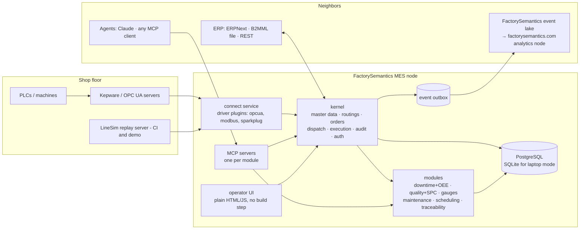

# Architecture

*Written 2026-08-28, before the first line of code — so this is intent, not description. Anything that survives contact with reality gets kept; anything that doesn't gets rewritten here first (this file stays truthful).*

## System shape



Three processes in a plant deployment (api, connect, and the DB), plus optional module workers. One process on a laptop (`fsmes demo`). The MES **makes** events; the semantic layer **names** them; the analytics node (factorysemantics.com) **learns** from them.

## The kernel

Always present; everything else optional. Contents:

- **Master data:** ISA-95 equipment hierarchy, materials, people/roles.
- **Work definitions:** routings and their operations. Copy-onto-order at creation time (an order's operations are its own history, immune to later routing edits) — ported behavior, kept sacred.
- **Orders & execution:** work order lifecycle, dispatch, production booking, lots and consumption.
- **The audit spine:** append-only, before/after JSON, actor = authenticated human *or* agent-on-behalf-of-human. E-signature records (re-auth + meaning + record hash) chain into it. One spine serves 21 CFR Part 11 *and* agent governance.
- **Auth:** stdlib PBKDF2 + HMAC tokens, role ladder viewer < operator < supervisor < admin (ported; it scales horizontally and audits easily).
- **Events:** every state change emits a FactorySemantics `CanonicalEvent` via a transactional outbox (same DB transaction as the change; a relay ships them). Deterministic UUID5 event ids make emission idempotent and replay-safe.
- **Hooks & module registry:** the kernel publishes lifecycle hooks (`order.released`, `operation.completed`, `state.changed`, `lot.created`...); modules subscribe. Modules register via Python entry points (`[project.entry-points."fsmes.modules"]`), declare their tables, routers, MCP tools, and pack-config schema. The kernel never imports a module.

## Data model — ISA-95 as the naming law

| fsmes table (proposed) | ISA-95 concept | Ported from |
|---|---|---|
| `equipment` (self-referencing) | Equipment hierarchy (Enterprise→Site→Area→WorkCenter→WorkUnit) | MES-TWIN `masterdata.py` |
| `materials`, `bom_items` | Material definition / material lot assembly | MES-TWIN |
| `personnel` | Personnel model | MES-TWIN |
| `routings`, `routing_operations` | Operations definition / process segments | MES-TWIN |
| `work_orders`, `work_order_operations` | Operations request → job order | MES-TWIN |
| `production_logs` | Job response / operations performance | MES-TWIN |
| `material_lots`, `lot_consumptions` | Material lot / sublot, material actual | MES-TWIN |
| `equipment_states` | Equipment state intervals | MES-TWIN (+ PackML vocabulary, + `planned_stop`) |
| `audit_log` | — (Part 11 pattern) | MES-TWIN |
| `erp_messages` | B2M transaction inbox/outbox | MES-TWIN |
| module tables (`downtime_reasons`, `shifts`, `quality_checks`, `gauges`, `pm_schedules`, ...) | Part 3 quality/maintenance/inventory domains | new, per module |

Known model upgrades over MES-TWIN (deliberate, scheduled in the roadmap): routing **versioning/effectivity** and alternates (one routing per material, first-match-wins is v0 behavior); operations get **planned start/end** (M5); machine states adopt the **PackML 17-state vocabulary** with per-driver mapping, collapsed to running/idle/down/setup/planned_stop for OEE buckets (M2); **site scoping** on kernel tables (M8); serialization below lot level (M6).

## Machine connectivity (`connect`)

- **Driver plugin API**: a driver turns a transport (OPC UA, Modbus, Sparkplug/MQTT, replay CSV) into the canonical tag set (`State`, `GoodCount`, `ScrapCount`, analogs) per the tag map. OPC UA (asyncua) ports first; pymodbus and aiomqtt+pysparkplug follow. Odd protocols (Fanuc, legacy) route through Kepware — a strength, not a shortcut.
- **The tag map is the contract** (ported): per-machine node addressing (template or per-tag), state mapping that *raises* on unmapped values, `order_tag: null` = read-only machine, analog naming. Pointing at a different machine layer is a config change — proven three times in MES-TWIN (replay, KepSim, live Kepware).
- **Counter discipline** (ported exactly, with its tests): book only positive deltas; a counter falling to near zero is a PLC reset — re-baseline, book nothing; stale/duplicate notifications ignored. *Never invent production.*
- **Commissioning toolchain** (ported): Engineering fills a one-row-per-machine CSV worksheet → `make-tag-map` → `opc-verify` proves live, through the agent's own resolver, exactly what will be subscribed. Blank cells stay unknown — a guessed cycle time silently turns OEE performance into fiction.

## The agent layer

- **One MCP server, tool files per module** (decided 2026-09-02, revising the original one server per module): a client registers one URL, and the tool list it sees is filtered to what its account may do, so the tool-count ceiling is met by capability rather than by process boundaries. Tool definitions live per module (`fsmes.mcp.<module>`), so a module a pack disables takes its tools with it; splitting into per-module servers stays a deployment option, never a code change. Streamable HTTP for remote, stdio for local. OAuth 2.1/PKCE when remote; bearer for co-located agents.
- **Read/command split:** read tools free; command tools idempotent, `dry_run`-capable, and gated — auto-allow reads, require human approval for dispatch overrides, booking corrections, holds, and anything that writes toward a PLC.
- **Capability-filtered surface** (pattern from factorysemantics.com): a module a pack disables takes its tools with it; a site whose data can't honestly support a tool doesn't serve it.
- **Identity:** agent tokens never earn a role; every agent action records the human it acts on behalf of, into the same audit spine as human actions.

## Storage & historian

PostgreSQL is the one database (SQLite for laptop mode, same models via SQLAlchemy). Time-series (tag samples, state intervals, production logs) live in partitioned tables behind a thin internal historian interface. TimescaleDB Community is an opt-in deployment profile the schema can exploit but never requires; QuestDB is the documented escape hatch if a site outgrows Postgres ingest. The FactorySemantics event lake (Parquet, hive-partitioned, DuckDB-read) is the analytical copy — the MES DB never serves analytics scans.

## UI

Plain HTML/CSS/JS served by FastAPI, no build step, no npm — a plant PC must render it for years (ported rule, and it kept MES-TWIN deployable). Operator screens are product surface and stay native; Grafana dashboards ship as *optional provisioned JSON* against the schema, run side-by-side, never embedded (keeps AGPL out of the codebase). The 3D line view stays in MES-TWIN for now — showpiece, not kernel.

## Deployment profiles

| Profile | Shape | For |
|---|---|---|
| Laptop | one process, SQLite, replay driver | demos, development, evaluation |
| Plant | compose: Postgres + api (N replicas behind nginx) + connect + one-shot migrate job | a real line (ported topology — the migrate-job-separate-from-API pattern is the keeper) |
| Fleet | N plant nodes + observe-don't-push console (enroll / telemetry / desired-state-as-intent / drift display) | multi-site (M8; pattern from factorysemantics.com) |

## Repo layout (proposed)

```
src/fsmes/
  kernel/          # domain models, services, hooks, events, audit, auth
  connect/         # driver plugins, tag maps, commissioning tools
  modules/         # downtime/, quality/, gauges/, maintenance/, scheduling/, trace/
  mcp/             # per-module MCP servers
  api/             # FastAPI routers (thin; services own the logic)
  web/             # no-build-step UI
  cli.py           # fsmes <command>
packs/             # plant packs incl. the adversarial demo pack
sim/               # LineSim configs + fixtures for CI
tests/
docs/
```

One repo, one installable dist to start; entry-point discovery means external modules are possible from day one, and splitting `fsmes-core`/`fsmes-quality`/... into separate dists is a later, mechanical step taken only when someone external needs it.

## Stack (proposed, with reasons)

| Layer | Choice | Why |
|---|---|---|
| Language/runtime | Python ≥3.12 | Continuity with everything being ported; the industrial Python stack is healthy in 2026 |
| Web/API | FastAPI | Ported code is FastAPI; async pairs with asyncua; OpenAPI for free |
| ORM/migrations | SQLAlchemy 2 + Alembic | Ported; SQLite/Postgres portability proven |
| OPC UA | asyncua (2.x) | Ported agent; active upstream; server side powers simulators |
| PLC drivers (later) | pymodbus, pylogix, python-snap7 3.x | Actively maintained, permissive; **not** pycomm3 (unmaintained) or PLC4Py (alpha) |
| MQTT/UNS | aiomqtt, in the `[mqtt]` extra; pysparkplug later | Outbound MQTT-JSON ships (`fsmes uns publish`, [how-to](operate/uns.md)); Sparkplug 3.0 is ISO/IEC 20237 and is a later envelope over the same events |
| Scheduling | OR-Tools CP-SAT via PyJobShop (MIT) | State-of-the-art job-shop as a pip install; **not** Timefold (Python solver discontinued 2025-10) |
| SPC | built here (~500 lines, numpy) | No maintained OSS lib; pyspc is GPL + dormant; the value is the MES wiring |
| Historian | Postgres partitioning (+pg_partman); Timescale opt-in | One DB, zero extra ops for a solo maintainer |
| Machine states | PackML enum + driver mapping | Industry vocabulary; maps 1:1 to OEE loss buckets |
| KPIs | ISO 22400-2 time model | Auditable OEE/TEEP/FPY/MTBF/MTTR; procurement speaks it |
| Events | FactorySemantics `CanonicalEvent` (MIT dep) | Bitemporal, idempotent, already built and tested |
| MCP | official Python SDK, spec 2026-07-28 line | Streamable HTTP + OAuth 2.1 direction |

## Debts acknowledged at birth

The three MES-TWIN seams to fix **during** the port, not after: (1) `session_scope()`/`get_settings()` are cached module globals — inject a session factory and settings; (2) order-completion side-effects are local imports dodging a cycle — they become kernel hooks; (3) `services/line.py` imports from the OPC integration — invert it. Upstream, FactorySemantics needs `WorkOrderCompleted/Closed/Cancelled` event types and a routing-definition payload — small PRs to that repo, not forks.

## Decision log

- **2026-08-28 — ratified:** Apache-2.0 license + DCO (LICENSE verified verbatim against three independent upstream copies; NOTICE carries copyright + the provenance statement); dist `factorysemantics-mes` / import `fsmes` (both free on PyPI); FastAPI+SQLAlchemy continuity; monorepo-single-dist with entry-point modules; PackML/ISA-95/ISO-22400 as the standards trio; port-don't-rewrite from MES-TWIN; go public at M1.
- **2026-08-28 — modules are discovered, never listed.** `fsmes info` reads the `fsmes.modules` entry-point group. Chosen at M0, while the list is empty, because that is the only moment the discovery path costs nothing to establish — and a hardcoded list is exactly the kind of thing that goes stale silently once the third module ships.
- **2026-08-28 — CI runs Windows as well as Linux from the first commit.** Plant PCs are a first-class deployment target, and `single_writer`'s `O_EXCL` form exists precisely because there is no `fcntl` there; a Linux-only matrix would let that regress unnoticed.
- **2026-08-28 — dependencies are declared only once code imports them.** M0 ships `sqlalchemy` and `typer` and nothing else; FastAPI, asyncua and the event model arrive with the M1 code that uses them. A dependency declared ahead of its first import is a promise the build cannot check.
