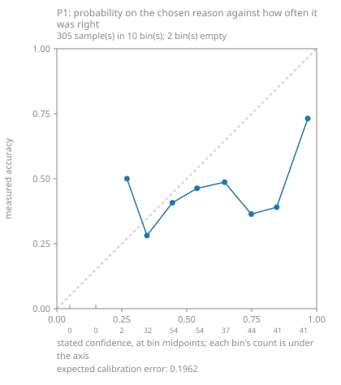

# Measuring the judgment model on this project's own runs

**What this page is about: the development build loop, and nothing else.**
No plant sends anything anywhere because of what is described here. No
screen, no API route, no agent tool and no plant data path asks a judgment
model anything, and shadow mode refuses the call outright.

This is step 2 of the phasing in [JEV.md](JEV.md): *build the P1 evaluation
set out of the scripted hours and measure; publish the number whatever it
is.* Step 1 — the questions asked beside the deterministic answers — is
[the build loop page](JUDGMENT-IN-THE-BUILD-LOOP.md). This page is what
decides whether any of those probabilities may ever be compared with a line.

The two decisions underneath stay as they are:
[0031](../decisions/0031-a-judgment-is-a-proposal.md) — a judgment is a
proposal — and [0032](../decisions/0032-a-hosted-judgment-and-the-shadow.md)
— a hosted judgment is an outbound path, classified by the state it sends.
Both are still *proposed*. **Nothing on this page chooses a threshold, and
the tooling it describes cannot choose one.**

## Why this project can measure this at all

Most people wiring a judgment model into an MES have no way of knowing
whether its answers are any good, because nobody wrote down why each machine
stopped. This project does: the simulated plants script their own
breakdowns, changeovers, counter resets, micro-stops and idling as named
regression tests, in the `line/<plant>.json` the generator obeys. That file
is not documentation — it is the input — so **the true reason for every stop
in a recorded run is already known**.

That makes an evaluation set available here that most integrators of this
model will never have.

## The labelled set

`fsmes jev labelled-set` reads one or more lab results directories and emits
one record per window: the window, the machine, the reason it actually had,
the state the MES could see around it, and what the run's own scorecard said
about it.

### Where a label comes from

The generator writes one state word per machine per simulated second, and
its precedence is fixed and readable in `fsmes.sim.generate.simulate`:
changeover, then breakdown, then a pre-rolled micro-stop, then scripted
blocking, then scripted starving, then the blocking and starving the line's
own buffers produce. So the state word **is** the truth about why a machine
stopped, and the label is read off it rather than inferred from it.

Whether a scripted event *named* the window is recorded separately, in
`scripted`. A knock-on starve is a real stop with a real reason; it is
simply one nobody wrote down in advance, and a reader needs to see how much
of a set is staged and how much is emergent.

### The vocabulary

Seven options, taken from the generator's own event types and state words
rather than invented. A fixed vocabulary's total is the measure of what it
cannot say: a stop whose real reason is not one of these seven can only be
answered wrongly.

| Option | What it means |
|---|---|
| `breakdown` | it was willing to run, something failed |
| `changeover` | a planned stop, and never downtime |
| `micro_stop` | a jam or a misfeed, cleared in seconds |
| `starved` | nothing arrived; the shortage was upstream |
| `blocked` | nowhere to put it; the hold-up was downstream |
| `counter_reset` | the counters went back to zero without a stop |
| `none` | it did not stop in this window; there is no reason to give |

### What the question is allowed to see

The label is read off the machine's state word, so **the window may not
carry it**. A question whose answer is printed in its own evidence measures
nothing at all.

So the default view — `stopped-not-why` — replaces the state word with a
plain `Running` column, 1 while the machine was making something and 0 while
it was not, and keeps every other tag exactly as the machine published it:
the alarm word, the ready bit, the cycle time, the counters, the analogs,
and the counters and run bit of the machine immediately before and after it
on the line. That is what most machine layers publish, and it is what a real
diagnosis reads.

Some machine layers *do* publish a reason code. `--state-view full` keeps
the state word, and both views are built by the same code — so the gap
between the two measurements is the reason code and nothing else, which
makes it a number worth having rather than an argument.

### What the MES could not see stays unseen

A scripted disconnect closes the OPC endpoint: the line runs on and the MES
has no state for those seconds at all
([decision 0030](../decisions/0030-a-lost-connection-is-unknown-time.md)). The tag
history still holds them, because the generator wrote them. Handing them to
a question about what the MES observed would be inventing observation, and
writing blanks or the last state anybody heard would be two other ways of
writing down something that did not happen. So those rows are cut out and
replaced by a line saying how long the gap was, and a stop that happened
entirely inside a disconnect is marked `observable: false` and is not asked
about unless you pass `--include-unobservable`.

### Negatives

A set of nothing but stops cannot show a reason being invented, and
inventing one is exactly what round 5 raised: one condition scored highest
on every run, including the six where nothing of the kind happened. So the
set also carries **control windows** — one per machine by default, spread
across the hour, in which the machine never stopped. Their label is `none`,
and an answer that finds a reason in one is visible in the matrix as a
column under a row with no stops in it.

### How big a question is

Sixty seconds of line either side of the stop, at one row a second, thinned
to about 120 rows for the machine and 60 for each neighbour, with the first
and the last row always kept and the thinning stated in the text.

Built over two of round 5's recorded runs that came to **1,479 to 9,205
characters a window, median 5,432** — roughly 390 to 2,400 input tokens,
median about 1,400. The comparison that matters: one run-level question in
round 5 cost about 9,400 input tokens, because its state was the tail of a
whole run. A stop window is a minute of one machine and its two neighbours,
so it is the smaller question by about six times at the median.

Every size the set produced is written into the set itself, under
`totals.state_characters`, so a pass can be costed from the file rather than
from the bill afterwards.

### The record

```json
{
  "id": "<results>/<plant>/<equipment>/<start second>",
  "window_sim_s": [100, 160],
  "label": "breakdown",
  "label_says": "the run scripted `down` for Weld from 100s to 160s",
  "scripted": true,
  "observable": true,
  "unseen_seconds": 0,
  "state_view": "stopped-not-why",
  "state_sha256": "…", "state_characters": 5356, "state_rows": 120,
  "state": "…the window as the question is asked over it…",
  "mes_verdict": {"kind": "faults", "observed": true, "…": "…"},
  "mes_verdict_says": "the scorecard's faults[0] covers this window"
}
```

A window the scorecard names nothing in says so in `mes_verdict_says`
rather than carrying nothing: unknown is not zero.

## P1, asked offline

`fsmes jev ask` asks one typed **choice** over that vocabulary, once per
window, through the same `integrations/jev` client the run-log triage uses —
the same `MES_JEV_API_KEY`, the same pinned `MES_JEV_MODEL`, the same
outbound register entry (`llm.jev`, refused in shadow mode). `state_class`
is `observation`, per decision 0032: a window of tag history is
observation-shaped, even though the plant that produced it is simulated.

A choice is the right shape because the options are not ordered — there is
no sense in which `blocked` is more than `starved` — and because **a choice
proposes an option of its own**, which is why a confusion matrix can be
drawn without anybody picking a threshold first.

Every answer is stored with the option chosen, the probability on it, the
whole distribution across the seven options, the stated confidence, the
model version **as served**, the request id and the usage, with the label
beside it. A call that fails is stored as `not asked (…)` and counted apart
from the answers: a judgment may not cost the thing it judges (0031), and a
matrix that counts a failure as a wrong answer is worthless.

**Nothing is asked without a key.** With no key — the normal case for every
installation of this package — `fsmes jev ask` writes a file saying it was
not asked and why, which is a record rather than a failure. Every test in
the repository runs the asked path through a transport a test wrote; none
opens a network connection.

### What a pass costs, before it is spent

`fsmes jev ask` prints the number of calls, the characters of state and an
input-token estimate **before it asks anything**, and refuses above 300
calls unless you pass `--yes`. `--dry-run` prints the estimate and stops.
`--limit` asks about fewer.

The estimate says where its own rate came from, because an estimate a reader
cannot tell from a measurement is worse than no estimate at all:

- **Measured**, where answers from an earlier pass of the *same state view*
  are there to read — the `--out` file if it already exists, or any answers
  file named with `--measure-from`. Every answered record carries the
  characters of state it was asked over and the input tokens the service
  billed for it, so the rate is a division rather than a guess. The estimate
  is that rate per character, rounded up, so it comes in under the bill only
  if the next pass is dearer per character than the last one was. A call the
  service billed nothing for is left out of both sums rather than counted as
  nought tokens.
- **Stated**, where there is nothing of that view to read: one character to
  a token, which is roughly how tag-history CSV tokenises. It is printed as
  a stated figure and says in as many words that it is not a measurement.

The first version of this estimator used 3.8 characters to a token, taken
from round 5's run-log usage, and [the pass below](#numbers) showed it wrong
by about four: 454,339 input tokens printed, 1,725,959 billed. A run log is
prose; a window of tag history is digits, commas and short column names. The
two passes of 2026-09-17 measured 1.000 and 0.988 characters a token, so
even the stated figure is about 1% optimistic on the full view, and the
measured path is the one to cost a pass from.

## D1's battery against the scripted hours

`fsmes jev calibrate` also pairs each scored run's recorded run-log battery
with what the hour was scripted to do. Two of the six questions have a truth
in the script; four do not.

| Question | What the scripted hour says |
|---|---|
| `component_stopped_reporting` | **true** where a `disconnect` was scripted, **false** where none was |
| `counter_went_backwards` | **true** where a `counter_reset` was scripted, **false** where none was |
| `retry_storm` | **unlabelled** — nothing in a scenario scripts how this MES retries |
| `silent_exception` | **unlabelled** — nothing scripts an exception in this MES |
| `deadlock` | **unlabelled** — nothing scripts a deadlock in this MES |
| `worst_problem` | **unlabelled** — a scenario scripts events, not a severity |

The unlabelled four are printed as unlabelled rather than guessed at. A
guessed label measured against a probability produces a number that looks
like evidence and is not.

One caveat is printed with every pairing rather than buried here: the
`component_stopped_reporting` question says "stopped logging **before the
run ended**", and a disconnect that later reconnects only half meets that
wording. The scripted windows are printed beside it so a reader can judge.

## The two figures

`fsmes jev calibrate --results … --set … --answers … --out <dir>` writes:

- `calibration.md` — the confusion matrix (labels × proposals, with every
  row, column and grand total stated), the calibration bins, the expected
  calibration error, and the D1 pairing table. Self-contained: every number
  in it can be checked against the two files it names, without running
  anything.
- `p1-by-probability.svg`, `p1-by-confidence.svg` and one SVG per labelled
  D1 condition — stated confidence against measured accuracy, in ten bins,
  with the perfect-calibration line drawn and the count printed under every
  bin.
- `d1-against-truth.json` — the pairing as data.

A bin with no samples is reported with a count of zero and no accuracy at
all. It is never interpolated, never joined across and never left out: an
empty bin is a thing the set did not measure, and a plot that hides it is a
plot that claims it did.

### And still no threshold

The tool chooses none, and nothing in this MES reads any number it produces.
Where a bin has at least ten samples at or above it and is right at least
nine times in ten throughout, the report **names that bin**, with its count,
and says in as many words that whether it is a threshold is a person's
decision and not the tool's. Where no bin manages that, it says so.

## Running it

```bash
# 1. Build the set. No key, no network, no plant: this reads files.
fsmes jev labelled-set \
  --results ~/lab-results/<a run> \
  --results ~/lab-results/<another run> \
  --out build/jev/set.json

# 2. See what asking would cost, and ask nothing.
fsmes jev ask --set build/jev/set.json --out build/jev/answers.json --dry-run

# 3. Ask. Needs MES_JEV_API_KEY, MES_JEV_MODEL and the [jev] extra.
fsmes jev ask --set build/jev/set.json --out build/jev/answers.json --yes

# 4. Draw both figures, and choose nothing.
fsmes jev calibrate \
  --results ~/lab-results/<a run> \
  --results ~/lab-results/<another run> \
  --set build/jev/set.json \
  --answers build/jev/answers.json \
  --out build/jev/report
```

Steps 1, 2 and 4 need no key. Step 3 is the only one that asks anything, and
without a key it writes a record saying it did not.

## Numbers

Run on **2026-09-17**, over six recorded lab runs from round 5. One pass per
state view, 305 calls each, through the pinned model: asked for
`jev-1.13.0`, served `jev-1.13.0`, and the served version stored with every
answer. The set had **311** windows; **305** were asked about and **305**
were answered, **0** were not, and **6** were left out because they happened
entirely inside a disconnect.

Both reports are checked in beside this page exactly as `fsmes jev
calibrate` wrote them, with their figures:

- [the default view, `stopped-not-why`](calibration/2026-09-17/stopped-not-why/calibration.md)
- [the full view, `--state-view full`](calibration/2026-09-17/full/calibration.md)

Every number below is in one of those two files, and every number in them
can be checked against the set and the answers they name. The sets and the
answers themselves are not checked in — they are about 2 MB each — and
[Running it](#running-it) is how they are rebuilt.

### The headline, both views

| State view | What the question could see | Right | Asked | Accuracy |
|---|---|---|---|---|
| `stopped-not-why` (default) | every tag the machine published, with the state word replaced by a running bit | 137 | 305 | **0.449** |
| `full` | the same window, with the machine's state word left in | 281 | 305 | **0.921** |

**The gap from 0.449 to 0.921 is the leak, measured.** The two sets are
built by the same code over the same 305 windows, and the only difference
between them is the state word — the word that names the reason. With it in
the state, the answer is read off the code rather than inferred from the
behaviour.

That has a consequence for who this could ever be for. A plant whose machine
layer already publishes a reason code does not need a model to tell it why a
machine stopped: it has the answer, and 0.921 is close to the cost of
copying it across. **The plant that does not publish one is the case that
matters — and on this evidence the model is right on fewer than half of
seven options there.**

### What was right, by the reason it actually had

| Scripted reason | Windows asked | Right, default view | Right, full view |
|---|---|---|---|
| `breakdown` | 6 | 6 | 6 |
| `changeover` | 15 | **0** | 14 |
| `micro_stop` | 75 | 26 | 67 |
| `starved` | 29 | 18 | 27 |
| `blocked` | 141 | 62 | 141 |
| `counter_reset` | 0 | 0 | 0 |
| `none` | 39 | 25 | 26 |
| **total** | **305** | **137** | **281** |

`counter_reset` is empty because none of these six runs scripted one. An
empty row is a thing this set did not measure, and it stays in the table
saying so.

### The confusion matrix, default view

Rows are the reason the generator actually scripted; columns are the reason
the model proposed. A choice proposes an option of its own, so no threshold
was picked to draw this.

| scripted \ proposed | breakdown | changeover | micro_stop | starved | blocked | counter_reset | none | **total** |
|---|---|---|---|---|---|---|---|---|
| breakdown | 6 | 0 | 0 | 0 | 0 | 0 | 0 | **6** |
| changeover | 15 | 0 | 0 | 0 | 0 | 0 | 0 | **15** |
| micro_stop | 2 | 0 | 26 | 45 | 1 | 0 | 1 | **75** |
| starved | 0 | 0 | 10 | 18 | 1 | 0 | 0 | **29** |
| blocked | 1 | 0 | 66 | 12 | 62 | 0 | 0 | **141** |
| counter_reset | 0 | 0 | 0 | 0 | 0 | 0 | 0 | **0** |
| none | 0 | 0 | 6 | 4 | 4 | 0 | 25 | **39** |
| **total** | **24** | **0** | **108** | **79** | **68** | **0** | **26** | **305** |

Four things in that table, in plain words:

- **`changeover` is 0 of 15, and all 15 were called `breakdown`.** A
  changeover is a planned stop and never downtime; a breakdown is downtime.
  On this set the model got the most consequential distinction in the whole
  vocabulary wrong every single time it was asked.
- **`blocked` and `micro_stop` are the two largest classes and are confused
  with each other and with `starved`.** 66 of 141 blocked windows were
  called micro-stops; 45 of 75 micro-stops were called starved; 12 more
  blocked windows were called starved. Those three states are the ones the
  generator distinguishes by the word the default view deliberately
  withheld, and they are 245 of the 305 windows asked about.
- **`none` holds up better than the stops.** 25 of 39 control windows — a
  machine that never stopped — were answered `none`. 14 were given a reason
  anyway, which is the round-5 failure this set was built to make visible,
  smaller than it was but still there.
- **A constant answer would have scored higher.** `blocked` is 141 of the
  305 windows, so proposing `blocked` every time, with no model and no
  state, would have been right 0.462 of the time against the model's 0.449.
  That is not a claim that the model knows nothing — it gets `breakdown` 6
  of 6 and `none` 25 of 39, which a constant cannot — but on this set, over
  this vocabulary, its total is under the dullest possible baseline, and
  that is the number Step 2 asked to be published.

The full view's matrix is in
[its own report](calibration/2026-09-17/full/calibration.md); its diagonal
is 281, `blocked` is 141 of 141 and `changeover` is 14 of 15.

### Calibration: stated confidence against measured accuracy

Ten bins, the count printed under every bin, empty bins left empty.

| View | Binned by | Expected calibration error |
|---|---|---|
| default | probability on the chosen option | **0.1962** |
| default | stated confidence | **0.1594** |
| full | probability on the chosen option | **0.1409** |
| full | stated confidence | **0.1819** |
| **4 measurements in total** | | |

Expected calibration error is the average distance between what was stated
and what was measured, weighted by how many samples fell in each bin. About
0.16 to 0.20 on the default view means the stated number is out by roughly a
sixth to a fifth on average — and it is out in one direction: every
populated bin below is under the diagonal.



On the default view the top bin is the worst place to read this. Binned by
probability, the 0.9–1.0 bin holds 41 samples and is right 0.732 of the
time; binned by stated confidence, 35 samples and 0.771. **The tool's own
sentence, printed under both plots:**

> no bin has 10 or more samples at or above it and is right 90% of the time
> throughout. On this evidence no threshold is defensible anywhere on the
> scale.

The full view prints the other sentence — *at or above 0.7 this set was
right 90% of the time or better, over 230 sample(s). Whether that is a
threshold is a person's decision, not this tool's* — and that is a sentence
about a question whose answer was in its own evidence. It is recorded
because the tool recorded it, not because anything follows from it.

### D1's battery against the scripted hours

Six questions are asked of every run log; two of them have a truth in the
script. Seven run records came out of the six runs — the two-plants run
writes one per plant — for **14** labelled pairs. The other 28 are printed
as unlabelled rather than guessed at.

| Run record | `component_stopped_reporting` | scripted | `counter_went_backwards` | scripted |
|---|---|---|---|---|
| 2026-09-17-lost-connection-2 | **0.41** | true | 0.12 | false |
| 2026-09-17-one-line-bad-hour-2 | 0.34 | false | 0.11 | **true** |
| 2026-09-17-over-run-2 | 0.34 | false | 0.12 | false |
| 2026-09-17-scrap-burst | 0.33 | false | 0.14 | false |
| 2026-09-17-starved-and-blocked | 0.33 | false | 0.12 | false |
| 2026-09-17-two-plants-two-zones | 0.37 | false | 0.13 | **true** |
| 2026-09-17-two-plants-two-zones | **0.61** | false | 0.14 | **true** |
| **7 run records, 14 labelled pairs** | | | | |

Neither question separates truth from not on this evidence, and one of them
separates it backwards:

- `component_stopped_reporting` was 0.41 on the one run with scripted
  disconnects and 0.33 to 0.61 on the six with none. **The highest
  probability of the seven, 0.61, is on a run where nothing was scripted to
  go silent.** The caveat printed with every pairing applies here and is not
  an excuse for the ordering: the question says "stopped logging *before the
  run ended*", and a disconnect that later reconnects only half meets that
  wording.
- `counter_went_backwards` was 0.11, 0.13 and 0.14 on the three records with
  a scripted counter reset and 0.12, 0.12, 0.12 and 0.14 on the four with
  none. The two ranges are the same range.

Fourteen pairs is a small number and these are probabilities on one run log
each, not a rate over many. They are recorded, not thresholded, and the
pairing is checked in as
[`d1-against-truth.json`](calibration/2026-09-17/stopped-not-why/d1-against-truth.json).


### What it cost

| Pass | Calls | Characters of state | Input tokens billed | Output tokens |
|---|---|---|---|---|
| default view | 305 | 1,726,490 | 1,725,959 | 22,829 |
| full view | 305 | 1,655,816 | 1,676,010 | 22,720 |
| **both, total** | **610** | **3,382,306** | **3,401,969** | **45,549** |

Every one of the 610 calls came back with its usage; none reported none.
About 5,600 input tokens a call, against a dry run that had printed about
1,490 — the estimator was wrong by a factor of about four, and
[it has been fixed](#what-a-pass-costs-before-it-is-spent) to measure its
rate from a stored pass of the same view instead.

### What this decides for the product half

Step 2 is the step the survey says decides the product half. On this
evidence:

- **Nothing here justifies a threshold, a gate, or an automatic label.** The
  tool says no threshold is defensible anywhere on the default view's scale,
  and the full view's threshold sentence is about a question that could read
  its answer off its own evidence. Decision
  [0031](../decisions/0031-a-judgment-is-a-proposal.md) — a judgment is a
  proposal — is not merely still defensible; it is the only reading this set
  supports.
- **The most that could be justified is P1 as a displayed proposal, with its
  probability shown, and only after the calibration improves or the question
  is reshaped.** A proposal that is right 0.449 of the time, shown to an
  operator beside the tags it was drawn from, costs a glance. The same
  number written into a downtime record costs the record.
- **The question may be the thing to change, not the model.** Three of the
  seven options — `blocked`, `starved`, `micro_stop` — carry 245 of the 305
  windows and are exactly where the answers go wrong. A question that asked
  "did something break, was it planned, or was the line simply waiting" over
  three options is a different measurement, and this set can be re-asked
  that way for the price of one more pass. That is a thing to try, not a
  thing that has been shown to work.
- **The class ladder in decision
  [0032](../decisions/0032-a-hosted-judgment-and-the-shadow.md) is untouched
  by this.** 0032 classifies a question by the state it sends, and these
  numbers are about whether an answer is any good, not about what left the
  building. Both decisions stay *proposed*, and neither is edited here.

Nothing is scheduled off this page. What happens next is the maintainer's
call, made with these numbers in front of him.

### What is not here

- **No real plant.** Every number above comes from simulated lines whose
  reasons are the generator's own input. That is the whole reason an
  accuracy could be computed at all, and it is also the limit of what the
  number means.
- **Six runs, one model version, one day.** `jev-1.13.0` on 2026-09-17.
  TypeSafe has said `confidence` will drift across versions, so a version
  change is a re-validation and this page is dated for that reason.
- **No second opinion.** Each window was asked once. Nothing here measures
  whether the same window asked twice gets the same answer.
- **`counter_reset` was never asked about.** The vocabulary carries it; this
  set has none of it.
