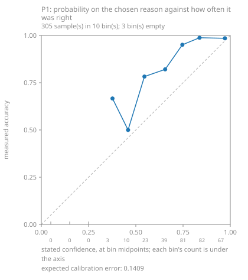
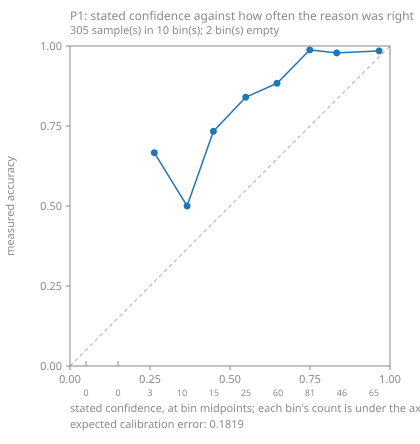
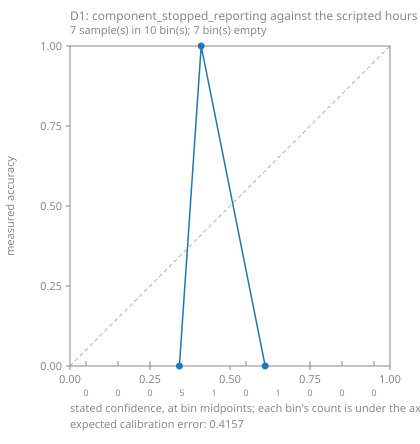

# Calibration of the judgment model on this project's own runs

Written 2026-09-17 by `fsmes jev calibrate`. Every number below comes from the labelled set and the stored answers named in it, and nothing here chooses a threshold.

## What was measured

- Runs read: **6**
- Windows in the labelled set: **311** (99 named by a scripted event, 212 produced by the line's own buffers)
- Windows the MES could see: **305**; windows entirely inside a disconnect: **6**
- Windows asked about: **305**, of which **305** were answered and **0** were not

### The set, by the reason it actually had

| reason | windows |
|---|---|
| breakdown | 7 |
| changeover | 15 |
| micro_stop | 75 |
| starved | 32 |
| blocked | 143 |
| counter_reset | 0 |
| none | 39 |
| **total** | **311** |

## P1: what was proposed against what was scripted

One choice over 7 options, asked once per window. A choice proposes an option of its own, so this table needs no threshold to be drawn.

| scripted \ proposed | breakdown | changeover | micro_stop | starved | blocked | counter_reset | none | **total** |
|---|---|---|---|---|---|---|---|---|
| breakdown | 6 | 0 | 0 | 0 | 0 | 0 | 0 | **6** |
| changeover | 1 | 14 | 0 | 0 | 0 | 0 | 0 | **15** |
| micro_stop | 0 | 1 | 67 | 6 | 1 | 0 | 0 | **75** |
| starved | 0 | 0 | 2 | 27 | 0 | 0 | 0 | **29** |
| blocked | 0 | 0 | 0 | 0 | 141 | 0 | 0 | **141** |
| counter_reset | 0 | 0 | 0 | 0 | 0 | 0 | 0 | **0** |
| none | 1 | 0 | 5 | 4 | 3 | 0 | 26 | **39** |
| **total** | **8** | **15** | **74** | **37** | **145** | **0** | **26** | **305** |

Right on **281** of **305** answered (**0.921**).

## P1: stated confidence against measured accuracy

### Binned by the probability the model put on the option it chose

| stated | samples | mean stated | right | measured accuracy |
|---|---|---|---|---|
| 0.0-0.1 | 0 | empty | 0 | empty |
| 0.1-0.2 | 0 | empty | 0 | empty |
| 0.2-0.3 | 0 | empty | 0 | empty |
| 0.3-0.4 | 3 | 0.377 | 2 | 0.667 |
| 0.4-0.5 | 10 | 0.459 | 5 | 0.500 |
| 0.5-0.6 | 23 | 0.546 | 18 | 0.783 |
| 0.6-0.7 | 39 | 0.655 | 32 | 0.821 |
| 0.7-0.8 | 81 | 0.746 | 77 | 0.951 |
| 0.8-0.9 | 82 | 0.837 | 81 | 0.988 |
| 0.9-1.0 | 67 | 0.972 | 66 | 0.985 |
| **total** | **305** |  |  |  |

Expected calibration error: **0.1409**

at or above 0.7 this set was right 90% of the time or better, over 230 sample(s). Whether that is a threshold is a person's decision, not this tool's.

### Binned by the confidence the model stated

| stated | samples | mean stated | right | measured accuracy |
|---|---|---|---|---|
| 0.0-0.1 | 0 | empty | 0 | empty |
| 0.1-0.2 | 0 | empty | 0 | empty |
| 0.2-0.3 | 3 | 0.263 | 2 | 0.667 |
| 0.3-0.4 | 10 | 0.366 | 5 | 0.500 |
| 0.4-0.5 | 15 | 0.448 | 11 | 0.733 |
| 0.5-0.6 | 25 | 0.549 | 21 | 0.840 |
| 0.6-0.7 | 60 | 0.647 | 53 | 0.883 |
| 0.7-0.8 | 81 | 0.749 | 80 | 0.988 |
| 0.8-0.9 | 46 | 0.834 | 45 | 0.978 |
| 0.9-1.0 | 65 | 0.966 | 64 | 0.985 |
| **total** | **305** |  |  |  |

Expected calibration error: **0.1819**

at or above 0.7 this set was right 90% of the time or better, over 192 sample(s). Whether that is a threshold is a person's decision, not this tool's.

## D1's run-log battery against the scripted hours

42 recorded condition(s) in total across 7 run record(s): **14** the scripted hour can decide, **28** it cannot. The ones it cannot are printed as unlabelled rather than guessed at.

| run | question | probability | scripted truth | why |
|---|---|---|---|---|
| 2026-09-17-lost-connection-2 | retry_storm | 0.06 | unlabelled | nothing in a scenario scripts how this MES retries |
| 2026-09-17-lost-connection-2 | counter_went_backwards | 0.12 | false | no counter reset was scripted, and the generator's counters only ever go backwards when one is |
| 2026-09-17-lost-connection-2 | component_stopped_reporting | 0.41 | true | 2 scripted disconnect(s) (360-600s, 1080-1260s): the machine layer went silent while the rest of the run carried on. The question says "stopped logging before the run ended", and a disconnect that later reconnects only half meets that wording - the windows are printed so a reader can judge it |
| 2026-09-17-lost-connection-2 | silent_exception | 0.06 | unlabelled | nothing in a scenario scripts an exception in this MES |
| 2026-09-17-lost-connection-2 | deadlock | 0.07 | unlabelled | nothing in a scenario scripts a deadlock in this MES |
| 2026-09-17-lost-connection-2 | worst_problem | 0.68 | unlabelled | a scenario scripts events, not a severity for them |
| 2026-09-17-one-line-bad-hour-2 | retry_storm | 0.06 | unlabelled | nothing in a scenario scripts how this MES retries |
| 2026-09-17-one-line-bad-hour-2 | counter_went_backwards | 0.11 | true | 1 scripted counter reset(s): bottling/RD at 3000s |
| 2026-09-17-one-line-bad-hour-2 | component_stopped_reporting | 0.34 | false | nothing in this hour was scripted to go silent: no disconnect, so no component stopped reporting |
| 2026-09-17-one-line-bad-hour-2 | silent_exception | 0.06 | unlabelled | nothing in a scenario scripts an exception in this MES |
| 2026-09-17-one-line-bad-hour-2 | deadlock | 0.08 | unlabelled | nothing in a scenario scripts a deadlock in this MES |
| 2026-09-17-one-line-bad-hour-2 | worst_problem | 0.69 | unlabelled | a scenario scripts events, not a severity for them |
| 2026-09-17-over-run-2 | retry_storm | 0.07 | unlabelled | nothing in a scenario scripts how this MES retries |
| 2026-09-17-over-run-2 | counter_went_backwards | 0.12 | false | no counter reset was scripted, and the generator's counters only ever go backwards when one is |
| 2026-09-17-over-run-2 | component_stopped_reporting | 0.34 | false | nothing in this hour was scripted to go silent: no disconnect, so no component stopped reporting |
| 2026-09-17-over-run-2 | silent_exception | 0.06 | unlabelled | nothing in a scenario scripts an exception in this MES |
| 2026-09-17-over-run-2 | deadlock | 0.07 | unlabelled | nothing in a scenario scripts a deadlock in this MES |
| 2026-09-17-over-run-2 | worst_problem | 0.48 | unlabelled | a scenario scripts events, not a severity for them |
| 2026-09-17-scrap-burst | retry_storm | 0.15 | unlabelled | nothing in a scenario scripts how this MES retries |
| 2026-09-17-scrap-burst | counter_went_backwards | 0.14 | false | no counter reset was scripted, and the generator's counters only ever go backwards when one is |
| 2026-09-17-scrap-burst | component_stopped_reporting | 0.33 | false | nothing in this hour was scripted to go silent: no disconnect, so no component stopped reporting |
| 2026-09-17-scrap-burst | silent_exception | 0.12 | unlabelled | nothing in a scenario scripts an exception in this MES |
| 2026-09-17-scrap-burst | deadlock | 0.1 | unlabelled | nothing in a scenario scripts a deadlock in this MES |
| 2026-09-17-scrap-burst | worst_problem | 0.91 | unlabelled | a scenario scripts events, not a severity for them |
| 2026-09-17-starved-and-blocked | retry_storm | 0.05 | unlabelled | nothing in a scenario scripts how this MES retries |
| 2026-09-17-starved-and-blocked | counter_went_backwards | 0.12 | false | no counter reset was scripted, and the generator's counters only ever go backwards when one is |
| 2026-09-17-starved-and-blocked | component_stopped_reporting | 0.33 | false | nothing in this hour was scripted to go silent: no disconnect, so no component stopped reporting |
| 2026-09-17-starved-and-blocked | silent_exception | 0.06 | unlabelled | nothing in a scenario scripts an exception in this MES |
| 2026-09-17-starved-and-blocked | deadlock | 0.07 | unlabelled | nothing in a scenario scripts a deadlock in this MES |
| 2026-09-17-starved-and-blocked | worst_problem | 0.84 | unlabelled | a scenario scripts events, not a severity for them |
| 2026-09-17-two-plants-two-zones | retry_storm | 0.06 | unlabelled | nothing in a scenario scripts how this MES retries |
| 2026-09-17-two-plants-two-zones | counter_went_backwards | 0.13 | true | 1 scripted counter reset(s): bottling/RD at 3000s |
| 2026-09-17-two-plants-two-zones | component_stopped_reporting | 0.37 | false | nothing in this hour was scripted to go silent: no disconnect, so no component stopped reporting |
| 2026-09-17-two-plants-two-zones | silent_exception | 0.06 | unlabelled | nothing in a scenario scripts an exception in this MES |
| 2026-09-17-two-plants-two-zones | deadlock | 0.07 | unlabelled | nothing in a scenario scripts a deadlock in this MES |
| 2026-09-17-two-plants-two-zones | worst_problem | 0.79 | unlabelled | a scenario scripts events, not a severity for them |
| 2026-09-17-two-plants-two-zones | retry_storm | 0.06 | unlabelled | nothing in a scenario scripts how this MES retries |
| 2026-09-17-two-plants-two-zones | counter_went_backwards | 0.14 | true | 1 scripted counter reset(s): bottling/RD at 3000s |
| 2026-09-17-two-plants-two-zones | component_stopped_reporting | 0.61 | false | nothing in this hour was scripted to go silent: no disconnect, so no component stopped reporting |
| 2026-09-17-two-plants-two-zones | silent_exception | 0.06 | unlabelled | nothing in a scenario scripts an exception in this MES |
| 2026-09-17-two-plants-two-zones | deadlock | 0.08 | unlabelled | nothing in a scenario scripts a deadlock in this MES |
| 2026-09-17-two-plants-two-zones | worst_problem | 0.72 | unlabelled | a scenario scripts events, not a severity for them |
| **42 in total** |  |  |  |  |

## No threshold is chosen here

Decision 0031 stands: a judgment is a proposal. Nothing in this MES reads any number above, and nothing gates on one. Where a bin is named as arguable it is named with its count beside it, for a person to decide in the open.

## The figures

