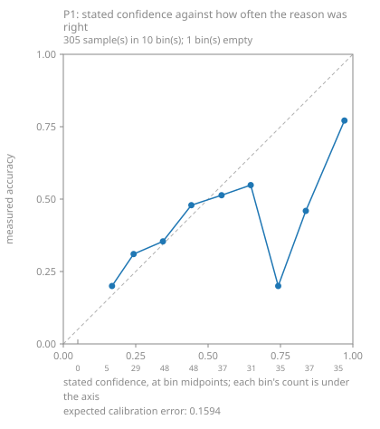
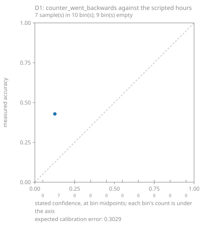

# Calibration of the judgment model on this project's own runs

Written 2026-09-17 by `fsmes jev calibrate`. Every number below comes from the labelled set and the stored answers named in it, and nothing here chooses a threshold.

## What was measured

- Runs read: **6**
- Windows in the labelled set: **311** (99 named by a scripted event, 212 produced by the line's own buffers)
- Windows the MES could see: **305**; windows entirely inside a disconnect: **6**
- Windows asked about: **305**, of which **305** were answered and **0** were not

### The set, by the reason it actually had

| reason | windows |
|---|---|
| breakdown | 7 |
| changeover | 15 |
| micro_stop | 75 |
| starved | 32 |
| blocked | 143 |
| counter_reset | 0 |
| none | 39 |
| **total** | **311** |

## P1: what was proposed against what was scripted

One choice over 7 options, asked once per window. A choice proposes an option of its own, so this table needs no threshold to be drawn.

| scripted \ proposed | breakdown | changeover | micro_stop | starved | blocked | counter_reset | none | **total** |
|---|---|---|---|---|---|---|---|---|
| breakdown | 6 | 0 | 0 | 0 | 0 | 0 | 0 | **6** |
| changeover | 15 | 0 | 0 | 0 | 0 | 0 | 0 | **15** |
| micro_stop | 2 | 0 | 26 | 45 | 1 | 0 | 1 | **75** |
| starved | 0 | 0 | 10 | 18 | 1 | 0 | 0 | **29** |
| blocked | 1 | 0 | 66 | 12 | 62 | 0 | 0 | **141** |
| counter_reset | 0 | 0 | 0 | 0 | 0 | 0 | 0 | **0** |
| none | 0 | 0 | 6 | 4 | 4 | 0 | 25 | **39** |
| **total** | **24** | **0** | **108** | **79** | **68** | **0** | **26** | **305** |

Right on **137** of **305** answered (**0.449**).

## P1: stated confidence against measured accuracy

### Binned by the probability the model put on the option it chose

| stated | samples | mean stated | right | measured accuracy |
|---|---|---|---|---|
| 0.0-0.1 | 0 | empty | 0 | empty |
| 0.1-0.2 | 0 | empty | 0 | empty |
| 0.2-0.3 | 2 | 0.270 | 1 | 0.500 |
| 0.3-0.4 | 32 | 0.347 | 9 | 0.281 |
| 0.4-0.5 | 54 | 0.445 | 22 | 0.407 |
| 0.5-0.6 | 54 | 0.540 | 25 | 0.463 |
| 0.6-0.7 | 37 | 0.646 | 18 | 0.486 |
| 0.7-0.8 | 44 | 0.748 | 16 | 0.364 |
| 0.8-0.9 | 41 | 0.846 | 16 | 0.390 |
| 0.9-1.0 | 41 | 0.966 | 30 | 0.732 |
| **total** | **305** |  |  |  |

Expected calibration error: **0.1962**

no bin has 10 or more samples at or above it and is right 90% of the time throughout. On this evidence no threshold is defensible anywhere on the scale.

### Binned by the confidence the model stated

| stated | samples | mean stated | right | measured accuracy |
|---|---|---|---|---|
| 0.0-0.1 | 0 | empty | 0 | empty |
| 0.1-0.2 | 5 | 0.168 | 1 | 0.200 |
| 0.2-0.3 | 29 | 0.243 | 9 | 0.310 |
| 0.3-0.4 | 48 | 0.344 | 17 | 0.354 |
| 0.4-0.5 | 48 | 0.442 | 23 | 0.479 |
| 0.5-0.6 | 37 | 0.546 | 19 | 0.513 |
| 0.6-0.7 | 31 | 0.647 | 17 | 0.548 |
| 0.7-0.8 | 35 | 0.742 | 7 | 0.200 |
| 0.8-0.9 | 37 | 0.838 | 17 | 0.460 |
| 0.9-1.0 | 35 | 0.971 | 27 | 0.771 |
| **total** | **305** |  |  |  |

Expected calibration error: **0.1594**

no bin has 10 or more samples at or above it and is right 90% of the time throughout. On this evidence no threshold is defensible anywhere on the scale.

## D1's run-log battery against the scripted hours

42 recorded condition(s) in total across 7 run record(s): **14** the scripted hour can decide, **28** it cannot. The ones it cannot are printed as unlabelled rather than guessed at.

| run | question | probability | scripted truth | why |
|---|---|---|---|---|
| 2026-09-17-lost-connection-2 | retry_storm | 0.06 | unlabelled | nothing in a scenario scripts how this MES retries |
| 2026-09-17-lost-connection-2 | counter_went_backwards | 0.12 | false | no counter reset was scripted, and the generator's counters only ever go backwards when one is |
| 2026-09-17-lost-connection-2 | component_stopped_reporting | 0.41 | true | 2 scripted disconnect(s) (360-600s, 1080-1260s): the machine layer went silent while the rest of the run carried on. The question says "stopped logging before the run ended", and a disconnect that later reconnects only half meets that wording - the windows are printed so a reader can judge it |
| 2026-09-17-lost-connection-2 | silent_exception | 0.06 | unlabelled | nothing in a scenario scripts an exception in this MES |
| 2026-09-17-lost-connection-2 | deadlock | 0.07 | unlabelled | nothing in a scenario scripts a deadlock in this MES |
| 2026-09-17-lost-connection-2 | worst_problem | 0.68 | unlabelled | a scenario scripts events, not a severity for them |
| 2026-09-17-one-line-bad-hour-2 | retry_storm | 0.06 | unlabelled | nothing in a scenario scripts how this MES retries |
| 2026-09-17-one-line-bad-hour-2 | counter_went_backwards | 0.11 | true | 1 scripted counter reset(s): bottling/RD at 3000s |
| 2026-09-17-one-line-bad-hour-2 | component_stopped_reporting | 0.34 | false | nothing in this hour was scripted to go silent: no disconnect, so no component stopped reporting |
| 2026-09-17-one-line-bad-hour-2 | silent_exception | 0.06 | unlabelled | nothing in a scenario scripts an exception in this MES |
| 2026-09-17-one-line-bad-hour-2 | deadlock | 0.08 | unlabelled | nothing in a scenario scripts a deadlock in this MES |
| 2026-09-17-one-line-bad-hour-2 | worst_problem | 0.69 | unlabelled | a scenario scripts events, not a severity for them |
| 2026-09-17-over-run-2 | retry_storm | 0.07 | unlabelled | nothing in a scenario scripts how this MES retries |
| 2026-09-17-over-run-2 | counter_went_backwards | 0.12 | false | no counter reset was scripted, and the generator's counters only ever go backwards when one is |
| 2026-09-17-over-run-2 | component_stopped_reporting | 0.34 | false | nothing in this hour was scripted to go silent: no disconnect, so no component stopped reporting |
| 2026-09-17-over-run-2 | silent_exception | 0.06 | unlabelled | nothing in a scenario scripts an exception in this MES |
| 2026-09-17-over-run-2 | deadlock | 0.07 | unlabelled | nothing in a scenario scripts a deadlock in this MES |
| 2026-09-17-over-run-2 | worst_problem | 0.48 | unlabelled | a scenario scripts events, not a severity for them |
| 2026-09-17-scrap-burst | retry_storm | 0.15 | unlabelled | nothing in a scenario scripts how this MES retries |
| 2026-09-17-scrap-burst | counter_went_backwards | 0.14 | false | no counter reset was scripted, and the generator's counters only ever go backwards when one is |
| 2026-09-17-scrap-burst | component_stopped_reporting | 0.33 | false | nothing in this hour was scripted to go silent: no disconnect, so no component stopped reporting |
| 2026-09-17-scrap-burst | silent_exception | 0.12 | unlabelled | nothing in a scenario scripts an exception in this MES |
| 2026-09-17-scrap-burst | deadlock | 0.1 | unlabelled | nothing in a scenario scripts a deadlock in this MES |
| 2026-09-17-scrap-burst | worst_problem | 0.91 | unlabelled | a scenario scripts events, not a severity for them |
| 2026-09-17-starved-and-blocked | retry_storm | 0.05 | unlabelled | nothing in a scenario scripts how this MES retries |
| 2026-09-17-starved-and-blocked | counter_went_backwards | 0.12 | false | no counter reset was scripted, and the generator's counters only ever go backwards when one is |
| 2026-09-17-starved-and-blocked | component_stopped_reporting | 0.33 | false | nothing in this hour was scripted to go silent: no disconnect, so no component stopped reporting |
| 2026-09-17-starved-and-blocked | silent_exception | 0.06 | unlabelled | nothing in a scenario scripts an exception in this MES |
| 2026-09-17-starved-and-blocked | deadlock | 0.07 | unlabelled | nothing in a scenario scripts a deadlock in this MES |
| 2026-09-17-starved-and-blocked | worst_problem | 0.84 | unlabelled | a scenario scripts events, not a severity for them |
| 2026-09-17-two-plants-two-zones | retry_storm | 0.06 | unlabelled | nothing in a scenario scripts how this MES retries |
| 2026-09-17-two-plants-two-zones | counter_went_backwards | 0.13 | true | 1 scripted counter reset(s): bottling/RD at 3000s |
| 2026-09-17-two-plants-two-zones | component_stopped_reporting | 0.37 | false | nothing in this hour was scripted to go silent: no disconnect, so no component stopped reporting |
| 2026-09-17-two-plants-two-zones | silent_exception | 0.06 | unlabelled | nothing in a scenario scripts an exception in this MES |
| 2026-09-17-two-plants-two-zones | deadlock | 0.07 | unlabelled | nothing in a scenario scripts a deadlock in this MES |
| 2026-09-17-two-plants-two-zones | worst_problem | 0.79 | unlabelled | a scenario scripts events, not a severity for them |
| 2026-09-17-two-plants-two-zones | retry_storm | 0.06 | unlabelled | nothing in a scenario scripts how this MES retries |
| 2026-09-17-two-plants-two-zones | counter_went_backwards | 0.14 | true | 1 scripted counter reset(s): bottling/RD at 3000s |
| 2026-09-17-two-plants-two-zones | component_stopped_reporting | 0.61 | false | nothing in this hour was scripted to go silent: no disconnect, so no component stopped reporting |
| 2026-09-17-two-plants-two-zones | silent_exception | 0.06 | unlabelled | nothing in a scenario scripts an exception in this MES |
| 2026-09-17-two-plants-two-zones | deadlock | 0.08 | unlabelled | nothing in a scenario scripts a deadlock in this MES |
| 2026-09-17-two-plants-two-zones | worst_problem | 0.72 | unlabelled | a scenario scripts events, not a severity for them |
| **42 in total** |  |  |  |  |

## No threshold is chosen here

Decision 0031 stands: a judgment is a proposal. Nothing in this MES reads any number above, and nothing gates on one. Where a bin is named as arguable it is named with its count beside it, for a person to decide in the open.

## The figures

