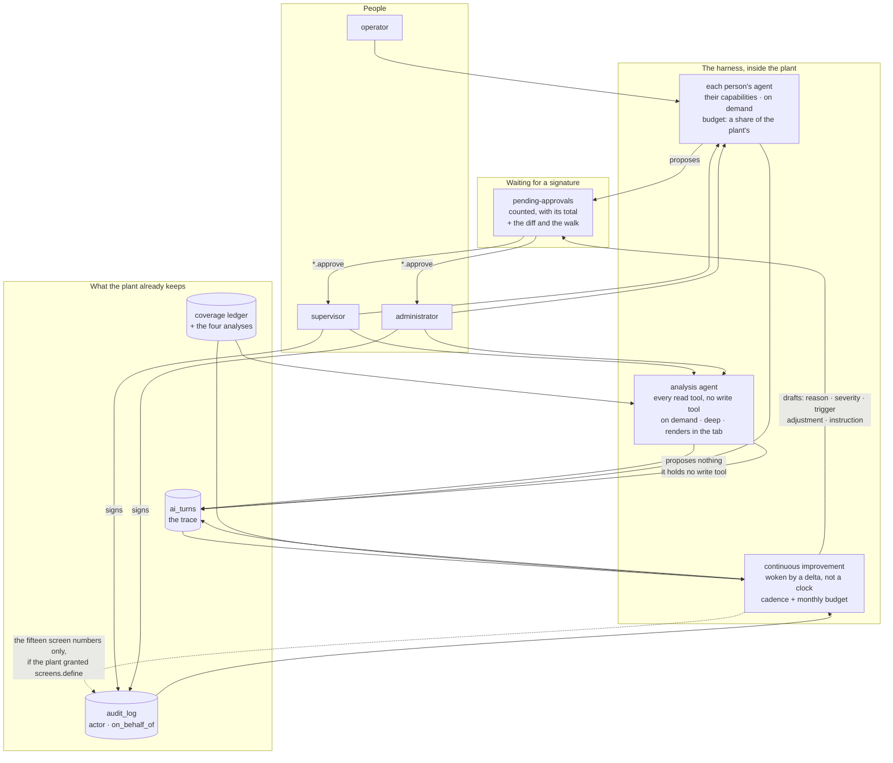

# The MES as an agentic harness

*Design. Written 2026-09-27 against `main` at `f9705990`, before anything is
built. Scott asked, that morning, how the AI tab becomes "the dashboard of an
MES agentic harness" — every person with their own agent, functional agents for
deep work, a continuous-improvement team on a cadence, and "this whole crew
setup, basically running in Bottling. Not exactly." This page answers that with
the code cited, proposes a boundary for what an agent may put in force without
a signature, and ends with ten questions. **It decides nothing and builds
nothing.** The decision it turns on is
[0038](../decisions/0038-an-agent-is-an-account-with-a-role-a-budget-and-a-cadence.md),
which is proposed and not accepted.*

---

## 1. What the harness is for

Scott's sentence is the specification: *"ultimately the goal of this MES is to
make better manufacturing decisions."* So the first thing to pin down is what a
decision is in this product, because the harness is worth exactly as much as
the decisions it improves and nothing more.

### A decision here is a write with a name on it

This MES has **68 write routes; 66 of them a screen calls**
(`docs/operate/assistant-coverage.md`, generated 2026-09-27). Almost all of
them record something that happened. A much smaller set *decides* something —
a person commits the plant to a state it was not in, and the record says who:

| The decision | The route | Who may |
|---|---|---|
| Put a work instruction in force | `POST /documents/{code}/approve/{revision}` | `documents.approve` |
| Put a trigger in force — logic against a live plant | `POST /triggers/{code}/approve` | `triggers.approve` |
| Write a setpoint to a PLC | `POST /adjustments/{code}/approve` | `adjustments.approve` |
| Name what every stop from now on is called | `POST /equipment/downtime-reasons/{code}/approve/{revision}` | `process.approve` |
| Grade what every non-conformance is graded at | `POST /quality/severities/{code}/approve/{revision}` | `quality.approve` |
| Disposition a non-conformance | `POST /quality/nonconformances/{code}/disposition` | `quality.close_nc` |
| Close an order short, or over | `POST /workorders/{code}/close` | `orders.close` |
| Change what a role grants | `PUT /admin/roles/{code}` | `users.manage` |

Five of those eight are **signatures on a draft somebody else wrote**, and that
is the shape this product already has: a draft is authored by the role that owns
the domain and signed by the role that owns the consequence
([0035](../decisions/0035-configuration-is-authored-by-roles-and-selected-by-operators.md)).
It is also the shape the `agent` role is built around — it holds the drafting
half of every pair and never the approving half
(`src/fsmes/services/capabilities.py:130-142`).

**A better decision, then, is one of three things: a draft that arrives with
the evidence for it, a signature that happens sooner because somebody was told
a draft was waiting, or a signature that does not happen because the evidence
said not to.** Everything the harness does has to land on that list. A screen
that makes a number prettier is not on it.

### "Actionable to the company" is a proposal, a walk, or a signature

Scott's other phrase — *"making it actionable to the company"* — has a test in
this repository already. Three things count as actionable output:

- **a proposal with its evidence**, which is what `recommended_adjustments`
  already is: `rationale` is required and refused empty
  (*"a recommendation needs a rationale - what was seen, and why this value"*),
  `evidence` is the JSON of what the proposer looked at, and the queue is
  *"the only way anything writes to a PLC"* (`src/fsmes/domain/adjustments.py`);
- **a walk**, which is what the assistant already puts on a screen: 38 authored
  surfaces (`services/assistant.py`, `SURFACES`), each one landing on the real
  control with the real values in it;
- **a signed change**, which is a row in `audit_log` with `actor`,
  `on_behalf_of`, `before` and `after`.

**Nothing else counts, and in particular a dashboard does not.** That is not a
style preference; it is what the product has already decided twice. Decision
[0023](../decisions/0023-the-fleet-console-observes.md) rejected Grafana for the
fleet view with one line that applies to every chart this harness might draw:
it puts the view *"outside the product, where the honesty rules do not reach"*.
And the same record rejected a single fleet OEE because *"a fleet OEE is a lie
unless every plant is the same shape, and no two plants are"* — rule 1 at
company scale.

### What the harness inherits, and cannot argue with

Everything below is already accepted and binds every part of this page.

| Rule | Where | What it forbids the harness |
|---|---|---|
| Never invent production; unknown is not zero | house rules 1–2, `CONTRIBUTING.md`; [0019](../decisions/0019-count-everything-the-machine-counted.md), [0030](../decisions/0030-a-lost-connection-is-unknown-time.md) | drawing a gap as a zero, or a missing edge as no edge |
| Every figure carries how much of the window was watched | [0033](../decisions/0033-availability-is-a-share-of-what-was-watched.md) | an agent's number without its coverage beside it |
| What is withheld is the figure, never the evidence | [0033](../decisions/0033-availability-is-a-share-of-what-was-watched.md) | an agent that hides a ledger it could not summarise |
| The honesty rules must reach the view | [0023](../decisions/0023-the-fleet-console-observes.md) | rendering plant numbers anywhere the product's rules do not apply |
| A judgment is a proposal, and never an input to a graded number | [0031](../decisions/0031-a-judgment-is-a-proposal.md) | a model's answer reaching OEE, a booked count, a yield or CI |
| A question declares the class of state it sends; shadow refuses by class | [0032](../decisions/0032-a-hosted-judgment-and-the-shadow.md) | any agent that has not said what leaves the box |
| The agent drafts; a person signs | [0035](../decisions/0035-configuration-is-authored-by-roles-and-selected-by-operators.md) | an agent holding any `*.approve` |
| Every list states its total | house rule; `STYLE.md` rule 4 | a graph, a roster or a proposals queue that reads complete when it is not |
| One database per plant | [0021](../decisions/0021-one-database-per-plant.md) | a harness that keeps its state anywhere but the plant's own database |

One consequence is worth stating early because it cuts against the most
exciting-sounding version of this idea. **An agent in this harness may not make
the plant's numbers better.** It may not label a stop, assign an orphan count,
or fill a coverage gap: 0031 puts a model's answer *beside* the fact, never in
place of it, and 0033's withheld figures stay withheld. What it may do is read
those refusals — the `unlabelled` bucket, the four `not_observed` causes, the
`unassigned_production` list — and propose the change that would stop them
recurring. **The harness's job is to act on the product's honesty, not to
paper over it.**

---

## 2. The map: crew → plant

Scott: *"make this whole crew setup I have here, basically run in Bottling. Not
exactly, I don't want my crew session there, but something like that."*

The "not exactly" is load-bearing, and it is worth saying why before the table.
The crew is six role files, three shell scripts and a timer, driving Claude Code
sessions in terminal panes. **Most of the machinery is repair, not
orchestration.** Of the 200 lines of `bin/crew-up`, roughly 60 orchestrate and
roughly 80 repair the runtime: agents restored without their role after a
snapshot restore, a phone channel that went dead, a session that acquired a
`/loop` and ran 48 times a day for four days, orphan panes, sessions that drift
from their role after two weeks, and a screen-scraper that sends arrow keys at a
"trust this folder" dialog so a headless agent is not blocked for ever. None of
that is an idea. It is scar tissue from running an interactive CLI as a daemon,
and **in a server process the whole category disappears** — which is most of
what "not exactly" means.

What is left, after the scar tissue, is five ideas and one posture.

### The table

| In the crew | What it actually is | In the plant | Why |
|---|---|---|---|
| **steward** | the only role in `--permission-mode default`: the risky calls become a dialog on Scott's phone | **no agent.** It is the *approvals queue* plus the person who signs | The steward is not a worker, it is the human-in-the-loop mechanism. An agent called "steward" would be an agent holding `*.approve`, which 0035 forbids. The plant already has the queue: `GET /dashboard/pending-approvals` |
| **executor** | one handoff → one pull request → stop | **one proposal.** A draft with its evidence, landing in the queue, and the agent stops | Already the shape of `recommended_adjustments` and of every draft revision. The discipline that ports is the write order: *the status flip is the last write, because a watcher fires on it* |
| **triage** | woken by a no-model delta against a watermark, never by a clock; the model advances the watermark itself | **the continuous-improvement crew's trigger** | The best idea in the crew and the cheapest to copy. 131 script passes a week, 22 with news, a handful of model wakes — against the 48 model passes a day of the `/loop` it replaced |
| **evolver** | changes the crew and never the product; only on surplus; each change states the effect expected in next week's report; a smoke test gates it; `rollback` to a blessed tag | **the part of the CI crew that may act without a signature** (§5) | Its three disciplines are exactly the ones §5 needs: spend only surplus, state the expected effect, and keep a one-step undo |
| **scout** | reads the internet weekly, writes one report, proposes at most three drafts | **no plant analogue, deliberately** | A scout is outbound by construction, and [0032](../decisions/0032-a-hosted-judgment-and-the-shadow.md) is about what may leave the box. The nearest plant-side thing is the fleet console, and [0023](../decisions/0023-the-fleet-console-observes.md) says it observes |
| **explainer** | answers questions, never does work, files each one | **the per-person agent** (§3) | Near-identical already. Its failure is the warning: it was told to file a question as documentation and **filed none in nineteen days**, because nothing enforced it |
| **`THROTTLE`** | one integer, four legal values, resolving to *(which roles stand, how many run at once)* | **one plant setting** for how much AI this plant buys | Four values rather than a continuum, so it is explainable to an administrator. The crew's own mistake to avoid: the cap is written twice (`crew-lib.sh` and the guard hook). One table, two readers |
| **the meter and the line** | `line = throttle × elapsed ÷ window`, with a five-point margin and an end-of-window sweep-up | **spend against plan, per agent** (§7) | Four lines of arithmetic over (share, elapsed, reset). It answers "may I spend now" with no coordinator. But note: the crew's meter is *scraped out of a terminal statusline*. The plant's is already a real number — `usd` on every `ai_turns` row |
| **standing orders** | prose Scott edits and agents may not, enforced by a hook | **the six house rules and the accepted decisions** | Already stronger: they ship in the wheel, and the capability checks and `shadow.REGISTER` enforce them in code rather than in prose |
| **`BOARD.md`** | the plan, who holds what, what is waiting | **no analogue, and none wanted** | The board exists because the crew has no database. It is edited by one guarded script (`bin/board-edit`) that refuses a write shrinking the file by more than 10 %, because an agent once truncated it and nobody noticed for fifteen hours. The plant has a database and [0021](../decisions/0021-one-database-per-plant.md) |
| **`handoffs/*.md`** | 116 files, 100 done; `Goal / Why / Constraints / Definition of done / Out of scope / Result` | **the draft rows that already exist** — a document revision, a trigger, an adjustment, a reason, a severity | `Why` cites its provenance; `Result` carries *Verified* and *Left out, and why*. A proposal's `rationale` and `evidence` are the same two fields |
| **`journal/`** | 479 stanzas, append-only, several concurrent writers, no locking — timestamps run backwards and three files carry a duplicate heading | **`ai_turns` and `audit_log`** | Already there and already better: indexed, pruned to a stated horizon, gated on `audit.read`, and one writer per row |
| **`reports/fitness-*.md`** | the crew measuring itself weekly | **the eval suite and `fsmes assist coverage`** | Both exist. Neither is on the AI tab yet (§8) |
| **`bin/crew-guard`** | seven mechanical refusals | **the capability checks, and `shadow.REGISTER`'s 35 entries** | The lesson, not the mechanism: *every rule in the guard exists because prose failed first.* The role file said "you do not loop" and the agent looped for four days |
| **panes, sessions, `--resume`, permission modes, `clear_trust_dialog`** | ~80 of `crew-up`'s 200 lines | **nothing** | This is the "not exactly". A server process has one long-lived loop already (`api/app.py`'s lifespan) and needs none of it |

### The five ideas worth taking, in order

1. **Wake on a delta, not on a clock** — and let the expensive thing advance the
   watermark, so a wake that did nothing is visible rather than silent.
2. **A budget is arithmetic, not a limit** — spend-so-far against share-times-
   elapsed, with a margin. It tells an agent whether it may run without asking
   anybody.
3. **One ordinal knob** resolving to which agents stand and how much runs at
   once, held in one place.
4. **A role is a row**: prompt, model, tool subset, cadence, budget, and where
   its work lands. And the distinction that matters — a *standing* agent resumes,
   a *one-shot* agent starts fresh, because "a two-week session drifts from its
   role".
5. **The cheap tier runs first.** The crew has a local index that searches,
   answers and first-pass classifies for free, and the rule is to use it before
   reading whole files. The plant has qwen on the box for exactly this.

And the one posture: **the risky thing becomes a question, and the agent waits.**
In the crew that is a terminal dialog on Scott's phone. In a plant it cannot be,
because the person who must answer is on a shift and may never open a terminal.
**So the whole of the crew's safety model has to be replaced by the approvals
queue, and that is the single most important thing this design has to get
right.** It is also the thing the market is asking for: ABI Research's
2026-07-30 note names the leaders for aligning with *"repeatability,
transparency, and human oversight, rather than promising fully autonomous
execution on the factory floor"*.

---

## 3. One agent per person

Scott: *"each user gets their own agent (this tab manages context/history)."*

### What a person has today, and how long they have it

Three stores, and only one of them survives anything.

| Store | Where | Lives for | Holds |
|---|---|---|---|
| The conversation the model actually sees | `agent._sessions`, a dict in the API process (`services/agent.py:686`) | until 30 minutes of silence (`[admin] agent_session_ttl_seconds`), a restart, or a second worker taking the next request | the whole message history, the open proposals, the tool results |
| What the panel showed | the browser's `sessionStorage`, capped at `[screens] assistant_log_entries` (60) | until the tab closes | the rendered lines |
| The plant's record | `ai_turns`, in the plant's own database | `[admin] ai_trace_days`, ninety days by default; `0` keeps everything | one row per turn: `asked`, `said`, tool summaries, proposals and outcomes, tokens, `usd` |

**So the honest answer to "each user gets their own agent" today is: for thirty
minutes, in one process's memory, and it forgets everything on restart.** After
that the person starts cold. An open proposal card is not even confirmable — the
confirm endpoint answers *"that conversation has expired - ask again"*.

The handoff for this page assumed `ai_turns` is already the history. **It is
not, and this is the most important correction on the page.** `ai_turns` is a
*record for people*: tool payloads are deliberately excluded, summaries are cut
at 160 characters, it is pruned, and nothing anywhere reads it back into a
session. It cannot be replayed to a model, and it was never meant to be
([`docs/operate/ai.md`](../operate/ai.md); `domain/ai_turns.py`).

There is a second problem in the same place. **The AI tab is behind
`audit.read`, which an operator does not hold.** So today a person cannot read
their own past conversations; a supervisor can read everybody's. That is right
for an audit screen and wrong for "each user gets their own agent", and the two
are different screens wanting different gates.

### What to build, in three pieces that are deliberately separate

1. **A transcript the person owns.** Durable, keyed to the person, replayable to
   a model — the `tool_use`/`tool_result` blocks the Messages API needs, which
   `ai_turns` deliberately does not keep. It is the person's own, readable by
   them **without `audit.read`**, and it is what makes "pick up where we left
   off" true. Recommendation: a table of its own in the plant's database
   (0021), with its own horizon, defaulting shorter than the trace's ninety
   days — a transcript is a convenience and the trace is the record.
2. **The trace.** Exists. Unchanged. Behind `audit.read`, because it is the
   record of what was done in this plant and by whom.
3. **Memory, which is not history.** Recommendation: **nothing, at first, and
   deliberately.** A remembered fact is a plant number cached outside the table
   that owns it, which is the thing `ai_turns` already refuses to do ("a screen
   gated on `audit.read` that carried raw tool results would be a way around the
   capabilities those rows are behind"). When memory arrives it must be a short
   list of sentences the **person can read and delete on their own screen**, and
   it must never hold a number — the agent re-reads numbers, every turn, because
   the system prompt already tells it to.

### What is private, and what the plant may see

Say this plainly on the page and on the screen, because it is not what people
assume: **nothing a person types to the assistant is private.** It is in
`ai_turns` and every holder of `audit.read` can read it. That is the correct
answer for a regulated MES — the trace exists because on 2026-09-26 a
conversation broke and nothing on the machine could say what it had been asked —
but it means a per-person agent is not a private assistant, and the tab should
say so where a person types.

Purging is already honest and stays: rows past the horizon are deleted as new
ones are written, so the screen shows what the plant has rather than what a
cleanup job got round to.

### What it costs

Today, one number for everything: `MES_AGENT_MONTHLY_USD`, default `$10`,
summed from `~/.local/share/fsmes/agent-usage.jsonl`. Three things about it are
wrong for a harness and §7 fixes them: it is **an environment variable, not a
plant setting**; it is **per box, not per plant** (that file holds every plant
on the machine); and it is **one pool**, so a person's conversation and a
nightly crawl spend the same money with no way to say which may have it.

### What it must never do — the current design, kept, with two holes named

An agent acts within the capabilities of the person it acts for. That is
enforced in `catalogue()` and `withheld()`: the model is never shown a tool the
person may not use, and the list of what they may not do is in the cached system
prompt as *"38 of the 38 actions the assistant can take for somebody"*, each
with the capability and who holds it. Keep all of it. Two things are not true
yet and a harness will make both worse:

- **`on_behalf_of` is attribution, not authorisation.** The API authorises
  against the `AGENT` account's own role — 14 capabilities, no `*.approve` —
  and the *person's* capabilities are enforced only inside `agent.py`, on this
  side of the API. That is deliberate and it works, but it means **every new
  agent kind either gets its own account and role or silently inherits AGENT's
  fourteen.** §4 makes that a requirement.
- **Nine write tools are outside the per-person gate.** `add_person`,
  `register_gauge`, `calibrate_gauge`, `issue_certificate`,
  `issue_pallet_certificate`, `produce_batch`, `pack_unit`, `set_unit_status`
  and `erp_retry` appear in no `NEEDS` entry and no `SURFACES` entry, so
  `catalogue()` offers all nine to anybody holding `plant.read` and only the
  API's own gate — against the `AGENT` account, not the person — refuses them.
  That is nine of the 47 write tools, and it makes one generated page inaccurate:
  `assistant-coverage.md` reads each row's capability from the *route*, so it
  prints `n` for an operator against `issue_certificate` while the catalogue
  would offer it to one. (Its Walk column says `no` for exactly these nine,
  which is the visible symptom.) **It should be closed before any of this is
  built** — a proposals queue filled by an agent is a bad place to discover it.

### The tab is where a person manages their own agent

Which, concretely, means the AI tab needs a second view that is **the person's
own**: my conversations, what my agent spent, what it has proposed for me and
what became of each, and a way to start again. `plant.read` is the right gate
for that view; `audit.read` stays the gate for everybody's.

---

## 4. Functional agents

Scott: *"there should be functional agents, like data analysis with full MCP for
extremely advanced analytics if necessary … Along with a continuous improvement
team that crawls this data at some configured time span to look for
improvements."*

### What a functional agent is — six fields, and it is a row

Recommendation: **an agent kind is a row in the plant's database with six
fields, and nothing more.** This is the crew's "a role is a row", with the
crew's scar tissue left out.

| Field | What it is | Already exists as |
|---|---|---|
| **account and role** | its own `Person` row and a role that is a bundle of capabilities | `AGENT` is already exactly this (`plant.py:84`, role `agent`, 14 capabilities) |
| **tool set** | which of the 100 MCP tools it may call | `catalogue(capabilities)` already computes it; a kind names a further subset |
| **cadence** | on demand, or a named interval | nothing. The one precedent is the hourly retention task in `api/app.py`'s lifespan |
| **budget** | what it may spend in a month, and what one run may spend | `MES_AGENT_MONTHLY_USD` for the whole box; `[admin] agent_max_rounds` per conversation |
| **data class** | what state its questions carry off the box | [0032](../decisions/0032-a-hosted-judgment-and-the-shadow.md)'s four classes: catalogue, configuration, observation, production |
| **where its work lands** | the table its output is a row in | `recommended_adjustments`, the draft revisions, and the approvals queue |

**A kind declares all six or it does not exist.** The fifth is the one nobody
would think to add: an agent that has not said what leaves the box cannot be
switched on in a plant that cares, and 0032 already made every *question* say
it.

### (a) The analysis agent

*What it is.* On demand, from the AI tab, for somebody who has sat down with a
question. It reads deeply and writes nothing.

*"Full MCP" means every read tool and no write tool.* Concretely, today: **53
read-only tools of the 100** — and `catalogue()`'s own filter drops two that
take no `plant` argument, so the surface a model is actually offered is **51**,
plus the two walk tools. A write tool is recognised by having a `dry_run`
parameter (`agent.py:544`), and `assist_coverage.py` derives the same 47 names
independently from which helper each tool's body calls. **Two independent
definitions that agree is what makes "no write tool" checkable rather than
asserted**, and the test should be written that way: the analysis kind's
catalogue is asserted to contain no tool with `dry_run`.

*The gap to close first.* The four analyses this product already computes —
`oee_breakdown`, `state_timeline`, `downtime_pareto`, `tag_trend` — **have no
MCP tool at all.** They are HTTP-only (`api/routers/analysis.py`), and the
`analysis` module carries no `tools=`. So an "extremely advanced analytics"
agent today cannot reach the plant's own analytics; it would recompute them
from `machines`, `downtime` and `tag_trend`, and a recomputed OEE is the thing
[0031](../decisions/0031-a-judgment-is-a-proposal.md) and
[0033](../decisions/0033-availability-is-a-share-of-what-was-watched.md) exist
to prevent. **Four read tools over the existing service is the whole of the
analysis agent's first requirement**, and they must return the payload the
screens get — `coverage`, `coverage_note`, the full ledger, `unknown_seconds`,
`labelled_by`, every `total` — so the agent inherits the honesty rather than
being told about it.

*What it may render.* Explorations, in the AI tab or beside the conversation,
for the person who asked. Never a default screen (§6). Every number it shows
carries its coverage, because the payload carries it; a station whose figures
are withheld is reported withheld with its ledger, not omitted and not
averaged away.

*What it must never do.* Compute a KPI itself. Answer a question the ledger
withheld. Reach a graded number. All three are 0031 and 0033 already.

### (b) The continuous-improvement crew

*What it is.* A scheduled crawl over records the plant already keeps, producing
**proposals and nothing else**.

*What it reads.* The trace (`ai_turns`), the audit trail, the four analyses, the
coverage ledger, the eval results, and the plant's own refusals — the
`unlabelled` bucket, the four `not_observed` causes, `unassigned_production`,
the withheld stations, the drafts that have been waiting.

*Where its work lands — and this is the important part.* **Into the flows that
already exist, never a third mechanism.** There are exactly five draft-and-sign
pairs in this product and the `agent` role already holds the drafting half of
every one:

| What it finds | What it drafts | Who signs |
|---|---|---|
| 40 % of stops typed four ways | a downtime reason (`draft_downtime_reason`, `process.define`) | `process.approve` |
| non-conformances graded in free text | a severity (`draft_nc_severity`, `quality.define`) | `quality.approve` |
| a stop pattern a condition would catch | a trigger (`draft_trigger`, `triggers.write`) | `triggers.approve` |
| scrap tracking a setpoint over 40 hours | an adjustment with `rationale` and `evidence` (`propose_adjustment`) | `adjustments.approve` |
| a procedure the floor works around | an instruction revision (`revise_document`, `documents.write`) | `documents.approve` |

And it lands where an approver will see it: `GET /dashboard/pending-approvals`,
which already answers *"what is waiting that **this caller** may act on, counted,
with its total"* from the caller's live capabilities, and which already refuses
to list a kind it cannot show the substance of. Two kinds are wired today
(`review.KINDS`: downtime reason, NC severity); work instructions, triggers and
adjustments are named in the code as the follow-up, *"an entry in that registry,
not a new mechanism here"*. **Wiring the remaining three is a prerequisite for
the CI crew, and it is worth doing whether or not any of this is built.**

*And its role is not `AGENT`'s.* The five drafting capabilities it needs are the
five in the table and nothing else. It must not simply sign in as `AGENT` and
inherit that role's whole bundle, for a reason §5 sets out and which is the single
strongest finding on this page: `AGENT` holds `process.define` and
`quality.define`, and twenty-four live settings behind those two take effect the
moment they are saved.

*Its cadence.* One precedent, and it is the right one: the tag-retention sweep
in `api/app.py`'s lifespan, whose own comment states the pattern — *"Retention
runs in the API process because it is the one long-lived process every
deployment has. Hourly, in batches, and it says so on Ops."* A nightly crawl is
that task with a different interval and a plant setting behind it.

*Its trigger, better than a clock.* Take the crew's best idea. A no-model delta
first: has anything the crawl is about changed since the last pass — new
unlabelled seconds, a new withheld station, a new open non-conformance, a draft
that has crossed a waiting threshold? **If nothing changed, no model runs, and
the pass is recorded as a pass that found nothing.** The agent itself advances
the watermark, so a wake that did nothing is visible. The crew replaced 48
model passes a day with a handful this way.

*What "found nothing" must never look like.* `ai_status`'s rule already:
**unknown is not zero and stale is not dead** — *"a night the loop did not run
is unknown in the morning, never a quiet 'clean'."*

---

## 5. What needs a signature, and what does not

Scott: *"Maybe even making things like UI updates 100 % automated whereas other
improvements need ADMIN user approval."*

### Where the line is today

There is no automated tier *by design*, and the reason is not caution — it is
that the settings Scott means are behind the administrator's own capability.
There is one *by accident*, and it is the subsection after this. The
numbers the screens run at are the `[screens]` pack table: **fifteen keys across
six Configuration sections** (how often a screen re-reads the plant, how many
machine cards and orders a page shows, how many rows Admin lists, the whole-list
ceiling, how long a confirmation lingers and how long typing settles, and the
three numbers behind the assistant's own walks). Every one of the six sections
carries `define="users.manage"` (`modules.py:331-434`). The `agent` role
deliberately does not hold `users.manage`, so **an agent cannot write one of
them today, and `write_plant_setting` is refused with the capability named.**

There is also a precedent for the opposite answer, and it is worth reading
before proposing anything: `signals.define` went to `admin` and **explicitly not
to `agent`**, with the reason in the source —

> *"an agent may draft a vocabulary for somebody to approve, and retuning how
> hard the OPC agent retries a booking is not drafting — there is nobody in the
> loop after it."*

**That sentence is the real boundary.** Not "is it the UI"; *is there anybody in
the loop after it*.

### An automated tier already exists, by accident, and it is twenty-four keys

This is the most important thing on the page and it was found while writing it.

A live Configuration section is written through
`PATCH /dashboard/config/{domain}/settings/{key}`, and *"the gate is the
section's, not this endpoint's"* — the capability is looked up per key from the
section that owns it
(`api/routers/dashboard.py:609-614`). A section with `approve=None` takes effect
when it is saved, which is rule three of
[0035](../decisions/0035-configuration-is-authored-by-roles-and-selected-by-operators.md):
a number with no pending state has nothing to sign.

**Twenty-two of the 56 sections — twenty-four keys — have `approve=None` and a
`define` the `agent` role already holds** (`process.define` or
`quality.define`). Among them:

- `[quality] hold_rules` and `[quality] major_rules` — which SPC rules raise a
  hold, the whole subject of [0036](../decisions/0036-the-chart-draws-every-rule-the-plant-chooses-which-hold.md);
- `[quality] cpk_capable` and `[quality] cpk_marginal` — the bars a process is
  judged capable against;
- `[oee] min_observed_seconds` — how little observed time is too little to
  divide by, which is the gate on whether availability is a number at all;
- `[quality] nc_code_prefix`, `[quality] serial_digits` — what records are
  *named*;
- `[process] default_report_hours`, `report_windows`, `gantt_screenful` — the
  presentation numbers, and the only three of the twenty-four that the test
  below would admit.

Today nothing exploits this, for one reason: **the floor assistant never writes
unattended.** Every write is proposed, the person presses "Do it", and the
confirm runs as `AGENT` *on their behalf*. There is a person in the loop on every
one.

**A scheduled agent has nobody in front of it, and if it signs in as `AGENT` it
inherits all twenty-four.** So the first consequence of building a functional
agent is not a new capability — it is that **a functional agent must not run as
the `AGENT` account.** It needs a role of its own with a bundle chosen for its
job, which is exactly what §4's first field says and why that field is first.

The second consequence is that the honest version of Scott's line is a
*narrowing*, not a widening: the plant declares a small list of keys an
unattended agent may put in force, and every other live setting stays a proposal
even though the account could technically write it.

### The test, in 0035's terms

Recommendation, as five clauses. An agent may put a change in force by itself
only when **all five** are true:

1. it changes **a number a screen runs at**, not a number the plant is judged
   by. The test is what the number *does*, not which pack table it sits in —
   `[screens]` is the table where these live, and it is not quite the whole set
   (see `gantt_screenful` below);
2. it changes **no record's meaning** — not what a stop is called, not what a
   non-conformance is graded at, not what a figure counts, and not how long a
   record is kept;
3. it changes **nobody's capability**, and nothing a role grants;
4. **nothing a PLC reads** changes, directly or through a cadence that a write
   depends on;
5. it is **undone from the screen that shows it, in one step, by the same path
   that made it**.

Anything failing one of the five needs a person: the domain's `*.approve` where
one exists, and otherwise the capability that section already names — which for a
setting with no pending state is usually `users.manage`. Anything about
a person's capability, a password, or the deletion of a record is **never
automatable at all**, and the product already says so: the assistant has no tool
for `DELETE /admin/roles/{code}`, for any `/auth/*` password route, or for any
`*.approve` route, each with a written reason.

In 0035's vocabulary: **the automatable set is tier three's presentation edge —
a number whose only consequence is what a person sees on the next page load.**
It is not a new tier. It is the smallest part of the existing one.

### The mechanism, if Scott accepts the line

- **A role of its own for every functional agent**, so no scheduled agent
  inherits `AGENT`'s `process.define` and `quality.define` and the twenty-four
  keys behind them. This one is not optional and does not depend on the rest.
- **One new capability, `screens.define`**, gating the six `[screens]` sections
  instead of `users.manage`, described as *"Set the numbers this plant's screens
  run at: refresh rates, page sizes, how long a confirmation stays"*. No
  `screens.approve` beside it — there is nothing to sign, and 0035's rule three
  plus `signals.approve`'s own absence say a capability that gates nothing is a
  role saying something untrue about itself. `[process] gantt_screenful` moves
  under it, or is named as an exception on the screen; either way the set is
  written down in one place.
- **It is not on `agent` by default.** An administrator grants it, deliberately,
  per plant — exactly the sentence the `agent` role's own description already
  uses. A plant that never grants it never has an automated change, and the
  harness still works.
- **A warn-only first pass.** The CI crew proposes screen numbers like anything
  else for the first release; the plant turns automation on when it has read a
  month of proposals it would have accepted. This is the crew's own discipline
  (a change states the effect expected in the next report) and it is the
  mitigation the scout named for exactly this class of idea: *a wrong refusal is
  worse than a missing guard*, so warn before you act.
- **Through the API, never through a pack.** 0035 records that `fsmes pack apply`
  writes no audit row. An automated change that left no audit row would be the
  one change in this product nobody can find, so the path is the same `PATCH`
  a person's Save uses.

### The boundary applied to ten things the CI crew might actually find

| # | What it found | What it would do | Verdict |
|---|---|---|---|
| 1 | The floor page shows 24 machine cards; this plant has 9 and half the page is empty | `[screens] floor_machine_page` 24 → 12 | **automatic** — presentation, reversible, nothing judged |
| 2 | Walks time out on this plant: 20 attempts at 150 ms is 3 s and the config page renders in 4 | `[screens] assistant_fill_attempts` 20 → 40 | **automatic** — this is the 2026-09-25 bug as a setting |
| 3 | Operators miss confirmations; the toast is gone before they look up | `[screens] toast_ms` 3500 → 6000 | **automatic** — an accessibility answer a plant gives for its own people |
| 4 | The state timeline shows 12 machines of 60 and people never scroll | `[process] gantt_screenful` 12 → 20 | **automatic** — presentation, and the total is already stated |
| 5 | Forty per cent of stops are four spellings of one changeover | draft a downtime reason `changeover` | **`process.approve`** — it names what every stop from now on is called |
| 6 | Half the stations report on under 30 % coverage and nobody notices | `[oee] coverage_floor` 0 → 0.8 | **not automatable, and not signable either** — it has no Configuration section, so it changes only when the pack is applied and the plant restarts. And `fsmes pack apply` writes no audit row (0035's own honest gap), so an agent could not leave a record of having done it. The proposal here is a sentence to a person, not a write |
| 7 | Brix has gone over specification eleven times without an NC being raised | draft a trigger: brix > 11.5 sustained 60 s → open NC | **`triggers.approve`** — logic against a live plant, and the record says so |
| 8 | Scrap tracks MIX01's speed setpoint across 40 hours | propose an adjustment 1.33 → 1.25, with the evidence | **`adjustments.approve`** — the human in the loop before a PLC write |
| 9 | The disk is small and the trace is ninety days | `[admin] ai_trace_days` 90 → 30 | **`users.manage`** — it deletes an audited record. Retention is not presentation |
| 10 | Operators cannot read their own AI conversations | grant `operator` the capability for it | **never automatable** — a person's capability is nobody's but an administrator's |

**Four automatic; three signed by the domain's approver; one by an administrator
with no approval step behind it; two an agent cannot do at all.** That ratio is
the answer to whether Scott's "100 % automated" is a large category. **It is
not** — it is about fifteen numbers. Which is the honest version of his sentence
rather than a diminished one: those fifteen are exactly the ones that made the
product feel broken on his phone on 2026-09-25, and nothing about the plant's own
records changes when any of them moves.

**Number 4 is the one to read twice**, because it is the clause-1 exception and it
is a real finding. `gantt_screenful` is a number a screen runs at — how many
machines the state timeline draws before it stops and says so — and it lives in
the `[process]` pack table rather than `[screens]`, because that is where the
analysis service's numbers live (`config-assistance.md` §13). So the boundary
cannot be "the `[screens]` table" and has to be the five clauses; a plant's
answer is a list of keys the product declares automatable, and
`[process] gantt_screenful` is on it while every other `[process]` key is not.
Which is one more argument for granting `screens.define` deliberately: the set it
gates is a judgement somebody made once, and it should be readable on a screen.

### Every automated change is still a record

- **An audit row**, written through the same `audit.record()` every other write
  uses, with `actor = "AGENT"` and `on_behalf_of` **null** — and that is a new
  case worth naming, because the column's own comment reads *"Null for a person
  acting as themselves."* An agent acting on its own standing is exactly that
  and has never happened before; the screens must render it as the agent, not as
  a blank.
- **A trace row**, so the change sits beside the reasoning that produced it —
  which is the pairing nothing in the researched field has: the 2026-09-25 sweep
  found no product keeping a record of model turns beside its business audit
  trail, and the closest thing (a hash-chained audit of device writes) has no
  orders to sit beside.
- **Undone by the same path.** `setting_changes` already answers "what was it
  before"; the undo is writing that value back, by the same `PATCH`, and it is
  one row in the same trail.
- **Counted.** The AI tab says how many changes this agent made without a
  signature this month, beside its spend. A number nobody can see is a number
  nobody governs.

---

## 6. Bare minimum by default; depth in the agent

Scott: *"Most other MES systems seem to have a ton of analytics but it's too
much. Ours should only default to showing bare minimum with somewhat limited
functionality. Whereas the analytics agent could do extremely deep and
interactive data explorations."*

### What the default screens already are

**29 addressable dashboard URLs over 26 templates** (the gap is the four
Configuration workspaces sharing one page), across 23 modules of which 9 are
kernel. Four of the 29 carry the full coverage treatment — the floor tile, the
machine page, the line page and the analysis page, sharing one `kit.js` so that
*"the Floor tile and the machine page can never state coverage differently"*.
**One page is the analytics page**, and the registry already says why it is
separate:

> *"Shift analysis: OEE losses, the state timeline, downtime pareto and tag
> trends. **Its own page because these are questions you sit down with, not
> things you watch.**"* (`modules.py:1098`)

That sentence is already the rule Scott is asking for. It should be promoted
from a comment to the design.

### The rule for a default screen

Recommendation, one sentence: **a default screen answers a question somebody has
while standing up.** State, queue, what is waiting on me, what is alarming, what
I must book. Anything you sit down with — a waterfall, a pareto, a correlation,
a window you choose — belongs behind a deliberate act: the analysis page for the
five things a plant looks at every week, and the analysis agent for everything
else.

The corollary matters more than the rule: **the way to keep the default screens
bare is to stop adding settings and charts to them, not to hide things.** The
2026-09-21 audit is the inventory to hold this against — 419 raw candidates in
235 files, **75 curated**, by scope 9 general, 54 plant, 12 object. Its own
verdict is that it *"does not turn seventy-five candidates into seventy-five
questions"*; sixty-six are routed rather than asked. A harness that proposes one
new screen control per finding would undo that in a month.

### The rule for what the analysis agent renders

- **In the AI tab or beside the conversation**, for the person who asked, and
  gone when they are done. An exploration is an answer, not a screen.
- **Never promoted to a default screen without a person's decision** — and when
  one is, it joins the system: `STYLE.md` rule 12, the palette, four themes, a
  `data-assist` anchor, and `ui-check` crawling it from the day it exists.
- **Every figure carries its coverage**, because the payload it came from does.
  A withheld station is reported withheld with its ledger, exactly as
  `analysis.js` already does: *"Watched 24 % — below this plant's floor, so the
  figures are unknown."*
- **Every list states its total**, including a list of things the agent chose not
  to draw.

### The network visualisation

Scott: *"With lots of nodes, cool network visualizations could come in very
handy."*

*What it would show.* This plant is already a graph and the product already
holds every edge: equipment in an ISA-95 hierarchy; materials joined by a bill
of material; routings joining operations to work centres; lots consumed into
lots; units packed into pallets; tags bound to machines; orders moving across
stations. **`GET /serialization/unit/{serial}/trace` and `where_used` are a
genealogy graph with no picture**, and `/dashboard/trace` is the screen that
already asks the question in a table.

*What makes one honest.* Four rules, all of them existing rules applied to a
picture:

1. **An edge nobody observed is not an edge.** A material that *should* be
   consumed into a lot is not drawn as consumed. A machine with no connection
   fact is drawn as unknown, never as connected — that is
   [0030](../decisions/0030-a-lost-connection-is-unknown-time.md), and its own
   line is *"inferring a lost connection from silence invents an outage"*.
2. **Unknown is drawn as unknown**, not as absence and not as zero. `STYLE.md`
   rule 8 on a graph means an unknown edge has a rendering of its own, and a
   node with no data is visibly a node with no data.
3. **The graph states its total.** *"Showing 60 of 340 nodes; 12 edges not
   drawn."* A layout that silently drops what will not fit is the same failure
   as a list that reads complete — rule 4, and the failure that produced
   *"no workspace holds such a setting"* on a truncated list in September.
4. **Coverage on the edges that carry a number.** If an edge is labelled with
   seconds or units, it carries how much of the window was watched, or it
   carries nothing.

*What it must not claim.* **It is a picture of what the records say, not a model
of the plant.** It cannot be asked to find a root cause, and a thicker line is
not a stronger relationship — it is more seconds, or more units, or whatever the
legend says. Rule 6 of the house rules applies with full force here, because a
rendered graph is the most convincing wrong thing this product could draw:
*"a rendered chart can be completely convincing and completely wrong … look at
it with real data before you call it done, then pin what you saw with a test."*

*How it is built, with no build step.* `STYLE.md` rule 9 is *"Plain HTML/JS/CSS,
hand-drawn SVG for charts, no bundler, no framework, no font or script fetched
from outside the box."* Two sanctioned routes exist:

- **hand-drawn SVG**, in the style of `web/kit.js`, whose own docstring is the
  brief: *"Hand-drawn SVG, no library — a plant PC renders this for years
  without a toolchain. Nothing here computes a number: a chart draws what the
  API measured, and draws 'unknown' when it did not."*
- **a vendored ES module**, which is what `line3d.html` already does: three.js
  r185 committed under `web/vendor/`, loaded by an import map, with a table
  giving each file's npm version, licence, SHA-256 and the date it was
  downloaded, and the standing terms — *"these files are read, never built."*

**Recommendation: hand-drawn SVG, and one graph.** The three.js precedent was
accepted because WebGL cannot be hand-drawn; a node-link layout can, and a
force-directed layout on 60 nodes is a hundred lines. The smallest version worth
building is **genealogy for one lot or one serial** — the data is already there,
the screen that wants it already exists, the honesty rules have obvious
renderings (a consumed-from edge is a fact; an unknown origin is a visible
unknown), and it answers a question a person actually has during a recall.

*And not the harness's own graph, first.* A picture of agents, budgets and
proposals flowing to signatures is a diagram for this design page (§8 has it),
not a screen. Three agents and a queue is a table.

---

## 7. Levels of investment and times

Scott: *"ensuring the AI, in whatever multiple forms, are always working for it
at their specified levels of investments and times."*

### Budgets

What exists: one environment variable, `$10` a month, per box, over one pooled
usage file, plus three per-conversation numbers on Setup
(`[admin] agent_max_rounds` 12, `agent_session_ttl_seconds` 1800,
`agent_result_limit` 6000) that a conversation reads once and keeps.

Recommendation, four changes and no new machinery:

1. **The plant's AI budget is a plant setting**, not an environment variable, so
   it is on a Configuration page, in the pack, in the audit trail when it
   changes, and per plant rather than per box.
2. **Each agent kind has a monthly share of it**, and the shares are checked
   against the plant's total when they are saved — the way `write` already
   refuses raising `cpk_marginal` over `cpk_capable`, judging the difference
   between the table before and after rather than each number alone.
3. **Spend is already recorded per turn** (`usd` on every `ai_turns` row), so
   spend per agent needs no new column — only the agent's name on the row.
4. **The estimate says it is an estimate.** `BUDGET.md`'s line stays: *"The
   Console is the bill."*

### Times

Recommendation: **cadence is a plant setting per agent kind, and "on demand" is
one of its values.** Concretely: the analysis agent is on demand; the CI crew has
an interval with a delta check in front of it; a per-person agent has neither,
because a person asking is its cadence.

### Where these rows live: a fifth Configuration domain, not Setup

§2a of [configuration assistance](config-assistance.md) is *"a domain gets one
`Configuration` entry in its nav group; every configurable section of that domain
lives inside it"* — and *"a domain does not have to invent a nav group"*, because
Supply chain's entry sits in Orders.

**AI already has its own nav group.** `web/common.js:78-90` puts it there
deliberately: *"AI is its own workspace beside Setup, not a chip per brain: one
entry with Conversations, Status and Settings inside it, the same shape §2a gives
a Configuration workspace."*

So: **a fifth `ConfigDomain`, `ai`, whose Configuration entry sits in the AI nav
group.** Not Setup. Setup already carries 20 sections and 45 keys, and putting
the agents' budgets and cadences there would separate them from the tab that
shows what they did — the same mistake §2a was written to prevent, in the other
direction. The four Setup sections that already hold the assistant's own numbers
— `agent_budget`, `assistant_context`, `ai_rollup_stale` and `ai_trace_days` —
move with them, or stay and are linked from the new domain, which is a judgement
Scott can make in one sentence.

### What happens at the cap

- **The agent stops, says which cap, and the plant carries on.** `available()`
  already returns the sentence — *"this month's budget is spent ($8.41 of
  $10.00)"* — and the panel already falls back to the local model. A scheduled
  agent that is out of budget records a pass it could not make, which is
  **unknown, not clean**.
- **Nothing is left half-done**, because nothing a functional agent does is a
  multi-step commit: it drafts, and a draft that was never finished is a draft
  nobody signs.

### What runs in shadow mode

The cloud brain is refused in shadow mode, in two places — `available()` checks
it before anything else, and `_call_model` calls `shadow.guard()` before it
imports the SDK — and the register's reason is the one that matters here: *"It
changes nothing in the plant, but it carries this plant's numbers off the box,
and a plant lending us its data to watch did not agree to that."* The local
model, the drafting path and the entire MCP surface stay allowed, and the trace
writes rows like any other plant.

So, per agent kind:

| Kind | In shadow mode | Why |
|---|---|---|
| Per-person agent | the local model answers; the tab says the cloud brain is off and why | already how it behaves |
| Analysis agent | **off, and says so** | deep exploration is what the cloud brain is for; a degraded version that quietly answered worse would be the failure 0032 warns about |
| CI crew | **local model only, or off, and the plant chooses** | its inputs are `configuration` and `observation` class, both refused off-box in shadow. A local-model crawl over the plant's own refusals is genuinely useful and carries nothing away |

And every kind declares its class, so `fsmes shadow` prints what would and would
not leave *in the vocabulary a plant asks the question in* — which is 0032's own
reason for having classes at all.

### Against the crew's throttle, line and meter

The crew's arithmetic ports almost unchanged and is worth copying: `line =
share × elapsed ÷ window`, with a margin, and surplus is what an agent may spend
now. One difference in the plant's favour: **the crew's meter is scraped out of a
terminal statusline; the plant's is a real number it wrote itself.** One
difference against: the crew has a human who changes the throttle three times in
nineteen days, and a plant has an administrator who will set it once. So the
default matters more than the knob, and the default should be the one that costs
nothing surprising: **the CI crew off, the analysis agent on demand, and the
per-person agent as it is today.**

---

## 8. The AI tab as the harness's dashboard

### What the tab is today

Three tabs behind `audit.read`, added 2026-09-26 (#112):

- **Conversations** — one row per conversation with who, when, turns, what was
  proposed and what became of each, how many turns failed, and what it cost;
  open one and get the turns in order, with the audit row a confirmed proposal
  wrote. Complete, and the best thing on it.
- **Status** — which brains are on and why the rest are off. Honest but
  **machine-shaped rather than plant-shaped**: its rows come from
  `services/ai_status.py`, which reads files under `~/.local/share/fsmes/` — the
  results store, the rollup notes, the design database, the usage file — because
  one GPU serves every plant on the box. Two consequences: the cloud brain's
  spend is a *note inside a local-AI payload*, and if `MES_LOCAL_AI=0` the whole
  tab blanks, cloud budget included. `agent.status()` returns spend, cap and
  tokens at `GET /assist/agent/status` and **the tab never calls it.**
- **Settings** — exactly one editable number, `ai_trace_days`, plus links to
  three Setup sections.

### What it gains, and where each piece already is

| Panel | What it shows | Status |
|---|---|---|
| **Agents** | every agent on this plant — the functional kinds and, counted, the people who have one — with role, tool count, budget, spend this month, last run, next run, and state | **new.** Needs a plant-scoped roster; `ai_status.consumers()` is the shape (`{name, trigger, output, state, last, note}`) and its five states are the right ones: `ok`, `idle`, `stale`, `down` and `unknown` |
| **Proposals** | what is waiting for a signature, whose it is, how long it has waited, and the diff behind each | **mostly exists.** `GET /dashboard/pending-approvals` is per-caller, counted, with its total, and `/pending-approvals/{kind}/{code}/{revision}` already returns the diff, how much recorded history carries the code, who drafted it and on whose behalf, the one-click revert, **and a generated walk to the signature**. Two of the five kinds are wired |
| **The trace** | every conversation, every turn | **exists** |
| **Faithfulness** | whether the assistant does what people ask, per role | **exists as a document, not a screen.** `fsmes assist eval` scripted runs on every pull request; the first live admin-role run scored 20 of 39 on 2026-09-26 and the fixture gaps behind most of those nineteen were fixed in #115. `docs/ai/ASSIST-EVAL.md` holds it. A number on the tab needs the run to be a record the plant keeps, not a file in the repository |
| **Coverage** | what share of the actions a person can take the assistant can do for them | **exists as a generated page** (`docs/operate/assistant-coverage.md`: 66 screen actions, 51 proposable as admin, 42 with a walk) |
| **Network** | the plant as a graph | **new**, and §6 says start with genealogy |
| **My agent** | this person's own conversations and spend, behind `plant.read` | **new**, and §3 says why it cannot be the audit view |

### The diagram

Read it as one claim: **everything an agent produces goes to the queue or to the
trace, and the only arrow that reaches the plant without passing a person is the
dotted one, which is fifteen numbers and off by default.**

### What it must not become

Scott's own complaint about the field is the specification for what to refuse. So,
plainly: **the AI tab is not where the analytics go.** It shows what the AI did,
what it costs, what it is waiting on and what it is asking for. It shows at most
one number per agent. The moment it carries a second chart nobody asked for, it
has become the thing he is describing — and the precedent is on the record: 0023
refused a single fleet OEE because *"an executive asks for it"* is not a reason
when the number would be a lie.

---

## 9. Where to start

Three candidates, scored on what a decision-maker gets on day one, how much of
the harness each proves, how far it is from a real plant, and what it costs.

**"How much of the harness" means these seven**, from §4 and §8: an account and
role of its own, a tool set, a cadence, a budget, a declared data class, a place
its work lands, and a tab that shows all six.

### A — The CI crew as a nightly job that only proposes

*What ships.* A delta check over the plant's own refusals; when it is non-empty,
one bounded model pass under a monthly budget; the output is drafts in the flows
that already exist, landing in the approvals queue; one roster row on the AI tab
saying when it last ran, what it found and what it spent. No automated changes at
all in the first release.

| | |
|---|---|
| **Day one value** | An approver opens the plant in the morning and something useful is waiting, with the evidence for it. That is the whole product thesis in one screen |
| **Proves** | all seven, and the three hardest ones — a cadence inside a long-lived process, a budget that is a plant setting, and a roster honest about a pass that did not happen. Its tool set is narrow by consequence rather than by design, which is the only one it exercises weakly |
| **Distance from the field** | small. It reads what the plant already wrote and writes only drafts, and a draft changes nobody's screen until somebody signs |
| **Cost** | the largest of the three: a cadence in the lifespan, a delta, a roster, a budget setting, and the three unwired `review.KINDS` entries |
| **Risk** | proposals nobody signs. Mitigated by the delta (no findings, no pass) and by the queue already stating how long each item has waited |

### B — The analysis agent, on demand from the AI tab

*What ships.* Four read tools over the existing analysis service, a kind with no
write tool and a test that asserts it, and a place in the tab for it to render
an exploration.

| | |
|---|---|
| **Day one value** | High for one person at a time, and it is the thing Scott asked for by name. It also closes a real gap: the plant's own analytics are unreachable by any agent today |
| **Proves** | four: the account and role, the tool set (strongly — a kind defined by what it may *not* call), the per-conversation budget, and a place on the tab. Nothing about a schedule, a monthly budget, proposals or signatures |
| **Distance from the field** | smallest of the three. It writes nothing anywhere |
| **Cost** | smallest. Four tools over a service that exists, and the payload already carries coverage and provenance |
| **Risk** | it is a better chat window rather than a harness. Nothing about it makes the next piece easier |

### C — Per-person persistent agents

*What ships.* A durable transcript, a person's own view of it behind
`plant.read`, and a per-person share of the plant's budget.

| | |
|---|---|
| **Day one value** | Real but quiet: the assistant stops forgetting. It does not produce a decision that would not have happened |
| **Proves** | two: a budget per agent, and the tab as a person's own place rather than an auditor's |
| **Distance from the field** | small, and it has a prerequisite that is a genuine bug: the nine ungated write tools in §3 |
| **Cost** | middling: a new table, a new view, a new gate, and a decision about memory that this page deliberately does not make |
| **Risk** | it is the piece most likely to grow a memory feature nobody scoped |

### Recommendation

**Start with A, and do B's four read tools as part of it.**

The reason is not that A is the most impressive; it is that **A is the only one of
the three that produces a decision that would not otherwise have happened**, which
is the test §1 set. It also proves the parts that are hard to retrofit — a cadence
in a long-lived process, a budget that is a plant setting, a roster that is honest
about a pass that did not happen — while writing nothing but drafts, so the worst
case is a queue somebody ignores rather than a plant somebody has to repair.
B's four read tools come along because the CI crew needs them to read the
analyses it is crawling, and once they exist the analysis agent is a kind with a
different tool subset rather than a project.

C waits. Two prerequisites do not, whichever of these is built: **give a
functional agent a role of its own rather than `AGENT`'s** (§5 — otherwise a
scheduled agent starts life able to move twenty-four settings including the Cpk
bars), and **close the nine ungated write tools** (§3).

### And the case for building none of it yet

This page would be dishonest without it, because the project's own strategy says
so in three places.

- *Growth engine* (2026-09-05) ranks the agent story **lever five of six** by
  leverage per evening and names the bottleneck elsewhere: *"the single most
  important growth work is the first-real-machine experience … Not more
  features."*
- *Why open source, and what winning looks like* (2026-09-05) puts *"agents
  operate it in someone else's plant"* **fifth of five** on what winning is, and
  says what winning is not: *"ship the 20 % of each module that covers 80 % of a
  small-to-mid plant."*
- *Costs and sustainability* (2026-09-05): *"The scarce resource is not money; it
  is evenings."* And *"the bus factor is one."* A harness with cadences and a
  budget is, by construction, a thing that produces work on a schedule — and a
  proposals queue only reduces bus factor if a second person can sign.

Two external facts sharpen it. **Nobody has asked for this**: the fitness reports
for the weeks ending 2026-09-17 and 2026-09-25 both record *issues, PRs or
discussions from someone other than the maintainer: 0*, while the one thing that
did earn forks and stars in the researched field earned them by answering a
question in public where the people asking it were already standing. And the
field's most disciplined comparable project **refuses to be resident at all**:
*"there is deliberately no run-forever mode: a resident process on an OT network
needs change management, a laptop running for a week does not."*

The counter-argument is one sentence and Scott should weigh it against the three
above: **the harness is the only lever on this list that makes the product better
without an evening per improvement**, and the evening budget is the constraint
every other page names.

### Where this is, and is not, ground nobody holds

Honest, with the caveats the research itself carries.

- **Table stakes, already shipped by somebody:** an MCP server over your
  product's data; governed writes with dry-run defaults and MOC gating at the
  device layer; blanket human approval of agent-sourced changes enforced in code;
  per-consumer token budgets at the gateway layer; and observed coverage printed
  beside a KPI — which the 2026-09-25 sweep records as a **correction** to this
  project's own earlier novelty claim.
- **Empty ground, per the same reports:** no MCP server anywhere exposes ISA-95
  Level 3 objects — orders, routings, operations, genealogy. Everything agentic
  in manufacturing is at the tag layer or in an ERP with no machine underneath,
  and *"nobody has both ends."* A per-person agent holding Level 3 tools is
  unoccupied ground.
- **The tiered boundary, with the caveat stated:** the 2026-09-25 report's own
  words are that this project's *"tiered draft → validated → signed-off → live
  loop with cheap undo (decision 0035) is as far as I can tell unmatched in any
  shipped product, **though I cannot verify the insides of Opcenter or Critical
  Manufacturing and say so.**"* Carry that caveat. The nearest commercial thing
  is a "Modeling Agent" for MES configuration guidance announced in April 2026,
  whose write-up names the risk — *"a false sense of understanding"* — and
  describes no guardrail.
- **Where the research is silent, and this page must not claim:** the word
  "faithfulness" appears nowhere in either landscape sweep or anywhere in the
  project's own research vault. **Neither pass looked.** So "nobody ships a
  per-role faithfulness score" is not a finding and must not be written as one.
  What is supportable is narrower and still worth something: the research found
  no product keeping a record of model turns beside its business audit trail, and
  none describing a scheduled, budgeted, multi-role agent crew inside an MES.

---

## 10. Questions for Scott

Each answerable in a sentence. Numbers 1, 2 and 4 are the ones the decision
turns on.

1. **Is the line right?** An agent may put a change in force by itself only when
   it changes a number a screen runs at, changes no record's meaning, changes
   nobody's capability, touches nothing a PLC reads, and is undone in one step
   from the screen that shows it. Everything else needs the domain's `*.approve`.
   Yes, or move a clause.

2. **"UI updates 100 % automated" turns out to be fifteen numbers** — the
   `[screens]` table, all of it behind `users.manage` today. Is that what you
   meant, or did you mean something larger that I have not found?

3. **Do you want a new capability `screens.define`, off `agent` by default**, so
   a plant grants automation deliberately rather than getting it on upgrade?

4. **Start with the CI crew that only proposes** (option A), taking the analysis
   agent's four read tools along with it? Or the analysis agent alone first
   (option B)?

5. **Warn-only first?** The CI crew proposes screen numbers like everything else
   for one release, and automation is switched on by a plant that has read a
   month of proposals it would have accepted.

6. **A fifth Configuration domain, `ai`, with its entry inside the AI nav group**
   — rather than the agents' budgets and cadences living on Setup, away from the
   tab that shows what they did?

7. **Per-person memory: nothing at first?** A durable transcript so the agent
   stops forgetting, but no remembered facts, until there is a design for a
   memory a person can read and delete.

8. **The trace is not private and a person cannot read their own conversations.**
   Both are consequences of one gate. Should the tab gain a "my agent" view
   behind `plant.read`, and should the panel say out loud that a supervisor can
   read what you type?

9. **The analysis agent in shadow mode: off and saying so, or a local-model
   version that answers worse?** I recommend off, because a quietly degraded
   answer is the failure 0032 was written about.

10. **The case against is in §9 and it is real** — your own strategy pages rank
    this fifth of five, nobody outside this machine has asked for it, and the
    field's most disciplined project refuses to run resident on an OT network at
    all. Is the harness worth an evening a week for a month, against the
    first-real-machine work your growth page calls the bottleneck?

---

## What this page does not do

- It does not build anything, and nothing in it is a commitment.
- It does not reopen the questions in
  [kernel and modules](https://github.com/factorysemantics/factorysemantics-mes/pull/107)
  — whether an agent kind is a module is that page's question, and the six-field
  row in §4 is deliberately written so that either answer works.
- It does not decide what memory is. §3 recommends none, which is a decision to
  defer, not a design.
- It does not choose the plant's numbers. Every budget, cadence and floor in it
  is a setting with a default, and the default is the one that costs nothing
  surprising.
- It does not claim to be first at anything the research could not verify. §9
  says where the ground is empty, where it is contested, and where nobody looked.
