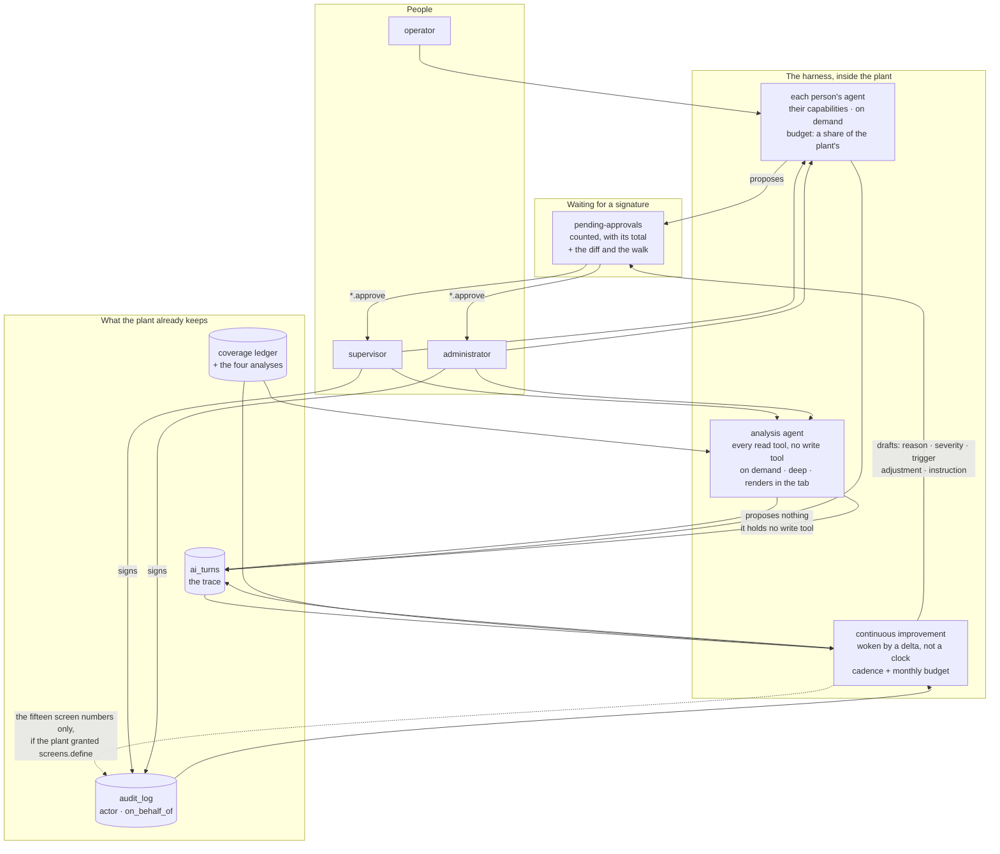

# The MES as an agentic harness

*Design. Written 2026-09-27 against `main` at `f9705990`, before anything is
built. Scott asked, that morning, how the AI tab becomes "the dashboard of an
MES agentic harness" — every person with their own agent, functional agents for
deep work, a continuous-improvement team on a cadence, and "this whole crew
setup, basically running in Bottling. Not exactly." This page answers that with
the code cited and proposes a boundary for what an agent may put in force
without a signature.*

***Revised 2026-09-28** against `main` at `ad5219d3`, to what Scott decided that
morning. His ten answers are quoted in full in [Decided](#decided-2026-09-28),
which also says, section by section, which recommendation was accepted, which was
accepted with a rider, and which was replaced. Two answers changed the shape of
the design: the harness changes the product's own **code**, UI first, and the
harness is the **engine of all product improvement** rather than one more
feature. §9 is now a four-milestone build plan sized as handoffs.
**Still nothing is built from this page.** The decision it turns on is
[0038](../decisions/0038-an-agent-is-an-account-with-a-role-a-budget-and-a-cadence.md),
accepted 2026-09-28 with those amendments.*

---

## Decided (2026-09-28)

Scott answered all ten questions of §10 on 2026-09-28 at about 06:20. **Eight
answers accept this page's recommendation. Two change its shape**, and this
revision is what they change. His words are below in full, unedited, because a
paraphrase of a decision is not the decision.

> **1. Is the line right?** Seems right to me but it should be configurable with the same agentic access to change.
>
> **2. "UI updates 100% automated" turned out to mean 15 specific numbers (the [screens] settings) — is that what you meant, or something bigger?** I was thinking a person should literally be able to change the code to improve the UI. Move cards, change graphs, etc. This should be as maliable as possible.
>
> **3. Want a new permission, screens.define, off by default, so a plant turns this on deliberately rather than getting it automatically?** Configurable with MCP tool.
>
> **4. Start with the CI crew that only proposes fixes (never applies them itself), plus the analysis agent's read-only tools? Or build the analysis agent alone first?** Analysis first with very good graphing capabilities.
>
> **5. Should it run warn-only for a release first — the crew proposes, nothing auto-applies, until you've seen a month of what it would have done?** Yes.
>
> **6. Should there be a new "AI" section in Configuration for agent budgets/schedules, rather than burying them in Setup?** Yes.
>
> **7. Per-person memory: start with none — the agent just stops forgetting mid-conversation, but doesn't remember facts about you — until there's a real design for memory you can read and delete?** I'd envision a fully customizable agent with full memory and potentially even a skill set later. I could envision each person eventually getting their own fully embodied agent that works on their behalf. But simple is best for now and I'd defer to a simpler proof of concept, with just retaining memory for now.
>
> **8. Right now nobody can read their own past AI conversations, and it's not private from supervisors either. Add a "my agent" view, and say that out loud in the UI?** Yes.
>
> **9. If the analysis agent runs in shadow/offline mode: turn it off and say so, or let it answer worse with a local model? (recommends: off)** Off.
>
> **10. The honest case against doing any of this is in §9 — this ranks 5th of 5 on your own priority list, nobody outside this machine asked for it. Is it worth an evening a week for a month, against the first-real-machine work you've called the real bottleneck?** I feel this should be a tool for driving product improvement and thus should accelerate solutions for all other areas. That's the goal for this harness. To make this product self evolve on its own. In that regard, this should become the bottle neck for driving all other improvements on that list. For example, if I wanted to integrate with SAP or fix any ERPNext connection, then it should be this harness that allows be to fix or build it.

### What each section now says

| § | The recommendation it made | Ruling |
|---|---|---|
| 2 — the map: crew → plant | the crew's five ideas, ported; the steward's safety model replaced by the approvals queue | **replaced by answer 10.** The map is not an analogy. The crew's roles run *inside the product, against the product's own repository*, and §2a below says what runs where |
| 3 — one agent per person | a durable transcript; the trace unchanged; **no memory at first** | **accepted, except memory, replaced by answer 7**: a simple proof of concept that retains memory. §3 defines what that is and what it is not |
| 3, 8 — a "my agent" view behind `plant.read`, and the panel saying out loud that a supervisor can read what you type | | **accepted** (answer 8) |
| 4 — functional agents as six fields | an agent kind is an account, a tool set, a cadence, a budget, a data class and one place its work lands | **accepted**, and answer 10 adds a seventh thing a code-editing kind needs: a checkout. §2a |
| 5 — the signature boundary | five clauses; the automatable set is fifteen screen numbers | **replaced by answer 2.** Fifteen numbers is a floor, not the thing. §5 is now three tiers, and the middle one is the harness changing the product's own code. The five clauses survive as tier (a)'s test |
| 5 — the automation line itself | a judgement written into the product | **accepted with the rider** (answer 1): the line is a Configuration setting the agent may read and propose changes to through the settings tools, gated on `*.approve` |
| 5 — `screens.define`, off `agent` by default | a new capability an administrator grants deliberately | **accepted with the rider** (answer 3): granted and revoked through the same settings tools, not only by hand |
| 5 — warn-only for a release first | the crew proposes; automation is switched on by a plant that has read a month of proposals | **accepted** (answer 5), and it now applies to tier (b) as well as tier (a) |
| 6 — bare minimum by default | a default screen answers a question somebody has while standing up | **accepted**, not asked about, unchanged |
| 7 — budgets, cadences, and a fifth `ai` Configuration domain inside the AI nav group | | **accepted** (answer 6) |
| 8 — the AI tab as the dashboard | what the AI did, what it costs, what it is waiting on; at most one number per agent | **accepted**, and it is where M1's charts render |
| 9 — start with the CI crew (option A), taking the analysis agent's read tools along | | **replaced by answer 4**: the analysis agent first, *"with very good graphing capabilities"*. §9 is now a four-milestone build plan in the order the answers imply |
| 9 — the analysis agent in shadow mode | off, and saying so | **accepted** (answer 9) |
| 9 — the case for building none of it yet | this ranks fifth of five on the project's own strategy pages | **kept, and answered** by answer 10 in §9. The case is not withdrawn; it is overruled with a reason, and the reason is testable |

### The two amendments, stated once

**Amendment A (answer 2) — the harness changes the product's code.** *"I was
thinking a person should literally be able to change the code to improve the UI.
Move cards, change graphs, etc. This should be as maliable as possible."* The
automated tier this page drew — fifteen `[screens]` numbers a plant runs at — is
a floor. The thing is an agent that **edits `web/*.html`, `web/*.js` and
`web/*.css`, runs the test tiers the repository already has (the `browser` tier
included), and lands the change through the same review the maintainer's own crew
uses: a branch, a pull request, CI, and a person's merge.** Decision
[0035](../decisions/0035-configuration-is-authored-by-roles-and-selected-by-operators.md)'s
rule that the agent never approves is kept exactly, and the mechanism that keeps
it is that **the merge is the signature**. §5 is rewritten around that.

**Amendment B (answer 10) — the harness is the engine, not a feature.** *"This
should become the bottle neck for driving all other improvements on that list.
For example, if I wanted to integrate with SAP or fix any ERPNext connection,
then it should be this harness that allows be to fix or build it."* So §2's
crew → plant table stops being an analogy: the roles the maintainer runs on his
own machine — a steward that keeps a board, executors that take a handoff to a
pull request, a triage that wakes on a delta, an evolver that changes the
machinery — are what runs **inside the product, against the product's own
repository**, budgeted and scheduled by the plant, with a person's merge as the
signature. §2a says what runs where and what it honestly cannot do.

**One thing this page still refuses to say.** Nothing here claims the harness
will make the product self-evolve. That is the stated goal, in Scott's words, and
§5 says tier by tier what would have to be true for a change to land without a
person: a test that fails on the bug, a `browser` tier that runs it, a diff
confined to a declared file set, a warn-only release whose proposals a person
reviewed, and an automation line the plant wrote down. Until those hold, every
code change is a pull request a person merges, and the page says so in every
section that touches code.

---

## 1. What the harness is for

Scott's sentence is the specification: *"ultimately the goal of this MES is to
make better manufacturing decisions."* So the first thing to pin down is what a
decision is in this product, because the harness is worth exactly as much as
the decisions it improves and nothing more.

### A decision here is a write with a name on it

This MES has **68 write routes; 66 of them a screen calls**
(`docs/operate/assistant-coverage.md`, generated 2026-09-27). Almost all of
them record something that happened. A much smaller set *decides* something —
a person commits the plant to a state it was not in, and the record says who:

| The decision | The route | Who may |
|---|---|---|
| Put a work instruction in force | `POST /documents/{code}/approve/{revision}` | `documents.approve` |
| Put a trigger in force — logic against a live plant | `POST /triggers/{code}/approve` | `triggers.approve` |
| Write a setpoint to a PLC | `POST /adjustments/{code}/approve` | `adjustments.approve` |
| Name what every stop from now on is called | `POST /equipment/downtime-reasons/{code}/approve/{revision}` | `process.approve` |
| Grade what every non-conformance is graded at | `POST /quality/severities/{code}/approve/{revision}` | `quality.approve` |
| Disposition a non-conformance | `POST /quality/nonconformances/{code}/disposition` | `quality.close_nc` |
| Close an order short, or over | `POST /workorders/{code}/close` | `orders.close` |
| Change what a role grants | `PUT /admin/roles/{code}` | `users.manage` |

Five of those eight are **signatures on a draft somebody else wrote**, and that
is the shape this product already has: a draft is authored by the role that owns
the domain and signed by the role that owns the consequence
([0035](../decisions/0035-configuration-is-authored-by-roles-and-selected-by-operators.md)).
It is also the shape the `agent` role is built around — it holds the drafting
half of every pair and never the approving half
(`src/fsmes/services/capabilities.py:130-142`).

**A better decision, then, is one of three things: a draft that arrives with
the evidence for it, a signature that happens sooner because somebody was told
a draft was waiting, or a signature that does not happen because the evidence
said not to.** Everything the harness does has to land on that list. A screen
that makes a number prettier is not on it.

### "Actionable to the company" is a proposal, a walk, or a signature

Scott's other phrase — *"making it actionable to the company"* — has a test in
this repository already. Three things count as actionable output:

- **a proposal with its evidence**, which is what `recommended_adjustments`
  already is: `rationale` is required and refused empty
  (*"a recommendation needs a rationale - what was seen, and why this value"*),
  `evidence` is the JSON of what the proposer looked at, and the queue is
  *"the only way anything writes to a PLC"* (`src/fsmes/domain/adjustments.py`);
- **a walk**, which is what the assistant already puts on a screen: 38 authored
  surfaces (`services/assistant.py`, `SURFACES`), each one landing on the real
  control with the real values in it;
- **a signed change**, which is a row in `audit_log` with `actor`,
  `on_behalf_of`, `before` and `after`.

**Nothing else counts, and in particular a dashboard does not.** That is not a
style preference; it is what the product has already decided twice. Decision
[0023](../decisions/0023-the-fleet-console-observes.md) rejected Grafana for the
fleet view with one line that applies to every chart this harness might draw:
it puts the view *"outside the product, where the honesty rules do not reach"*.
And the same record rejected a single fleet OEE because *"a fleet OEE is a lie
unless every plant is the same shape, and no two plants are"* — rule 1 at
company scale.

### What the harness inherits, and cannot argue with

Everything below is already accepted and binds every part of this page.

| Rule | Where | What it forbids the harness |
|---|---|---|
| Never invent production; unknown is not zero | house rules 1–2, `CONTRIBUTING.md`; [0019](../decisions/0019-count-everything-the-machine-counted.md), [0030](../decisions/0030-a-lost-connection-is-unknown-time.md) | drawing a gap as a zero, or a missing edge as no edge |
| Every figure carries how much of the window was watched | [0033](../decisions/0033-availability-is-a-share-of-what-was-watched.md) | an agent's number without its coverage beside it |
| What is withheld is the figure, never the evidence | [0033](../decisions/0033-availability-is-a-share-of-what-was-watched.md) | an agent that hides a ledger it could not summarise |
| The honesty rules must reach the view | [0023](../decisions/0023-the-fleet-console-observes.md) | rendering plant numbers anywhere the product's rules do not apply |
| A judgment is a proposal, and never an input to a graded number | [0031](../decisions/0031-a-judgment-is-a-proposal.md) | a model's answer reaching OEE, a booked count, a yield or CI |
| A question declares the class of state it sends; shadow refuses by class | [0032](../decisions/0032-a-hosted-judgment-and-the-shadow.md) | any agent that has not said what leaves the box |
| The agent drafts; a person signs | [0035](../decisions/0035-configuration-is-authored-by-roles-and-selected-by-operators.md) | an agent holding any `*.approve` |
| Every list states its total | house rule; `STYLE.md` rule 4 | a graph, a roster or a proposals queue that reads complete when it is not |
| One database per plant | [0021](../decisions/0021-one-database-per-plant.md) | a harness that keeps its state anywhere but the plant's own database |

One consequence is worth stating early because it cuts against the most
exciting-sounding version of this idea. **An agent in this harness may not make
the plant's numbers better.** It may not label a stop, assign an orphan count,
or fill a coverage gap: 0031 puts a model's answer *beside* the fact, never in
place of it, and 0033's withheld figures stay withheld. What it may do is read
those refusals — the `unlabelled` bucket, the four `not_observed` causes, the
`unassigned_production` list — and propose the change that would stop them
recurring. **The harness's job is to act on the product's honesty, not to
paper over it.**

---

## 2. The map: crew → plant

Scott: *"make this whole crew setup I have here, basically run in Bottling. Not
exactly, I don't want my crew session there, but something like that."*

The "not exactly" is load-bearing, and it is worth saying why before the table.
The crew is six role files, three shell scripts and a timer, driving Claude Code
sessions in terminal panes. **Most of the machinery is repair, not
orchestration.** Of the 200 lines of `bin/crew-up`, roughly 60 orchestrate and
roughly 80 repair the runtime: agents restored without their role after a
snapshot restore, a phone channel that went dead, a session that acquired a
`/loop` and ran 48 times a day for four days, orphan panes, sessions that drift
from their role after two weeks, and a screen-scraper that sends arrow keys at a
"trust this folder" dialog so a headless agent is not blocked for ever. None of
that is an idea. It is scar tissue from running an interactive CLI as a daemon,
and **in a server process the whole category disappears** — which is most of
what "not exactly" means.

What is left, after the scar tissue, is five ideas and one posture.

### The table

| In the crew | What it actually is | In the plant | Why |
|---|---|---|---|
| **steward** | the only role in `--permission-mode default`: the risky calls become a dialog on Scott's phone | **no agent.** It is the *approvals queue* plus the person who signs | The steward is not a worker, it is the human-in-the-loop mechanism. An agent called "steward" would be an agent holding `*.approve`, which 0035 forbids. The plant already has the queue: `GET /dashboard/pending-approvals` |
| **executor** | one handoff → one pull request → stop | **one proposal.** A draft with its evidence, landing in the queue, and the agent stops | Already the shape of `recommended_adjustments` and of every draft revision. The discipline that ports is the write order: *the status flip is the last write, because a watcher fires on it* |
| **triage** | woken by a no-model delta against a watermark, never by a clock; the model advances the watermark itself | **the continuous-improvement crew's trigger** | The best idea in the crew and the cheapest to copy. 131 script passes a week, 22 with news, a handful of model wakes — against the 48 model passes a day of the `/loop` it replaced |
| **evolver** | changes the crew and never the product; only on surplus; each change states the effect expected in next week's report; a smoke test gates it; `rollback` to a blessed tag | **the part of the CI crew that may act without a signature** (§5) | Its three disciplines are exactly the ones §5 needs: spend only surplus, state the expected effect, and keep a one-step undo |
| **scout** | reads the internet weekly, writes one report, proposes at most three drafts | **no plant analogue, deliberately** | A scout is outbound by construction, and [0032](../decisions/0032-a-hosted-judgment-and-the-shadow.md) is about what may leave the box. The nearest plant-side thing is the fleet console, and [0023](../decisions/0023-the-fleet-console-observes.md) says it observes |
| **explainer** | answers questions, never does work, files each one | **the per-person agent** (§3) | Near-identical already. Its failure is the warning: it was told to file a question as documentation and **filed none in nineteen days**, because nothing enforced it |
| **`THROTTLE`** | one integer, four legal values, resolving to *(which roles stand, how many run at once)* | **one plant setting** for how much AI this plant buys | Four values rather than a continuum, so it is explainable to an administrator. The crew's own mistake to avoid: the cap is written twice (`crew-lib.sh` and the guard hook). One table, two readers |
| **the meter and the line** | `line = throttle × elapsed ÷ window`, with a five-point margin and an end-of-window sweep-up | **spend against plan, per agent** (§7) | Four lines of arithmetic over (share, elapsed, reset). It answers "may I spend now" with no coordinator. But note: the crew's meter is *scraped out of a terminal statusline*. The plant's is already a real number — `usd` on every `ai_turns` row |
| **standing orders** | prose Scott edits and agents may not, enforced by a hook | **the six house rules and the accepted decisions** | Already stronger: they ship in the wheel, and the capability checks and `shadow.REGISTER` enforce them in code rather than in prose |
| **`BOARD.md`** | the plan, who holds what, what is waiting | **no analogue, and none wanted** | The board exists because the crew has no database. It is edited by one guarded script (`bin/board-edit`) that refuses a write shrinking the file by more than 10 %, because an agent once truncated it and nobody noticed for fifteen hours. The plant has a database and [0021](../decisions/0021-one-database-per-plant.md) |
| **`handoffs/*.md`** | 116 files, 100 done; `Goal / Why / Constraints / Definition of done / Out of scope / Result` | **the draft rows that already exist** — a document revision, a trigger, an adjustment, a reason, a severity | `Why` cites its provenance; `Result` carries *Verified* and *Left out, and why*. A proposal's `rationale` and `evidence` are the same two fields |
| **`journal/`** | 479 stanzas, append-only, several concurrent writers, no locking — timestamps run backwards and three files carry a duplicate heading | **`ai_turns` and `audit_log`** | Already there and already better: indexed, pruned to a stated horizon, gated on `audit.read`, and one writer per row |
| **`reports/fitness-*.md`** | the crew measuring itself weekly | **the eval suite and `fsmes assist coverage`** | Both exist. Neither is on the AI tab yet (§8) |
| **`bin/crew-guard`** | seven mechanical refusals | **the capability checks, and `shadow.REGISTER`'s 35 entries** | The lesson, not the mechanism: *every rule in the guard exists because prose failed first.* The role file said "you do not loop" and the agent looped for four days |
| **panes, sessions, `--resume`, permission modes, `clear_trust_dialog`** | ~80 of `crew-up`'s 200 lines | **nothing** | This is the "not exactly". A server process has one long-lived loop already (`api/app.py`'s lifespan) and needs none of it |

### The five ideas worth taking, in order

1. **Wake on a delta, not on a clock** — and let the expensive thing advance the
   watermark, so a wake that did nothing is visible rather than silent.
2. **A budget is arithmetic, not a limit** — spend-so-far against share-times-
   elapsed, with a margin. It tells an agent whether it may run without asking
   anybody.
3. **One ordinal knob** resolving to which agents stand and how much runs at
   once, held in one place.
4. **A role is a row**: prompt, model, tool subset, cadence, budget, and where
   its work lands. And the distinction that matters — a *standing* agent resumes,
   a *one-shot* agent starts fresh, because "a two-week session drifts from its
   role".
5. **The cheap tier runs first.** The crew has a local index that searches,
   answers and first-pass classifies for free, and the rule is to use it before
   reading whole files. The plant has qwen on the box for exactly this.

And the one posture: **the risky thing becomes a question, and the agent waits.**
In the crew that is a terminal dialog on Scott's phone. In a plant it cannot be,
because the person who must answer is on a shift and may never open a terminal.
**So the whole of the crew's safety model has to be replaced by the approvals
queue, and that is the single most important thing this design has to get
right.** It is also the thing the market is asking for: ABI Research's
2026-07-30 note names the leaders for aligning with *"repeatability,
transparency, and human oversight, rather than promising fully autonomous
execution on the factory floor"*.

### 2a. Amended by answer 10: the map is not an analogy

Scott, 2026-09-28: *"This should become the bottle neck for driving all other
improvements on that list. For example, if I wanted to integrate with SAP or fix
any ERPNext connection, then it should be this harness that allows be to fix or
build it."*

So the table above is not a set of metaphors. **The roles are what runs inside
the product, against the product's own repository.** A steward that keeps a
board of what is being worked on; executors that take one piece of work from open
to a pull request and stop; a triage woken by a delta rather than a clock; an
evolver that changes the machinery and never the product in the same pass. The
plant schedules them and pays for them; a person merges.

That is a bigger claim than anything else on this page, so it is worth being
exact about what it requires, because three of the four requirements do not exist
and one of them cannot exist in some plants.

#### What runs where

**The plant box has the wheel, not the repository.** A plant runs `fsmes` from an
installed wheel (PyPI, or the container image) with its own database beside it
([0021](../decisions/0021-one-database-per-plant.md)). There is no git checkout
on it, no compiler, no test runner and no network path to GitHub, and none of
those is an oversight: [0005](../decisions/0005-plain-html-no-build-step.md) is
*"plain HTML, CSS and JS, no build step"* precisely so a plant PC needs no
toolchain for years.

So a harness that edits code needs three things the plant does not have, and they
have to be somewhere:

| What it needs | Where it can honestly be | What it is today |
|---|---|---|
| **A checkout of the product's source** | not the plant. A machine the maintainer controls — his own box, a runner, or a container the project publishes — holding a clone and a branch per proposal | the maintainer's own crew already is this, exactly: worktrees under `~/.herdr/worktrees/`, a branch per handoff |
| **A CI that can fail the change** | GitHub Actions, already: `test`, `postgres`, `browser`, `lab`, `lockfile`, `wheel-demo`, plus the DCO sign-off check | exists and is required on pull requests |
| **A way for the result to reach a running plant** | **a release.** A merged change reaches a plant when the plant upgrades its wheel or its image and runs its migrations — which ship in the wheel since #25 | exists, and is the only path |

**The consequence, stated plainly: a code change made by the harness does not
reach a plant until the plant upgrades.** There is no hot patch, no code pushed
down a wire into a running plant, and this page does not propose one. A plant
that pulled executable code from the internet at run time would be a plant that
fails its own change management, and the field's most disciplined comparable
project refuses even to run resident on an OT network for the same reason (§9).
The loop is: the plant's records produce the finding → a checkout somewhere else
produces the change → CI judges it → a person merges it → the release carries it
back. **The plant is where the evidence and the goal come from; it is not where
the compiler runs.**

#### What a plant with no internet can do

An air-gapped or shadow-mode plant cannot participate in the code half at all,
and it should be told so rather than shown a dead button. What it can still do is
everything the harness does with configuration and evidence:

- **Produce the finding.** The crawl over its own refusals — unlabelled seconds,
  withheld stations, orphan counts, drafts nobody signed — runs on the local
  model or on no model at all, and its output is a proposal in the plant's own
  queue.
- **Export the finding, not the data.** A proposal is a sentence, an evidence
  payload and a diff. `fsmes shadow`'s register already names, per class, what
  may leave the box ([0032](../decisions/0032-a-hosted-judgment-and-the-shadow.md));
  a finding written for a maintainer is `catalogue` or `configuration` class, and
  a plant that will not export even that is a plant that contributes nothing
  upstream and keeps working.
- **Receive the fix as a release**, like every other plant.

What it cannot do is run the cloud brain, and the register already refuses that
with its own sentence: *"it carries this plant's numbers off the box, and a plant
lending us its data to watch did not agree to that."*

#### What the maintainer's own crew keeps doing

**Governance of the public repository stays a person's, and stays outside the
product.** Merging, releasing, tagging, answering an issue, writing on the
website, posting anywhere — the crew's standing orders already reserve every one
of those for Scott, and nothing in this design moves them into a plant. A plant's
harness may open a pull request; it may not merge one, may not tag a release, and
has no account on GitHub of its own that a maintainer did not deliberately give
it.

That division is also the answer to *"I don't want my crew session there"* from
2026-09-27: **the crew's shape ports; the crew's session does not.** About 80 of
`bin/crew-up`'s 200 lines are repair of an interactive CLI run as a daemon, and
in a server process that whole category disappears.

#### What answer 10 does to the priority list

It reverses it, and that is the whole of the argument in §9. Every other item on
the project's roadmap costs an evening per improvement. If SAP and ERPNext work
is to go *through* the harness, then the harness is not competing with the
first-real-machine work for evenings — it is the thing that is supposed to make
each of those evenings produce more than one change. **That is a claim that can
be wrong, and §9 says what would show it wrong.**

---

## 3. One agent per person

Scott: *"each user gets their own agent (this tab manages context/history)."*

### What a person has today, and how long they have it

Three stores, and only one of them survives anything.

| Store | Where | Lives for | Holds |
|---|---|---|---|
| The conversation the model actually sees | `agent._sessions`, a dict in the API process (`services/agent.py:686`) | until 30 minutes of silence (`[admin] agent_session_ttl_seconds`), a restart, or a second worker taking the next request | the whole message history, the open proposals, the tool results |
| What the panel showed | the browser's `sessionStorage`, capped at `[screens] assistant_log_entries` (60) | until the tab closes | the rendered lines |
| The plant's record | `ai_turns`, in the plant's own database | `[admin] ai_trace_days`, ninety days by default; `0` keeps everything | one row per turn: `asked`, `said`, tool summaries, proposals and outcomes, tokens, `usd` |

**So the honest answer to "each user gets their own agent" today is: for thirty
minutes, in one process's memory, and it forgets everything on restart.** After
that the person starts cold. An open proposal card is not even confirmable — the
confirm endpoint answers *"that conversation has expired - ask again"*.

The handoff for this page assumed `ai_turns` is already the history. **It is
not, and this is the most important correction on the page.** `ai_turns` is a
*record for people*: tool payloads are deliberately excluded, summaries are cut
at 160 characters, it is pruned, and nothing anywhere reads it back into a
session. It cannot be replayed to a model, and it was never meant to be
([`docs/operate/ai.md`](../operate/ai.md); `domain/ai_turns.py`).

There is a second problem in the same place. **The AI tab is behind
`audit.read`, which an operator does not hold.** So today a person cannot read
their own past conversations; a supervisor can read everybody's. That is right
for an audit screen and wrong for "each user gets their own agent", and the two
are different screens wanting different gates.

### What to build, in three pieces that are deliberately separate

1. **A transcript the person owns.** Durable, keyed to the person, replayable to
   a model — the `tool_use`/`tool_result` blocks the Messages API needs, which
   `ai_turns` deliberately does not keep. It is the person's own, readable by
   them **without `audit.read`**, and it is what makes "pick up where we left
   off" true. Recommendation: a table of its own in the plant's database
   (0021), with its own horizon, defaulting shorter than the trace's ninety
   days — a transcript is a convenience and the trace is the record.
2. **The trace.** Exists. Unchanged. Behind `audit.read`, because it is the
   record of what was done in this plant and by whom.
3. **Memory, which is not history.** This page recommended **nothing at first**.
   **Answer 7 replaced that**: *"I'd envision a fully customizable agent with
   full memory and potentially even a skill set later … But simple is best for
   now and I'd defer to a simpler proof of concept, with just retaining memory
   for now."*

   So memory is in, at proof-of-concept size, and the size has to be written
   down or it will grow. **"Retaining memory", for M2, is exactly two things:**

   - **the durable transcript** of piece 1 above — the agent picks up where the
     person left off, across a restart and across a week, because the
     `tool_use`/`tool_result` blocks were kept; and
   - **a short remembered-facts list**, plain sentences, **which the person can
     read and delete on the `my agent` view**, with a stated maximum number of
     entries and its total shown beside it like every other list.

   **And nothing else.** Not a skill set, not a profile the agent infers, not a
   vector store, not a memory shared between people, and **never a plant
   number** — a remembered number is a plant fact cached outside the table that
   owns it, which is the thing `ai_turns` already refuses to do (*"a screen gated
   on `audit.read` that carried raw tool results would be a way around the
   capabilities those rows are behind"*). The agent re-reads numbers every turn
   because the system prompt already tells it to, and a remembered "OEE on MIX01
   is 62 %" would be wrong by the next shift and convincing anyway.

   Two consequences that must be built with it rather than after it. A
   remembered fact is **written only when the person's own turn put it there**,
   so the list is readable as things I told it about me rather than things it
   decided about me. And a remembered fact is **not private from a supervisor**,
   like everything else in the trace, so the same sentence that says so on the
   panel says so on the memory list. The fully embodied agent with a skill set
   is a later design, and this page does not pretend to be it.

### What is private, and what the plant may see

Say this plainly on the page and on the screen, because it is not what people
assume: **nothing a person types to the assistant is private.** It is in
`ai_turns` and every holder of `audit.read` can read it. That is the correct
answer for a regulated MES — the trace exists because on 2026-09-26 a
conversation broke and nothing on the machine could say what it had been asked —
but it means a per-person agent is not a private assistant, and the tab should
say so where a person types.

Purging is already honest and stays: rows past the horizon are deleted as new
ones are written, so the screen shows what the plant has rather than what a
cleanup job got round to.

### What it costs

Today, one number for everything: `MES_AGENT_MONTHLY_USD`, default `$10`,
summed from `~/.local/share/fsmes/agent-usage.jsonl`. Three things about it are
wrong for a harness and §7 fixes them: it is **an environment variable, not a
plant setting**; it is **per box, not per plant** (that file holds every plant
on the machine); and it is **one pool**, so a person's conversation and a
nightly crawl spend the same money with no way to say which may have it.

### What it must never do — the current design, kept, with one hole named

An agent acts within the capabilities of the person it acts for. That is
enforced in `catalogue()` and `withheld()`: the model is never shown a tool the
person may not use, and the list of what they may not do is in the cached system
prompt, each entry with the capability and who holds it. Keep all of it. One
thing is not true yet and a harness will make it worse:

- **`on_behalf_of` is attribution, not authorisation.** The API authorises
  against the `AGENT` account's own role — 14 capabilities, no `*.approve` —
  and the *person's* capabilities are enforced only inside `agent.py`, on this
  side of the API. That is deliberate and it works, but it means **every new
  agent kind either gets its own account and role or silently inherits AGENT's
  fourteen.** §4 makes that a requirement.

**The second hole this page found has been closed since it was written, and the
numbers in it have moved with the fix.** Nine write tools — `add_person`,
`register_gauge`, `calibrate_gauge`, `issue_certificate`,
`issue_pallet_certificate`, `produce_batch`, `pack_unit`, `set_unit_status` and
`erp_retry` — were in no `NEEDS` entry and no `SURFACES` entry, so `catalogue()`
offered all nine to anybody holding `plant.read`, and only the API's own gate
against the `AGENT` account refused them. **PR #119 closed it on 2026-09-27.**
Measured against `main` at `ad5219d3`, which this revision is written against:
`NEEDS ∪ PER_CALL_NEEDS` is now **47 of the 47 write tools** rather than 38, and
the catalogue offered on `plant.read` alone is **51** — every read tool that
takes a `plant` argument, and no write tool at all — rather than 60.
`assistant-coverage.md` is accurate for those nine rows again. It is named here
rather than deleted because it is the reason §4's first field is the account:
the hole existed for months and nothing exploited it only because the floor
assistant never writes unattended.

### The tab is where a person manages their own agent

Which, concretely, means the AI tab needs a second view that is **the person's
own**: my conversations, what my agent spent, what it has proposed for me and
what became of each, and a way to start again. `plant.read` is the right gate
for that view; `audit.read` stays the gate for everybody's.

---

## 4. Functional agents

Scott: *"there should be functional agents, like data analysis with full MCP for
extremely advanced analytics if necessary … Along with a continuous improvement
team that crawls this data at some configured time span to look for
improvements."*

### What a functional agent is — six fields, and it is a row

Recommendation: **an agent kind is a row in the plant's database with six
fields, and nothing more.** This is the crew's "a role is a row", with the
crew's scar tissue left out.

| Field | What it is | Already exists as |
|---|---|---|
| **account and role** | its own `Person` row and a role that is a bundle of capabilities | `AGENT` is already exactly this (`plant.py:84`, role `agent`, 14 capabilities) |
| **tool set** | which of the 100 MCP tools it may call | `catalogue(capabilities)` already computes it; a kind names a further subset |
| **cadence** | on demand, or a named interval | nothing. The one precedent is the hourly retention task in `api/app.py`'s lifespan |
| **budget** | what it may spend in a month, and what one run may spend | `MES_AGENT_MONTHLY_USD` for the whole box; `[admin] agent_max_rounds` per conversation |
| **data class** | what state its questions carry off the box | [0032](../decisions/0032-a-hosted-judgment-and-the-shadow.md)'s four classes: catalogue, configuration, observation, production |
| **where its work lands** | the table its output is a row in | `recommended_adjustments`, the draft revisions, and the approvals queue |

**A kind declares all six or it does not exist.** The fifth is the one nobody
would think to add: an agent that has not said what leaves the box cannot be
switched on in a plant that cares, and 0032 already made every *question* say
it.

**Amendment A adds a seventh field, and only for the kinds that have it: a
checkout.** A kind that edits the product's own code needs a clone of the
repository, a branch per proposal, and a CI that can fail it — and §2a says why
none of those is on the plant box and what that means for a plant with no
internet. The six fields above are unchanged for every kind that does not edit
code, which is all of them until M4.

### (a) The analysis agent

*What it is.* On demand, from the AI tab, for somebody who has sat down with a
question. It reads deeply and writes nothing.

*"Full MCP" means every read tool and no write tool.* Concretely, today: **53
read-only tools of the 100** — and `catalogue()`'s own filter drops two that
take no `plant` argument, so the surface a model is actually offered is **51**,
plus the two walk tools. A write tool is recognised by having a `dry_run`
parameter (`agent.py:544`), and `assist_coverage.py` derives the same 47 names
independently from which helper each tool's body calls. **Two independent
definitions that agree is what makes "no write tool" checkable rather than
asserted**, and the test should be written that way: the analysis kind's
catalogue is asserted to contain no tool with `dry_run`.

*The gap to close first.* The four analyses this product already computes —
`oee_breakdown`, `state_timeline`, `downtime_pareto`, `tag_trend` — **have no
MCP tool at all.** They are HTTP-only (`api/routers/analysis.py`), and the
`analysis` module carries no `tools=`. So an "extremely advanced analytics"
agent today cannot reach the plant's own analytics; it would recompute them
from `machines`, `downtime` and `tag_trend`, and a recomputed OEE is the thing
[0031](../decisions/0031-a-judgment-is-a-proposal.md) and
[0033](../decisions/0033-availability-is-a-share-of-what-was-watched.md) exist
to prevent. **Four read tools over the existing service is the whole of the
analysis agent's first requirement**, and they must return the payload the
screens get — `coverage`, `coverage_note`, the full ledger, `unknown_seconds`,
`labelled_by`, every `total` — so the agent inherits the honesty rather than
being told about it.

*What it may render.* Explorations, in the AI tab or beside the conversation,
for the person who asked. Never a default screen (§6). Every number it shows
carries its coverage, because the payload carries it; a station whose figures
are withheld is reported withheld with its ledger, not omitted and not
averaged away.

*What it must never do.* Compute a KPI itself. Answer a question the ledger
withheld. Reach a graded number. All three are 0031 and 0033 already.

### (b) The continuous-improvement crew

*What it is.* A scheduled crawl over records the plant already keeps, producing
**proposals and nothing else**.

*What it reads.* The trace (`ai_turns`), the audit trail, the four analyses, the
coverage ledger, the eval results, and the plant's own refusals — the
`unlabelled` bucket, the four `not_observed` causes, `unassigned_production`,
the withheld stations, the drafts that have been waiting.

*Where its work lands — and this is the important part.* **Into the flows that
already exist, never a third mechanism.** There are exactly five draft-and-sign
pairs in this product and the `agent` role already holds the drafting half of
every one:

| What it finds | What it drafts | Who signs |
|---|---|---|
| 40 % of stops typed four ways | a downtime reason (`draft_downtime_reason`, `process.define`) | `process.approve` |
| non-conformances graded in free text | a severity (`draft_nc_severity`, `quality.define`) | `quality.approve` |
| a stop pattern a condition would catch | a trigger (`draft_trigger`, `triggers.write`) | `triggers.approve` |
| scrap tracking a setpoint over 40 hours | an adjustment with `rationale` and `evidence` (`propose_adjustment`) | `adjustments.approve` |
| a procedure the floor works around | an instruction revision (`revise_document`, `documents.write`) | `documents.approve` |

And it lands where an approver will see it: `GET /dashboard/pending-approvals`,
which already answers *"what is waiting that **this caller** may act on, counted,
with its total"* from the caller's live capabilities, and which already refuses
to list a kind it cannot show the substance of. Two kinds are wired today
(`review.KINDS`: downtime reason, NC severity); work instructions, triggers and
adjustments are named in the code as the follow-up, *"an entry in that registry,
not a new mechanism here"*. **Wiring the remaining three is a prerequisite for
the CI crew, and it is worth doing whether or not any of this is built.**

*And its role is not `AGENT`'s.* The five drafting capabilities it needs are the
five in the table and nothing else. It must not simply sign in as `AGENT` and
inherit that role's whole bundle, for a reason §5 sets out and which is the single
strongest finding on this page: `AGENT` holds `process.define` and
`quality.define`, and twenty-four live settings behind those two take effect the
moment they are saved.

*Its cadence.* One precedent, and it is the right one: the tag-retention sweep
in `api/app.py`'s lifespan, whose own comment states the pattern — *"Retention
runs in the API process because it is the one long-lived process every
deployment has. Hourly, in batches, and it says so on Ops."* A nightly crawl is
that task with a different interval and a plant setting behind it.

*Its trigger, better than a clock.* Take the crew's best idea. A no-model delta
first: has anything the crawl is about changed since the last pass — new
unlabelled seconds, a new withheld station, a new open non-conformance, a draft
that has crossed a waiting threshold? **If nothing changed, no model runs, and
the pass is recorded as a pass that found nothing.** The agent itself advances
the watermark, so a wake that did nothing is visible. The crew replaced 48
model passes a day with a handful this way.

*What "found nothing" must never look like.* `ai_status`'s rule already:
**unknown is not zero and stale is not dead** — *"a night the loop did not run
is unknown in the morning, never a quiet 'clean'."*

---

## 5. What needs a signature, and what does not

Scott, 2026-09-27: *"Maybe even making things like UI updates 100 % automated
whereas other improvements need ADMIN user approval."*

Scott, 2026-09-28, answer 2, which replaced this section's shape: *"I was
thinking a person should literally be able to change the code to improve the UI.
Move cards, change graphs, etc. This should be as maliable as possible."*

**So there are three tiers, not one line.** The fifteen numbers this page found
are the floor — tier (a). The thing Scott means is tier (b), the harness changing
the product's own code. Tier (c) is everything else, and it never automates.
Each tier below has its **test** — what has to pass before the change counts as
safe — and its **signature** — who or what stands behind it.

### Where the line is today

There is no automated tier *by design*, and the reason is not caution — it is
that the settings Scott means are behind the administrator's own capability.
There is one *by accident*, and it is the subsection after this. The
numbers the screens run at are the `[screens]` pack table: **fifteen keys across
six Configuration sections** (how often a screen re-reads the plant, how many
machine cards and orders a page shows, how many rows Admin lists, the whole-list
ceiling, how long a confirmation lingers and how long typing settles, and the
three numbers behind the assistant's own walks). Every one of the six sections
carries `define="users.manage"` (`modules.py:331-434`). The `agent` role
deliberately does not hold `users.manage`, so **an agent cannot write one of
them today, and `write_plant_setting` is refused with the capability named.**

And there is no code tier at all. **No agent in this product has ever written a
line of the product**, there is no checkout on a plant box (§2a), and the only
thing that changes a plant's code is an upgrade.

There is also a precedent for the opposite answer, and it is worth reading
before proposing anything: `signals.define` went to `admin` and **explicitly not
to `agent`**, with the reason in the source —

> *"an agent may draft a vocabulary for somebody to approve, and retuning how
> hard the OPC agent retries a booking is not drafting — there is nobody in the
> loop after it."*

**That sentence is the real boundary, and it survives amendment A intact.** Not
"is it the UI"; *is there anybody in the loop after it*. What answer 2 changes is
the answer for code, not the question: for a code change there **is** somebody in
the loop after it, and it is whoever merges the pull request.

### An automated tier already exists, by accident, and it is twenty-four keys

This is the most important thing this page found in the code, and nothing in the
amendments touches it.

A live Configuration section is written through
`PATCH /dashboard/config/{domain}/settings/{key}`, and *"the gate is the
section's, not this endpoint's"* — the capability is looked up per key from the
section that owns it
(`api/routers/dashboard.py:609-614`). A section with `approve=None` takes effect
when it is saved, which is rule three of
[0035](../decisions/0035-configuration-is-authored-by-roles-and-selected-by-operators.md):
a number with no pending state has nothing to sign.

**Twenty-two of the 56 sections — twenty-four keys — have `approve=None` and a
`define` the `agent` role already holds** (`process.define` or
`quality.define`). Among them:

- `[quality] hold_rules` and `[quality] major_rules` — which SPC rules raise a
  hold, the whole subject of [0036](../decisions/0036-the-chart-draws-every-rule-the-plant-chooses-which-hold.md);
- `[quality] cpk_capable` and `[quality] cpk_marginal` — the bars a process is
  judged capable against;
- `[oee] min_observed_seconds` — how little observed time is too little to
  divide by, which is the gate on whether availability is a number at all;
- `[quality] nc_code_prefix`, `[quality] serial_digits` — what records are
  *named*;
- `[process] default_report_hours`, `report_windows`, `gantt_screenful` — the
  presentation numbers, and the only three of the twenty-four that tier (a)
  below would admit.

Today nothing exploits this, for one reason: **the floor assistant never writes
unattended.** Every write is proposed, the person presses "Do it", and the
confirm runs as `AGENT` *on their behalf*. There is a person in the loop on every
one.

**A scheduled agent has nobody in front of it, and if it signs in as `AGENT` it
inherits all twenty-four.** So the first consequence of building a functional
agent is not a new capability — it is that **a functional agent must not run as
the `AGENT` account.** It needs a role of its own with a bundle chosen for its
job, which is exactly what §4's first field says and why that field is first.

The second consequence is that the honest version of tier (a) is a *narrowing*,
not a widening: the plant declares a small list of keys an unattended agent may
put in force, and every other live setting stays a proposal even though the
account could technically write it.

### Tier (a) — the numbers a screen runs at

*The change.* A value in the `[screens]` table, plus `[process] gantt_screenful`
(see below): how often a screen re-reads the plant, how many cards a page shows,
how long a confirmation lingers, how many times a walk retries an anchor.

*The test.* Five clauses, **all five** of which must hold:

1. it changes **a number a screen runs at**, not a number the plant is judged
   by. The test is what the number *does*, not which pack table it sits in —
   `[screens]` is the table where these live, and it is not quite the whole set
   (see `gantt_screenful` below);
2. it changes **no record's meaning** — not what a stop is called, not what a
   non-conformance is graded at, not what a figure counts, and not how long a
   record is kept;
3. it changes **nobody's capability**, and nothing a role grants;
4. **nothing a PLC reads** changes, directly or through a cadence that a write
   depends on;
5. it is **undone from the screen that shows it, in one step, by the same path
   that made it**.

*The signature.* **Warn-only for the first release** (answer 5): the crew
proposes the number like anything else, nothing applies itself, and a person
reads a month of what it would have done. After that release, and only in a plant
whose administrator has granted `screens.define`, the change applies itself and
writes its own audit row.

*Why this tier is small and stays small.* In 0035's vocabulary it is tier three's
presentation edge — a number whose only consequence is what a person sees on the
next page load. It is not a new tier; it is the smallest part of the existing
one. Anything failing one of the five clauses is tier (c).

### Tier (b) — the product's own UI code

This is what answer 2 asked for, and it is the new thing on this page.

*The change.* A diff to the operator UI's own files — moving a card, changing a
chart, adding a column, fixing a layout that is wrong on a phone — **proposed by
the harness as a branch and a pull request, and merged by a person.** Not applied
to a running plant; see §2a. It reaches plants in the next release, like every
other change.

*The test.* The repository's existing gates, unchanged and unweakened, all of
them required on the pull request: `test`, `postgres`, `browser`, `lab`,
`lockfile`, `wheel-demo`, and the DCO sign-off check. **The `browser` tier is the
one that matters here** — it exists because until 2026-09-25 the Chromium tests
were `slow`-marked and nothing ran them, and a `test_ui_nav` assertion had been
red on `main` for a day of green checks. A UI change with no browser test is a UI
change nobody checked.

Beyond the gates, **three things a code proposal must carry or it is not
reviewable**, taken from the crew's own handoff shape: the finding it came from,
with the record that produced it; a test that fails before the change and passes
after it, named as prose; and one sentence saying what it did not do and why.

*The signature.* **A person's merge, for a release — and that is not a temporary
measure, it is the mechanism.** Decision 0035 says the agent never approves.
Here the approval is the merge button on a pull request, held by a person with
commit rights on a repository the plant does not control. That is a stronger
signature than any `*.approve` capability in the product, because it is outside
the plant the agent is running in.

*What could later automate, and what could not.* After the warn-only release
(answer 5), the candidate for automation is narrow and it has to be written down
before it is granted, because "touch only `web/`" sounds obvious and is not.

**Included** — the per-screen files, where a diff confined to one screen's own
`web/<screen>.html`, `web/<screen>.js` and `web/<screen>.css` changes what that
one screen looks like and nothing else. There are 27 such HTML files, 32 JS and
16 CSS.

**Excluded, by name, even though they are under `web/`:**

| File | Why it is not presentation |
|---|---|
| `common.js` (778 lines) | the nav and the one `api()`. It exists because *"the nav was pasted into eight HTML files - which is how one page grew a duplicate link and seven lost their current-page marker"*. A change here changes every screen at once, and `test_ui_nav.py` checks the nav against the module registry |
| `assist.js` (952) and `assist-record.js` (552) | the walk engine and the recorder. Walks are how approvals are signed — *"approvals are walks to the signature"* (#113) — and the 2026-09-25 anchor race was a bug in this file that made the product look permission-broken on Scott's phone. Not layout |
| `kit.js` (255) | the one set of coverage charts, so that *"the Floor tile and the machine page can never state coverage differently"*. A change here changes how a coverage figure reads on four pages at once. That is honesty rendering, and honesty rendering is tier (c) |
| `styles.css` (586), `themes.css`, `themes.js` | the palette and the four themes — `STYLE.md` rules 2 and 3. All four themes are first-class, and a change to the palette is a change to every screen in four looks |
| `web/vendor/` | three.js, vendored with its licences and SHA-256s under the standing terms *"these files are read, never built"* |
| `web/line/`, `line3d.html` | the 3D line view, which is the one place the no-build-step rule is met by a vendored ES module rather than by hand-drawn SVG |

**And three exclusions that are about the diff rather than the file**, because a
change inside an included file can still be any of them:

- **Removing or renaming a `data-assist` anchor.** Guides point at anchors, and
  `tests/page_anchors.py` with `test_assistant.py` and `test_agent.py` fail when
  a guide step names an anchor its page does not have. The test catches it; the
  point is that it is not a presentation change, it is a change to how somebody
  is walked to a signature.
- **Moving a computation into the browser.** A screen draws what the API
  measured ([0031](../decisions/0031-a-judgment-is-a-proposal.md),
  [0033](../decisions/0033-availability-is-a-share-of-what-was-watched.md), and
  `kit.js`'s own *"nothing here computes a number"*). A diff that starts
  calculating a figure in JavaScript has changed what a number means, whatever
  directory it is in.
- **Fetching anything from outside the box** — a script tag, a font, a CDN.
  `STYLE.md` rule 9 and [0005](../decisions/0005-plain-html-no-build-step.md).

**One honest hole in automating this tier, and it has no answer yet.**
`fsmes ui-check` crawls every screen in every theme and judges it against
accepted baselines in `tests/ui/baselines/` — and `ui-check --accept` *makes the
current look the accepted look*. **An agent that may run `--accept` can erase the
only check that would have said the look changed.** So either the baselines are
re-accepted by a person as part of the merge, or tier (b) never automates at all.
This page recommends the first and names the second as the fallback; it does not
pretend the problem is solved.

### Tier (c) — everything else, always a person's merge

Everything not in (a) or (b): the kernel, the API, the domain services, the
capability model, migrations, the packs, the connectors, the docs that state a
rule. A harness may propose any of it — that is the whole of answer 10, and it is
how SAP or an ERPNext fix would arrive — and **none of it ever applies itself.**
There is no release after which tier (c) automates, and no setting that turns it
on.

Three things are not automatable at any tier, and the product already refuses
them: a person's capability, a password, and the deletion of a record. The
assistant has no tool for `DELETE /admin/roles/{code}`, for any `/auth/*`
password route, or for any `*.approve` route, each with a written reason.

### The line itself is a setting, not a constant (answer 1, and answer 3)

Scott, answer 1: *"Seems right to me but it should be configurable with the same
agentic access to change."* Answer 3, on `screens.define`: *"Configurable with
MCP tool."*

So the boundary above is not a constant in the wheel. **It is this plant's
configuration**, in the `[ai]` domain of §7, and it says: which tier (a) keys
this plant will let an agent write; whether tier (b) is warn-only or automated;
and which file set tier (b) counts as presentation. Three consequences follow
from putting it there, and all three are already the product's own rules:

- **The agent can read it and propose changes to it** through the settings tools
  that already exist (`read_plant_setting`, `write_plant_setting`,
  `propose_plant_setting`, §11 of [configuration assistance](config-assistance.md)),
  which is exactly what Scott asked for. It reads it the way it reads any other
  setting, and it proposes a change to it the way it proposes any other change.
- **It is gated on `*.approve`, not on a `define`.** This is the one setting in
  the product that must not be a `approve=None` section, because a section that
  takes effect when saved would let an agent widen its own boundary and then use
  the widened one. **The section that holds the automation line is signed, by a
  person, every time it moves** — and the pending-approval row says which clause
  moved and in whose favour.
- **`screens.define` is granted and revoked through the same tools**, on the same
  gate: an agent may propose that a plant grant it, with its evidence; an
  administrator signs. It is off by default and a plant that never grants it
  never has an automated change, and the harness still works — the proposals
  simply wait.

### The mechanism, per tier

**Common to all three.** A role of its own for every functional agent, so no
scheduled agent inherits `AGENT`'s `process.define` and `quality.define` and the
twenty-four keys behind them. This one is not optional and does not depend on the
rest.

**Tier (a).** One new capability, `screens.define`, gating the six `[screens]`
sections instead of `users.manage`, described as *"Set the numbers this plant's
screens run at: refresh rates, page sizes, how long a confirmation stays"*. No
`screens.approve` beside it — there is nothing to sign, and 0035's rule three
plus `signals.approve`'s own absence say a capability that gates nothing is a
role saying something untrue about itself. `[process] gantt_screenful` moves
under it, or is named as an exception on the screen; either way the set is
written down in one place, in the `[ai]` domain, where it is readable.
Through the API, never through a pack: 0035 records that `fsmes pack apply`
writes no audit row, and an automated change that left no audit row would be the
one change in this product nobody can find, so the path is the same `PATCH` a
person's Save uses.

**Tier (b).** A checkout, a branch per proposal, a pull request, CI, a merge —
§2a says where each of those lives and why none of them is on the plant. Three
things it needs that the maintainer's own crew already has working and the
product does not: a worktree per piece of work, a handoff shape that carries the
finding and the evidence into the pull request body, and a sign-off on every
commit. The DCO check already enforces the third.

**Tier (c).** Nothing new. It is a proposal like any other, and the merge is the
signature.

### The boundary applied to ten things the harness might actually find

| # | What it found | What it would do | Verdict |
|---|---|---|---|
| 1 | The floor page shows 24 machine cards; this plant has 9 and half the page is empty | `[screens] floor_machine_page` 24 → 12 | **tier (a)** — presentation, reversible, nothing judged |
| 2 | Walks time out on this plant: 20 attempts at 150 ms is 3 s and the config page renders in 4 | `[screens] assistant_fill_attempts` 20 → 40 | **tier (a)** — this is the 2026-09-25 bug as a setting |
| 3 | Operators miss confirmations; the toast is gone before they look up | `[screens] toast_ms` 3500 → 6000 | **tier (a)** — an accessibility answer a plant gives for its own people |
| 4 | The state timeline shows 12 machines of 60 and people never scroll | `[process] gantt_screenful` 12 → 20 | **tier (a)**, and the clause-1 exception — read the note below |
| 5 | On a phone the order card's three buttons wrap and the middle one falls under the fold | a diff to `orders.html` and `orders.css`, with a `browser` test that fails at 390 px before it | **tier (b)** — a pull request, CI, a person's merge. This is answer 2's "move cards" exactly |
| 6 | The OEE waterfall's bars are unreadable in the high-contrast theme | a diff to `analysis.css` — and **not** to `styles.css`, which would be tier (c) | **tier (b)**, if it stays out of the palette; **tier (c)** the moment it touches a theme variable |
| 7 | Forty per cent of stops are four spellings of one changeover | draft a downtime reason `changeover` | **`process.approve`** — it names what every stop from now on is called. Tier (c) |
| 8 | Brix has gone over specification eleven times without an NC being raised | draft a trigger: brix > 11.5 sustained 60 s → open NC | **`triggers.approve`** — logic against a live plant, and the record says so |
| 9 | Scrap tracks MIX01's speed setpoint across 40 hours | propose an adjustment 1.33 → 1.25, with the evidence | **`adjustments.approve`** — the human in the loop before a PLC write |
| 10 | The ERPNext connector drops a confirmation when the Job Card is closed between read and write | a diff to the connector, a test that reproduces it, a pull request | **tier (c)** — and it is answer 10's own example. The harness may find it, write it and prove it; a person merges it |

Two more that show the edges, both real and both from this repository's history:
half the stations reporting on under 30 % coverage would want `[oee]
coverage_floor`, which **has no Configuration section at all** — it changes only
when the pack is applied and the plant restarts, and `fsmes pack apply` writes no
audit row, so an agent could not leave a record of having done it; the proposal
there is a sentence to a person. And "operators cannot read their own AI
conversations" wants a capability grant, which is **never automatable** at any
tier.

**Number 4 is the one to read twice**, because it is tier (a)'s clause-1
exception and it is a real finding. `gantt_screenful` is a number a screen runs
at — how many machines the state timeline draws before it stops and says so — and
it lives in the `[process]` pack table rather than `[screens]`, because that is
where the analysis service's numbers live (`config-assistance.md` §13). So the
boundary cannot be "the `[screens]` table" and has to be the five clauses; a
plant's answer is a list of keys the product declares automatable, and
`[process] gantt_screenful` is on it while every other `[process]` key is not.
Which is one more argument for the line being a setting a person signs: the set
it gates is a judgement somebody made once, and it should be readable on a
screen.

### Every automated change is still a record

- **An audit row**, written through the same `audit.record()` every other write
  uses, with `actor = "AGENT"` and `on_behalf_of` **null** — and that is a new
  case worth naming, because the column's own comment reads *"Null for a person
  acting as themselves."* An agent acting on its own standing is exactly that
  and has never happened before; the screens must render it as the agent, not as
  a blank.
- **A trace row**, so the change sits beside the reasoning that produced it —
  which is the pairing nothing in the researched field has: the 2026-09-25 sweep
  found no product keeping a record of model turns beside its business audit
  trail, and the closest thing (a hash-chained audit of device writes) has no
  orders to sit beside.
- **Undone by the same path.** `setting_changes` already answers "what was it
  before"; the undo is writing that value back, by the same `PATCH`, and it is
  one row in the same trail.
- **Counted.** The AI tab says how many changes this agent made without a
  signature this month, beside its spend. A number nobody can see is a number
  nobody governs.

**And for tier (b), a code change's record is the pull request** — the branch,
the diff, the CI run, the sign-off and the merge commit, all of them outside the
plant and all of them permanent. That is a better record than anything the plant
could keep about its own code, and it is the reason the code half lives where it
does. What the **plant** keeps is the other end: the finding that produced the
change, and — once the release carries it back — the version it arrived in.

---

## 6. Bare minimum by default; depth in the agent

Scott: *"Most other MES systems seem to have a ton of analytics but it's too
much. Ours should only default to showing bare minimum with somewhat limited
functionality. Whereas the analytics agent could do extremely deep and
interactive data explorations."*

### What the default screens already are

**29 addressable dashboard URLs over 26 templates** (the gap is the four
Configuration workspaces sharing one page), across 23 modules of which 9 are
kernel. Four of the 29 carry the full coverage treatment — the floor tile, the
machine page, the line page and the analysis page, sharing one `kit.js` so that
*"the Floor tile and the machine page can never state coverage differently"*.
**One page is the analytics page**, and the registry already says why it is
separate:

> *"Shift analysis: OEE losses, the state timeline, downtime pareto and tag
> trends. **Its own page because these are questions you sit down with, not
> things you watch.**"* (`modules.py:1098`)

That sentence is already the rule Scott is asking for. It should be promoted
from a comment to the design.

### The rule for a default screen

Recommendation, one sentence: **a default screen answers a question somebody has
while standing up.** State, queue, what is waiting on me, what is alarming, what
I must book. Anything you sit down with — a waterfall, a pareto, a correlation,
a window you choose — belongs behind a deliberate act: the analysis page for the
five things a plant looks at every week, and the analysis agent for everything
else.

The corollary matters more than the rule: **the way to keep the default screens
bare is to stop adding settings and charts to them, not to hide things.** The
2026-09-21 audit is the inventory to hold this against — 419 raw candidates in
235 files, **75 curated**, by scope 9 general, 54 plant, 12 object. Its own
verdict is that it *"does not turn seventy-five candidates into seventy-five
questions"*; sixty-six are routed rather than asked. A harness that proposes one
new screen control per finding would undo that in a month.

### The rule for what the analysis agent renders

- **In the AI tab or beside the conversation**, for the person who asked, and
  gone when they are done. An exploration is an answer, not a screen.
- **Never promoted to a default screen without a person's decision** — and when
  one is, it joins the system: `STYLE.md` rule 12, the palette, four themes, a
  `data-assist` anchor, and `ui-check` crawling it from the day it exists.
- **Every figure carries its coverage**, because the payload it came from does.
  A withheld station is reported withheld with its ledger, exactly as
  `analysis.js` already does: *"Watched 24 % — below this plant's floor, so the
  figures are unknown."*
- **Every list states its total**, including a list of things the agent chose not
  to draw.

### The network visualisation

Scott: *"With lots of nodes, cool network visualizations could come in very
handy."*

*What it would show.* This plant is already a graph and the product already
holds every edge: equipment in an ISA-95 hierarchy; materials joined by a bill
of material; routings joining operations to work centres; lots consumed into
lots; units packed into pallets; tags bound to machines; orders moving across
stations. **`GET /serialization/unit/{serial}/trace` and `where_used` are a
genealogy graph with no picture**, and `/dashboard/trace` is the screen that
already asks the question in a table.

*What makes one honest.* Four rules, all of them existing rules applied to a
picture:

1. **An edge nobody observed is not an edge.** A material that *should* be
   consumed into a lot is not drawn as consumed. A machine with no connection
   fact is drawn as unknown, never as connected — that is
   [0030](../decisions/0030-a-lost-connection-is-unknown-time.md), and its own
   line is *"inferring a lost connection from silence invents an outage"*.
2. **Unknown is drawn as unknown**, not as absence and not as zero. `STYLE.md`
   rule 8 on a graph means an unknown edge has a rendering of its own, and a
   node with no data is visibly a node with no data.
3. **The graph states its total.** *"Showing 60 of 340 nodes; 12 edges not
   drawn."* A layout that silently drops what will not fit is the same failure
   as a list that reads complete — rule 4, and the failure that produced
   *"no workspace holds such a setting"* on a truncated list in September.
4. **Coverage on the edges that carry a number.** If an edge is labelled with
   seconds or units, it carries how much of the window was watched, or it
   carries nothing.

*What it must not claim.* **It is a picture of what the records say, not a model
of the plant.** It cannot be asked to find a root cause, and a thicker line is
not a stronger relationship — it is more seconds, or more units, or whatever the
legend says. Rule 6 of the house rules applies with full force here, because a
rendered graph is the most convincing wrong thing this product could draw:
*"a rendered chart can be completely convincing and completely wrong … look at
it with real data before you call it done, then pin what you saw with a test."*

*How it is built, with no build step.* `STYLE.md` rule 9 is *"Plain HTML/JS/CSS,
hand-drawn SVG for charts, no bundler, no framework, no font or script fetched
from outside the box."* Two sanctioned routes exist:

- **hand-drawn SVG**, in the style of `web/kit.js`, whose own docstring is the
  brief: *"Hand-drawn SVG, no library — a plant PC renders this for years
  without a toolchain. Nothing here computes a number: a chart draws what the
  API measured, and draws 'unknown' when it did not."*
- **a vendored ES module**, which is what `line3d.html` already does: three.js
  r185 committed under `web/vendor/`, loaded by an import map, with a table
  giving each file's npm version, licence, SHA-256 and the date it was
  downloaded, and the standing terms — *"these files are read, never built."*

**Recommendation: hand-drawn SVG, and one graph.** The three.js precedent was
accepted because WebGL cannot be hand-drawn; a node-link layout can, and a
force-directed layout on 60 nodes is a hundred lines. The smallest version worth
building is **genealogy for one lot or one serial** — the data is already there,
the screen that wants it already exists, the honesty rules have obvious
renderings (a consumed-from edge is a fact; an unknown origin is a visible
unknown), and it answers a question a person actually has during a recall.

*And not the harness's own graph, first.* A picture of agents, budgets and
proposals flowing to signatures is a diagram for this design page (§8 has it),
not a screen. Three agents and a queue is a table.

---

## 7. Levels of investment and times

Scott: *"ensuring the AI, in whatever multiple forms, are always working for it
at their specified levels of investments and times."*

### Budgets

What exists: one environment variable, `$10` a month, per box, over one pooled
usage file, plus three per-conversation numbers on Setup
(`[admin] agent_max_rounds` 12, `agent_session_ttl_seconds` 1800,
`agent_result_limit` 6000) that a conversation reads once and keeps.

Recommendation, four changes and no new machinery:

1. **The plant's AI budget is a plant setting**, not an environment variable, so
   it is on a Configuration page, in the pack, in the audit trail when it
   changes, and per plant rather than per box.
2. **Each agent kind has a monthly share of it**, and the shares are checked
   against the plant's total when they are saved — the way `write` already
   refuses raising `cpk_marginal` over `cpk_capable`, judging the difference
   between the table before and after rather than each number alone.
3. **Spend is already recorded per turn** (`usd` on every `ai_turns` row), so
   spend per agent needs no new column — only the agent's name on the row.
4. **The estimate says it is an estimate.** `BUDGET.md`'s line stays: *"The
   Console is the bill."*

### Times

Recommendation: **cadence is a plant setting per agent kind, and "on demand" is
one of its values.** Concretely: the analysis agent is on demand; the CI crew has
an interval with a delta check in front of it; a per-person agent has neither,
because a person asking is its cadence.

### Where these rows live: a fifth Configuration domain, not Setup

§2a of [configuration assistance](config-assistance.md) is *"a domain gets one
`Configuration` entry in its nav group; every configurable section of that domain
lives inside it"* — and *"a domain does not have to invent a nav group"*, because
Supply chain's entry sits in Orders.

**AI already has its own nav group.** `web/common.js:78-90` puts it there
deliberately: *"AI is its own workspace beside Setup, not a chip per brain: one
entry with Conversations, Status and Settings inside it, the same shape §2a gives
a Configuration workspace."*

So: **a fifth `ConfigDomain`, `ai`, whose Configuration entry sits in the AI nav
group.** Not Setup. Setup already carries 20 sections and 45 keys, and putting
the agents' budgets and cadences there would separate them from the tab that
shows what they did — the same mistake §2a was written to prevent, in the other
direction. The four Setup sections that already hold the assistant's own numbers
— `agent_budget`, `assistant_context`, `ai_rollup_stale` and `ai_trace_days` —
move with them, or stay and are linked from the new domain, which is a judgement
Scott can make in one sentence.

### What happens at the cap

- **The agent stops, says which cap, and the plant carries on.** `available()`
  already returns the sentence — *"this month's budget is spent ($8.41 of
  $10.00)"* — and the panel already falls back to the local model. A scheduled
  agent that is out of budget records a pass it could not make, which is
  **unknown, not clean**.
- **Nothing is left half-done**, because nothing a functional agent does is a
  multi-step commit: it drafts, and a draft that was never finished is a draft
  nobody signs.

### What runs in shadow mode

The cloud brain is refused in shadow mode, in two places — `available()` checks
it before anything else, and `_call_model` calls `shadow.guard()` before it
imports the SDK — and the register's reason is the one that matters here: *"It
changes nothing in the plant, but it carries this plant's numbers off the box,
and a plant lending us its data to watch did not agree to that."* The local
model, the drafting path and the entire MCP surface stay allowed, and the trace
writes rows like any other plant.

So, per agent kind:

| Kind | In shadow mode | Why |
|---|---|---|
| Per-person agent | the local model answers; the tab says the cloud brain is off and why | already how it behaves |
| Analysis agent | **off, and says so** | deep exploration is what the cloud brain is for; a degraded version that quietly answered worse would be the failure 0032 warns about |
| CI crew | **local model only, or off, and the plant chooses** | its inputs are `configuration` and `observation` class, both refused off-box in shadow. A local-model crawl over the plant's own refusals is genuinely useful and carries nothing away |

And every kind declares its class, so `fsmes shadow` prints what would and would
not leave *in the vocabulary a plant asks the question in* — which is 0032's own
reason for having classes at all.

### Against the crew's throttle, line and meter

The crew's arithmetic ports almost unchanged and is worth copying: `line =
share × elapsed ÷ window`, with a margin, and surplus is what an agent may spend
now. One difference in the plant's favour: **the crew's meter is scraped out of a
terminal statusline; the plant's is a real number it wrote itself.** One
difference against: the crew has a human who changes the throttle three times in
nineteen days, and a plant has an administrator who will set it once. So the
default matters more than the knob, and the default should be the one that costs
nothing surprising: **the CI crew off, the analysis agent on demand, and the
per-person agent as it is today.**

---

## 8. The AI tab as the harness's dashboard

### What the tab is today

Three tabs behind `audit.read`, added 2026-09-26 (#112):

- **Conversations** — one row per conversation with who, when, turns, what was
  proposed and what became of each, how many turns failed, and what it cost;
  open one and get the turns in order, with the audit row a confirmed proposal
  wrote. Complete, and the best thing on it.
- **Status** — which brains are on and why the rest are off. Honest but
  **machine-shaped rather than plant-shaped**: its rows come from
  `services/ai_status.py`, which reads files under `~/.local/share/fsmes/` — the
  results store, the rollup notes, the design database, the usage file — because
  one GPU serves every plant on the box. This page found that the cloud brain's
  spend was a note inside a local-AI payload, so the whole tab blanked when
  `MES_LOCAL_AI=0`, cloud budget included; **PR #122 closed that on 2026-09-27**
  and the tab now calls `GET /assist/agent/status` for spend, cap and tokens
  whatever the local layer is doing. What remains true is the shape: the rows
  are still the box's rather than the plant's, and §7 is where that is fixed.
- **Settings** — exactly one editable number, `ai_trace_days`, plus links to
  three Setup sections.

### What it gains, and where each piece already is

| Panel | What it shows | Status |
|---|---|---|
| **Agents** | every agent on this plant — the functional kinds and, counted, the people who have one — with role, tool count, budget, spend this month, last run, next run, and state | **new.** Needs a plant-scoped roster; `ai_status.consumers()` is the shape (`{name, trigger, output, state, last, note}`) and its five states are the right ones: `ok`, `idle`, `stale`, `down` and `unknown` |
| **Proposals** | what is waiting for a signature, whose it is, how long it has waited, and the diff behind each | **mostly exists.** `GET /dashboard/pending-approvals` is per-caller, counted, with its total, and `/pending-approvals/{kind}/{code}/{revision}` already returns the diff, how much recorded history carries the code, who drafted it and on whose behalf, the one-click revert, **and a generated walk to the signature**. Two of the five kinds are wired |
| **The trace** | every conversation, every turn | **exists** |
| **Faithfulness** | whether the assistant does what people ask, per role | **exists as a document, not a screen.** `fsmes assist eval` scripted runs on every pull request; the first live admin-role run scored 20 of 39 on 2026-09-26 and the fixture gaps behind most of those nineteen were fixed in #115. `docs/ai/ASSIST-EVAL.md` holds it. A number on the tab needs the run to be a record the plant keeps, not a file in the repository |
| **Coverage** | what share of the actions a person can take the assistant can do for them | **exists as a generated page** (`docs/operate/assistant-coverage.md`: 66 screen actions, 51 proposable as admin, 42 with a walk) |
| **Network** | the plant as a graph | **new**, and §6 says start with genealogy |
| **My agent** | this person's own conversations and spend, behind `plant.read` | **new**, and §3 says why it cannot be the audit view |

### The diagram

Read it as one claim: **everything an agent produces goes to the queue or to the
trace, and the only arrow that reaches the plant without passing a person is the
dotted one, which is fifteen numbers and off by default.**

### What it must not become

Scott's own complaint about the field is the specification for what to refuse. So,
plainly: **the AI tab is not where the analytics go.** It shows what the AI did,
what it costs, what it is waiting on and what it is asking for. It shows at most
one number per agent. The moment it carries a second chart nobody asked for, it
has become the thing he is describing — and the precedent is on the record: 0023
refused a single fleet OEE because *"an executive asks for it"* is not a reason
when the number would be a lie.

**And the distinction M1 has to hold, because it puts charts on this tab.** An
exploration the analysis agent drew *for the person who asked, beside their
conversation, gone when they are done* is not a dashboard panel; it is an answer.
The rule is the one already in the registry — *"its own page because these are
questions you sit down with, not things you watch"* — so an exploration lives
where the question was asked, and **a chart becomes part of the tab only by
somebody deciding it should be**, at which point it joins the system like any
other screen (§6). If a chart is on this tab for everybody and nobody asked it a
question, it has crossed the line.

---

## 9. The build plan

This section asked which of three candidates to start with and recommended the
continuous-improvement crew. **Answer 4 replaced that**: *"Analysis first with
very good graphing capabilities."* Answer 5 set the release discipline —
*warn-only first*. Answer 7 put a simple memory in. Answer 2 put code changes in.
Answer 10 said what the whole thing is for.

So this is now four milestones in the order those answers imply, each sized as
handoffs an executor can take one at a time. **Nothing here is built, and this
plan is not a schedule.** Each milestone states what it proves, and — more
usefully — what it still does not.

Two prerequisites from this page's own findings are already done and are not
milestones: the nine ungated write tools were closed by **#119**, and the AI
tab's Status blanking without a local model was closed by **#122**, both on
2026-09-27. The prerequisite that remains is inside M1: **a functional agent gets
an account and a role of its own rather than `AGENT`'s**, because `AGENT` holds
`process.define` and `quality.define` and the twenty-four settings behind them
(§5).

### M1 — the analysis agent, with graphing (answer 4)

*What it is.* An agent, on demand from the AI tab, that holds every read tool and
no write tool, can reach the plant's own four analyses, and draws what it finds.
It writes nothing anywhere, so the worst case is a wrong picture rather than a
wrong plant.

*Its read tools.* The four analyses the product computes and no agent can reach
(`oee_breakdown`, `state_timeline`, `downtime_pareto`, `tag_trend`), plus what is
already reachable: the trace (`ai_turns`), the audit trail, the coverage ledger,
and the eval results. The four must return **the payload the screens get** —
`coverage`, `coverage_note`, the full ledger, `unknown_seconds`, `labelled_by`,
every `total` — so the agent inherits the honesty rather than being told about
it.

*The chart contract.* This is the *"very good graphing"* half of the answer, and
it is where the milestone can go wrong, because a rendered chart is the most
convincing wrong thing this product can draw (house rule 6). Six rules, all of
them existing rules applied to a picture:

1. **A chart draws what the API measured.** It computes nothing —
   `kit.js`'s own line, and [0031](../decisions/0031-a-judgment-is-a-proposal.md)
   and [0033](../decisions/0033-availability-is-a-share-of-what-was-watched.md)
   behind it.
2. **Every figure carries its coverage**, because the envelope it came from
   does. A station whose figures are withheld is drawn as withheld, with its
   ledger, never omitted and never averaged away.
3. **Unknown is drawn as unknown** — a rendering of its own, not a gap, not a
   zero, not a smooth line through it (`STYLE.md` rule 8,
   [0030](../decisions/0030-a-lost-connection-is-unknown-time.md)).
4. **Honest axes.** A y-axis that does not start at zero says so on itself; a
   truncated window says what it truncated; a rate has its denominator in the
   label. A chart whose shape depends on a choice states the choice.
5. **Every chart states its total** — *"showing 60 of 340"* — including the
   things the agent chose not to draw (`STYLE.md` rule 4).
6. **The palette, and all four themes.** `STYLE.md` rules 2 and 3: colour comes
   from the palette and nowhere else, and control-room, daylight, high-contrast
   and night-shift are all first-class. A chart that is only legible in one
   theme is not finished.

*And the charting library, which is the decision inside this milestone.*
[0005](../decisions/0005-plain-html-no-build-step.md) is "no build step", and
`STYLE.md` rule 9 is *"plain HTML/JS/CSS, hand-drawn SVG for charts, no bundler,
no framework, no font or script fetched from outside the box."* So "no build
step" means, concretely: **no npm, no bundler, nothing fetched at run time, and
any library at all must be vendored** — committed under `web/vendor/` with its
npm version, licence, SHA-256 and the date it was downloaded, under the standing
terms *"these files are read, never built"*, which is exactly what three.js
already has there. **Recommendation: hand-drawn SVG through `kit.js`, extended
rather than duplicated**, because `kit.js` exists precisely so that *"the Floor
tile and the machine page can never state coverage differently"* and a second
chart engine would make that drift permanent. A vendored library is the fallback
if a chart the agent needs genuinely cannot be hand-drawn — the three.js
precedent was accepted because WebGL cannot be — and it is a decision record when
it happens, not a quiet addition.

*Where it renders.* The AI tab (§8), beside the conversation, for the person who
asked. Never promoted to a default screen without a person's decision (§6), and
when one is, it joins the system: same header and nav, the palette, four themes,
a `data-assist` anchor, and `ui-check` crawling it from the day it exists.

*In shadow mode: off, and saying so* (answer 9).

| Handoff | One line |
|---|---|
| `analysis-mcp-tools` | The four analyses as read tools, returning the screens' own envelope with coverage, the ledger and every total |
| `analysis-agent-kind` | The kind: its own account and role, no write tool, asserted by a test that its catalogue contains nothing carrying `dry_run`; off in shadow mode and saying which brain and why |
| `analysis-chart-kit` | `kit.js` extended to the chart shapes an exploration needs, against the six rules above, in four themes, with no build step and nothing fetched from outside the box |
| `analysis-in-the-ai-tab` | Where an exploration renders, what it costs, and what it does when the ledger withheld the answer |

*What M1 proves.* An account and role of its own, a tool set defined by what it
may **not** call, a per-conversation budget, and a place on the tab. *What it
does not.* Anything about a schedule, a monthly budget, a proposal, a signature,
or a line of the product's own code.

### M2 — the `[ai]` domain, the person's own agent, and memory (answers 6, 7, 8)

*What it is.* The plumbing every later milestone needs, plus the two things
Scott asked for by name: a *my agent* view, and an agent that stops forgetting.

*The `[ai]` Configuration domain* (answer 6): a fifth `ConfigDomain` whose
Configuration entry sits in the **AI nav group**, not Setup — §7 says why, and
§2a of [configuration assistance](config-assistance.md) is the rule it follows.
It holds each kind's budget and cadence, the plant's AI budget as a plant setting
rather than an environment variable, and — from §5 — **the automation line
itself, in a section gated on `*.approve` rather than one that takes effect when
saved.**

*The `my agent` view* (answer 8): behind `plant.read`, not `audit.read`, showing
my conversations, what my agent spent, what it proposed for me and what became of
each. And the panel **says out loud, where a person types, that nothing they type
is private** — it is in `ai_turns` and every holder of `audit.read` can read it.
That sentence is the deliverable, not a footnote to it.

*Retained memory* (answer 7), at the size §3 fixes: the durable transcript, plus
a short remembered-facts list the person can read and delete on that view, with
its maximum and its total stated. No skill set, no inferred profile, no shared
memory, and never a plant number.

*Per-person budgets*: shares of the plant's budget, checked against the total
when they are saved the way `cpk_marginal` is already checked against
`cpk_capable`. Spend per agent needs no new column — `usd` is on every `ai_turns`
row — only the agent's name on the row.

| Handoff | One line |
|---|---|
| `ai-config-domain` | The fifth Configuration domain, its entry in the AI nav group, the plant's AI budget as a setting, and the automation line in a section a person signs |
| `my-agent-view` | The person's own view behind `plant.read`, and the panel saying out loud that a supervisor can read what you type |
| `durable-transcript` | A transcript that replays: the `tool_use`/`tool_result` blocks `ai_turns` deliberately does not keep, its own horizon, the person's to read |
| `remembered-facts` | The short list, written only from the person's own turns, readable and deletable on the `my agent` view, with its maximum and its total |
| `per-agent-budgets` | Each kind's monthly share, checked against the plant's total when saved; the agent's name on the trace row |

*What M2 proves.* A budget that is the plant's, a cadence field with somewhere to
live, and the tab as a person's own place rather than an auditor's. *What it does
not.* Anything on a schedule, and anything that proposes.

### M3 — the improvement crew, warn-only (answer 5)

*What it is.* A scheduled, budgeted crawl over the records the plant already
keeps, whose entire output is **proposals**, in the flows that already exist.
**Nothing applies itself in this milestone — that is what warn-only means**, and
it runs that way for a release so Scott can read a month of what it would have
done before any of it is switched on.

*Its trigger.* A no-model delta first: has anything the crawl is about changed —
new unlabelled seconds, a new withheld station, a new open non-conformance, a
draft that has crossed a waiting threshold? If nothing changed, **no model runs**,
and the pass is recorded as a pass that found nothing. The agent advances its own
watermark, so a wake that did nothing is visible rather than silent. This is the
crew's best idea and its cheapest: 131 script passes a week, 22 with news, a
handful of model wakes, against the 48 model passes a day it replaced.

*Its cadence.* The one precedent in the product is the hourly tag-retention sweep
in `api/app.py`'s lifespan, whose own comment states the pattern: *"Retention
runs in the API process because it is the one long-lived process every deployment
has."*

*Where its work lands.* The five draft-and-sign pairs and the approvals queue,
never a third mechanism. Two of the five kinds are wired into `review.KINDS`
today; wiring the other three — trigger, instruction, adjustment — is a
prerequisite and is worth doing whether or not any of this is built, because
*"a lifecycle whose last step is that somebody remembers to look"* is the failure
0035 was aimed at.

*A pass that did not happen is unknown, never clean.* `ai_status`'s rule already:
*"a night the loop did not run is unknown in the morning, never a quiet
'clean'."*

| Handoff | One line |
|---|---|
| `review-kinds-unwired` | The three unwired `review.KINDS` entries — trigger, instruction, adjustment — so a drafted one reaches an approver |
| `crew-cadence-and-delta` | The cadence in the API lifespan, the no-model delta in front of it, the watermark the pass advances itself, and a pass that found nothing recorded as one |
| `crew-proposals-warn-only` | The crawl's findings as drafts in the flows that exist; nothing applies itself; the roster row on the AI tab, honest about a pass that did not run |
| `screens-define-capability` | `screens.define`, off `agent` by default, granted and revoked through the settings tools on a signature (answers 1 and 3) |

*What M3 proves.* All six fields of §4's row, against a real plant, with the
three hardest — a cadence inside a long-lived process, a budget that is a plant
setting, and a roster honest about a pass that did not happen. *What it does
not.* Touch a line of the product's code.

### M4 — the harness as the engine (answer 10, and answer 2)

*What it is.* The milestone Scott's tenth answer describes: the crew's roles
running inside the product, against the product's own repository, so that *"if I
wanted to integrate with SAP or fix any ERPNext connection, then it should be
this harness that allows be to fix or build it."*

*What it needs, and §2a is the honest version.* A checkout somewhere that is not
the plant; the CI the repository already has; and a release as the only path back
to a running plant. **No code is pushed into a running plant, ever**, and an
air-gapped plant participates by exporting a finding and receiving a release.

*What it produces.* Tier (b) of §5 first, because it is the narrowest and it is
the one Scott asked for: a UI change as a **branch, a pull request, a test that
fails before it, and a person's merge**. Then, on the same machinery, tier (c) —
a connector fix, an ERPNext bug, an SAP adapter — which is the same shape and
never automates.

*And the automation question for tier (b), which this milestone must answer
rather than assume.* After the warn-only release: the declared file set (§5 names
the inclusions, the six named exclusions and the three diff-shaped ones), and the
`ui-check` baseline problem — `ui-check --accept` makes the current look the
accepted look, so an agent that may run it can erase the check that would have
caught it. **Either a person re-accepts the baselines as part of the merge, or
tier (b) never automates.** Both are acceptable outcomes; pretending the question
does not exist is not.

| Handoff | One line |
|---|---|
| `harness-checkout-and-ci` | Where the checkout lives, a branch per proposal, and a pull-request body that carries the finding, its evidence and what it did not do |
| `ui-code-proposals` | Tier (b): the harness opens a draft pull request against `web/`, with a `browser` test that fails before the change and passes after it |
| `harness-roles-in-product` | The crew's roles as agent kinds inside the product — a board, a handoff, an executor that stops at a pull request, a triage on a delta |
| `tier-b-automation-line` | After the warn-only release: the declared file set as a setting, and the `ui-check` baseline question answered one way or the other |

*What M4 proves.* Answer 10, or disproves it — see the next section. *What it
does not.* Make the product self-evolve. §5 says what would have to be true, tier
by tier, for a change to land without a person, and tier (c) never does.

### The case for building none of it yet — kept, and answered

This page made the case against itself, because the project's own strategy says
so in three places, and the case is not withdrawn by being answered.

- *Growth engine* (2026-09-05) ranks the agent story **lever five of six** by
  leverage per evening and names the bottleneck elsewhere: *"the single most
  important growth work is the first-real-machine experience … Not more
  features."*
- *Why open source, and what winning looks like* (2026-09-05) puts *"agents
  operate it in someone else's plant"* **fifth of five** on what winning is, and
  says what winning is not: *"ship the 20 % of each module that covers 80 % of a
  small-to-mid plant."*
- *Costs and sustainability* (2026-09-05): *"The scarce resource is not money; it
  is evenings."* And *"the bus factor is one."* A harness with cadences and a
  budget is, by construction, a thing that produces work on a schedule — and a
  proposals queue only reduces bus factor if a second person can sign.

Two external facts sharpen it. **Nobody has asked for this**: the fitness reports
for the weeks ending 2026-09-17 and 2026-09-25 both record *issues, PRs or
discussions from someone other than the maintainer: 0*, while the one thing that
did earn forks and stars in the researched field earned them by answering a
question in public where the people asking it were already standing. And the
field's most disciplined comparable project **refuses to be resident at all**:
*"there is deliberately no run-forever mode: a resident process on an OT network
needs change management, a laptop running for a week does not."*

**Scott's answer, 2026-09-28, in his own words:**

> *"I feel this should be a tool for driving product improvement and thus should
> accelerate solutions for all other areas. That's the goal for this harness. To
> make this product self evolve on its own. In that regard, this should become
> the bottle neck for driving all other improvements on that list. For example,
> if I wanted to integrate with SAP or fix any ERPNext connection, then it should
> be this harness that allows be to fix or build it."*

Read against the three strategy pages, that is not a disagreement about the
ranking. It is a claim that the ranking is **the wrong shape**: the harness is
not the fifth item competing with the other four for evenings, it is the thing
that is supposed to change the price of the other four. The scarce resource is
still evenings, and the answer to a scarce resource is not to spend it on the
fifth item — it is to spend it on the thing that makes each evening produce more
than one change.

**Two of the three objections survive that answer intact, and are not answered
here.** Nobody outside this machine has asked for it, and the field's most
disciplined comparable project refuses to run resident on an OT network — which
§2a takes seriously by putting the checkout, the CI and the compiler anywhere but
the plant. The third objection, the ranking, is overruled with a reason.

**And the reason is testable, so this page says what would show it wrong.** After
M3's warn-only release and M4's first tier (b) proposals, three numbers exist
that do not exist today:

1. **How many of the harness's proposals a person signed**, against how many were
   declined and how many were ignored. 0038 already says to revisit on exactly
   this number and not before.
2. **How many evenings a merged harness proposal cost**, end to end, against what
   the same change would have cost by hand. If a proposal costs an evening to
   review, the harness has moved the work rather than reduced it.
3. **Whether a second person could sign.** The bus factor objection is answered
   only if somebody other than the maintainer ever merges one.

If, after a month, the first number is small, the second is not better than
one-for-one, and the third is zero, then the ranking was right and this is lever
five of six. **That is the honest test, it is a month away, and it is the reason
M3 is warn-only and M4 is last.**

### Where this is, and is not, ground nobody holds

Honest, with the caveats the research itself carries.

- **Table stakes, already shipped by somebody:** an MCP server over your
  product's data; governed writes with dry-run defaults and MOC gating at the
  device layer; blanket human approval of agent-sourced changes enforced in code;
  per-consumer token budgets at the gateway layer; and observed coverage printed
  beside a KPI — which the 2026-09-25 sweep records as a **correction** to this
  project's own earlier novelty claim.
- **Empty ground, per the same reports:** no MCP server anywhere exposes ISA-95
  Level 3 objects — orders, routings, operations, genealogy. Everything agentic
  in manufacturing is at the tag layer or in an ERP with no machine underneath,
  and *"nobody has both ends."* A per-person agent holding Level 3 tools is
  unoccupied ground.
- **The tiered boundary, with the caveat stated:** the 2026-09-25 report's own
  words are that this project's *"tiered draft → validated → signed-off → live
  loop with cheap undo (decision 0035) is as far as I can tell unmatched in any
  shipped product, **though I cannot verify the insides of Opcenter or Critical
  Manufacturing and say so.**"* Carry that caveat. The nearest commercial thing
  is a "Modeling Agent" for MES configuration guidance announced in April 2026,
  whose write-up names the risk — *"a false sense of understanding"* — and
  describes no guardrail.
- **Where the research is silent, and this page must not claim:** the word
  "faithfulness" appears nowhere in either landscape sweep or anywhere in the
  project's own research vault. **Neither pass looked.** So "nobody ships a
  per-role faithfulness score" is not a finding and must not be written as one.
  What is supportable is narrower and still worth something: the research found
  no product keeping a record of model turns beside its business audit trail, and
  none describing a scheduled, budgeted, multi-role agent crew inside an MES.

---

## 10. The ten questions, and what each answer changed

These were the questions this page ended with on 2026-09-27. Scott answered all
ten on 2026-09-28 at about 06:20; his words are quoted in full in
[Decided](#decided-2026-09-28) and are not paraphrased here. This table is the
index: the question, the answer in a word, and where the page changed.

| # | The question | Answer | Where it landed |
|---|---|---|---|
| 1 | Is the five-clause line right? | **yes, with a rider** — make it configurable, with agentic access to change it | §5, *The line itself is a setting*: the line lives in the `[ai]` domain, in a section gated on `*.approve`, and the agent reads and proposes changes to it through the settings tools |
| 2 | "UI updates 100 % automated" turned out to be fifteen numbers — is that what you meant? | **no — something bigger**: a person should be able to change the *code* | §5 rewritten as three tiers; tier (b) is the harness editing `web/`, proving it with the `browser` tier, and landing it as a pull request a person merges. Amendment A |
| 3 | A new capability `screens.define`, off by default? | **yes**, and configurable with an MCP tool | §5, *The mechanism, per tier*, and the `screens-define-capability` handoff in M3: granted and revoked through the same settings tools, on a signature |
| 4 | The CI crew first, or the analysis agent alone? | **analysis first, with very good graphing** | §9 is now M1–M4, and M1 is the analysis agent with the six-rule chart contract and the no-build-step question answered |
| 5 | Warn-only for a release first? | **yes** | §5, tier (a) and tier (b) both; M3 is the warn-only milestone and M4's automation waits on its release |
| 6 | A fifth `ai` Configuration domain rather than Setup? | **yes** | §7 unchanged, and it is the `ai-config-domain` handoff in M2 |
| 7 | Per-person memory: none at first? | **no — retain memory, in a simple proof of concept** | §3, piece 3, rewritten: the durable transcript plus a short remembered-facts list the person can read and delete, with its total. No skill set, no inferred profile, never a plant number |
| 8 | A "my agent" view, and say out loud that it is not private? | **yes** | §3 and §8, and the `my-agent-view` handoff in M2 |
| 9 | The analysis agent in shadow mode: off, or worse answers? | **off** | §7's shadow table, unchanged, and M1 builds it that way |
| 10 | Is this worth an evening a week, against the first-real-machine work? | **it is the engine, not the fifth item** | §2a — the crew's roles inside the product, what runs where, and what an air-gapped plant can do; §9's case-against, kept and answered, with three numbers that would show the answer wrong. Amendment B |

**What is still open, and is Scott's to say when it arrives.** Three things this
revision names as decisions rather than deciding:

1. **Whether tier (b) ever automates at all**, which turns on the `ui-check`
   baseline question in §5 — an agent that may run `ui-check --accept` can erase
   the check that would have caught its own change. M4 answers it; either answer
   is honest.
2. **Whether a chart the analysis agent needs justifies a vendored library.**
   M1 recommends hand-drawn SVG through `kit.js`; a vendored library would be a
   decision record, not a quiet addition.
3. **Whether the four Setup sections that already hold the assistant's numbers
   move into the `[ai]` domain or stay and are linked** (§7). One sentence.

---

## What this page does not do

- **It does not build anything.** The design is accepted; §9's four milestones
  are a plan, not a schedule, and no handoff named in it has been opened.
- **It does not claim the harness will make the product self-evolve.** That is
  the stated goal, in Scott's words. What the page says is what would have to be
  true, tier by tier, for a change to land without a person — and that tier (c),
  which is most of the product, never does.
- **It does not put a compiler on a plant.** §2a says where the checkout, the CI
  and the release live, and that a code change reaches a plant only when the
  plant upgrades.
- It does not reopen the questions in
  [kernel and modules](https://github.com/factorysemantics/factorysemantics-mes/pull/107)
  — whether an agent kind is a module is that page's question, and the six-field
  row in §4 is deliberately written so that either answer works.
- **It does not design the fully embodied agent** Scott described in answer 7.
  §3 defines memory at proof-of-concept size and says so; a skill set is a later
  design.
- It does not choose the plant's numbers. Every budget, cadence and floor in it
  is a setting with a default, and the default is the one that costs nothing
  surprising.
- It does not claim to be first at anything the research could not verify. §9
  says where the ground is empty, where it is contested, and where nobody looked.
