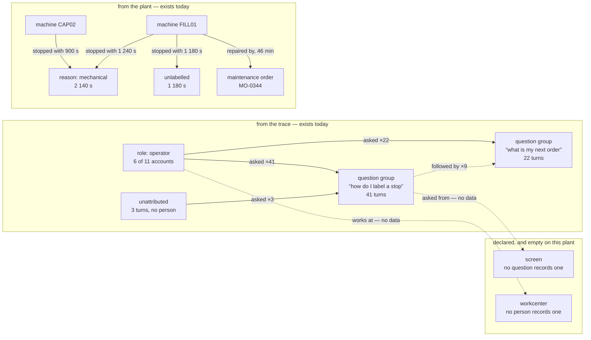

# Analysis that reasons as deeply as the question

**Status: a proposal for the maintainer to accept or send back. Nothing here is
built.** Everything in it was measured on `7b8b2142` on 2026-09-29; where a
figure came from somewhere else, the source and the date are beside it.

Scott, 2026-09-29, on the four analysis handoffs of
[the agentic harness](agentic-harness.md) §9 M1:

> *"I'm not super happy with the graphs. I like these as in they should be
> somewhat default throughout the UI. I like the idea of having all the
> standard style charts on a specific UI and even having configurations and
> ways to push them to different tabs if possible. However, in terms of the
> analysis, this doesn't go nearly deep enough. … I don't think it should be in
> engineering, it should be in AI, as I want it to be able to access all data
> including the AI traces. So management wants to know what's the biggest
> problem for our operators. They should ask the agent who looks at all the
> conversations and graphs a network node analysis. Which workcenters are
> asking which questions? What pages do they visit most and how much time? Are
> they asking different questions or the same questions? Are they having
> downtime as a result? Are they having issues with maintenance fixing stuff?
> Then the agent, after graphing and analyzing those connections, should be
> able to graph and analyze any data internally relevant to that thread. Can it
> graph the ui response time for those pages? could it graph maintenance repair
> time over time? can it compare oee and scrap during a specific users shift?
> can it look at downtime logs? can it measure specific features over time per
> opc tag? … it should be able to reason extremely deeply so the graphing
> should be incredibly flexible and interactive. Interactive network node
> analysis for complex tracing analysis. Traditional interactive
> line/bar/pareto charts for more traditional manufacturing data analysis.
> These need to be presentation ready yet fully adjustable to meet whatever a
> person could possibly dream up of asking. I don't want to be prescriptive of
> what solution you build. But using matplotlib or plotly is what I had in my
> mind."*

This page answers that in eleven sections. **The short version, so the rest is
optional reading:**

- His example can be answered today to about **half** the depth he described,
  and what stops the other half is **the records, not the engine.** Five
  nullable columns and one new tool close most of it. Page-visit dwell time is
  the one thing that does not exist in any form and cannot be approximated.
- The **engine** should be the catalogue it already is, extended by three
  tools — and agent-written analysis code in a sandbox is a real second step
  worth taking *after* the first one shows how deep the catalogue actually
  reaches. Cost is not what separates them; ~29 MB of new dependencies and an
  authorisation surface are.
- The **renderer** should be `kit.js`, extended. Plotly is 4.83 MB against
  `kit.js`'s 53 KB, has no network graph in it either, and would turn six rules
  that are currently structural into six rules a wrapper has to remember. What
  Scott loses by not taking it is a modebar and about two weeks of work.
- **One thing needs a decision before anything is built**, and it is not
  technical: this analysis reads what named people typed, and the product has
  no written position on that. [0039](../decisions/0039-an-analysis-is-recorded-code-that-can-only-read.md)
  proposes one. It is question 1 of §11.

---

## 1. "What is the biggest problem for our operators?" — end to end

A plant manager opens the AI tab on the bottling plant and types that sentence.
This section is the whole page; the rest justifies it. Every step says what
today's records support, and the coverage the answer carries.

### Step 1 — the agent establishes the ground it is standing on

Before anything else: **the window, and the totals.** The trace goes back as far
as `[admin] ai_trace_days`, which is 90 (`services/ai_trace.py`,
`domain/ai_turns.py`). So the honest first sentence is *"over the 90 days this
plant keeps"*, never *"historically"*.

It reads `ai_trace.conversations()` — which already exists and already returns
one row per conversation with who, when, how many turns, what was proposed and
what became of it, and what it cost. It states: how many conversations, how
many turns, how many distinct people, of how many accounts that can sign in
(`personnel` where `password_hash` is not null), and **how many turns carry no
person at all.**

*Coverage:* `absent`. This is a count of records, not a rate over a window
somebody watched, and `kit.js` has a third attribute value for exactly this
case — `data-coverage="absent"` rather than a number or `null`
(`web/kit.js`, `coverageOf`). A "100 % coverage" on a count of conversations
would be a lie about a different thing.

### Step 2 — are they asking the same questions or different ones?

This is the one question in Scott's list that needs **no new data at all**.
`ai_turns.asked` holds what the person typed. Grouping is read-side: normalise
the text, group, count. Nothing is stored twice.

The output is a list of question groups by turn count, **and the count of turns
that fell in no group** — the once-only questions, which are the interesting
half. A list that showed only the top five would be the failure `STYLE.md`
rule 4 exists to prevent.

*Honest limit:* text grouping is a judgment, so the answer says which
normalisation it used and how many groups it made, and a reader can expand any
group into its verbatim turns. The agent never reports a group count as a fact
about the plant without the reader being able to see what went in it.

### Step 3 — which workcenters are asking which questions?

**Not answerable as asked. Today the honest version is "which roles".**

- `ai_turns.person` holds the account code, and `personnel` holds that
  account's `role` (`domain/masterdata.py`, `class Person`: `code`, `name`,
  `role`, `password_hash` — and nothing else).
- **`personnel` has no equipment link.** A person is not attached to a
  workcenter anywhere in this product.
- The nearest thing that exists is the station a browser last chose, and it
  lives in **one browser's `localStorage`** (`web/station.js`,
  `rememberMachine`). It never reaches the server and it is not a fact about a
  person.

So the first honest answer groups by **role** — operator, supervisor, admin —
and the graph in step 4 carries a `workcenter` node kind that is **empty, and
visibly empty**, until one nullable column exists. The smallest honest start is
`personnel.home_equipment_id`, nullable, with every rollup stating how many
people it could not attribute. That is milestone D1.

### Step 4 — what pages do they visit most, and for how long?

**Not answerable at all, and this is the largest gap on the page.**

Two facts, both checked:

1. **The screen a question was asked from reaches the API and is thrown away.**
   `web/assist.js` posts `{message, session, screen: window.location.pathname}`
   to `/assist/agent`. `api/routers/assist.py` declares `screen: str | None` on
   `AgentIn` — and **nothing in the product reads `body.screen` on that route.**
   (`design.py` reads its own; the floor agent's is dropped.) One nullable
   column on `ai_turns` and one line in the handler recovers *where a question
   was asked from*, for every question asked from now on.
2. **Page visits and dwell time do not exist in any form.** No table, no
   beacon, no access log the product keeps. There is no proxy: the trace only
   knows about screens where somebody typed at the assistant.

The difference between those two matters, and it is the reason they are
separate milestones. The first is *recovering data the browser already sends
and the server already receives*. The second is **new observation of what
people do while they are not talking to the product** — which is a different
kind of thing, and §4 argues it needs a decision before it needs a table.

### Step 5 — the network graph

With what exists after step 2 and step 3, the graph the agent draws is:

Two things about that picture are the design, not the illustration:

**The empty node kinds are drawn.** A graph that silently omitted `screen` and
`workcenter` would read as a complete picture of a plant where those questions
came from nowhere. The harness's §6 rule 3 is *"the graph states its total"*;
this is the same rule applied to a kind of thing rather than to a count.

**`unattributed` is a node, not a silence.** Three turns with no person, 1 180
stopped seconds with no reason: both get a node with a degree, so the reader
sees the hole rather than a tidy graph that happens to be 3 turns short.

Reading it: the biggest cluster is *labelling a stop* — 41 of 380 turns, from 6
of the 11 accounts that asked anything, connected onward to two machines and to
1 180 seconds nobody named.

### Step 6 — "are they having downtime as a result?"

**No, and the agent has to say no.** Nothing in this product links a question to
a stop. There is no causal edge and there is no timestamp correlation that would
be honest — a question asked at 09:12 and a stop starting at 09:14 is a
coincidence until somebody records that they are the same event, and nothing
records that.

What the agent *can* say, and does, is the adjacency: *the machines these
questions came from are also the machines with the most unlabelled downtime.*
That is two facts side by side, and the sentence has to be built so a reader
cannot mistake it for a third.

This is the single most important honesty rule on the page, because it is the
one a plant manager most wants broken.

### Step 7 — the drill-downs he listed, one at a time

| His question | Answerable today? | What carries it, or what is missing |
|---|---|---|
| **"graph the ui response time for those pages"** | **No** | No timing anywhere. `/metrics` (`api/routers/system.py`) is counts and ids, and its own docstring says *"there is deliberately **no performance and no OEE series here**"*. The app has two `http` middlewares (`api/app.py`) and neither times anything. Smallest honest start: a bounded in-memory ring per route template — p50, p95, count — on the middleware that already runs. **A ring is not history:** it answers "now", never "last Tuesday", and a chart drawn from it says so |
| **"graph maintenance repair time over time"** | **Yes, with a count beside it** | `maintenance_orders` carries `raised_at`, `started_at`, `completed_at`, `performed_by`, `downtime_minutes` — every one but `raised_at` nullable. So MTTR is real arithmetic over the orders that were timed, and **every MTTR prints how many orders were not timed.** An MTTR over 6 of 19 orders is a different fact from an MTTR over 19 |
| **"compare oee and scrap during a specific users shift"** | **Partly, and the words have to change** | `ShiftStamped` (`domain/common.py`, decision [0028](../decisions/0028-which-shift-a-minute-belongs-to.md)) stamps **rows, not people**: `equipment_states`, `production_logs`, `quality_checks`, `non_conformances`. `production_logs` has `source` and `source_system` and **no actor at all** — the only name on a booking is `audit_log.actor` on the `production.reported` row. And `ai_turns` and `audit_log` carry no shift stamp. So *"a user's shift"* means **"the shift the rows they touched fell in"**, and the honest answer is *OEE and scrap in shift B, beside the audit rows this person wrote in shift B* — never "this person's OEE". Stamping `ai_turns` and `audit_log` the way every floor table is already stamped is one migration |
| **"look at downtime logs"** | **Yes, fully** | `equipment_states` with `reason`, `reason_code`, `reason_source`, and the plant's own `downtime_pareto`, which already returns `unlabelled_share`, `from_the_list_share`, `typed_share`, `vocabulary_total`, per-reason `machines`, per-reason `labelled_by`, `unknown_seconds` and `unknown_share`. House rule 3 — unlabelled is reported as unlabelled — is already in the payload |
| **"measure specific features over time per opc tag"** | **Yes** | `tag_trend` returns mean/min/max per bucket, and asks the plant for fewer, wider buckets rather than sampling, so an excursion is never dropped (`mcp/analysis.py`). The `xfail` in `tests/test_kepsim.py` that qualified this answer was **settled on 2026-10-05: the test stopped waiting too early**, 0.75 s in, and the first analog row exists at 5.04 s because process values are sampled at `history_interval_ms` (`opc_publish_ms` x `opc_history_ratio`, floored at `opc_min_history_ms` — 5 s as shipped). Nothing was dropped: a replayed line stores 12.00 samples a minute per station, and bottling stored 17,280 `FILL01.FillWeight` samples in the 24 h to 2026-10-05 11:55 UTC. A per-tag chart still states its `tag_values` coverage — the resolution is a plant setting, so the reader has to be told which one they are looking at |

### Step 8 — the sentence it ends with

Written out, because this is what "deep" has to look like when the data is
shallow:

> Over the 90 days this plant keeps a trace for, the largest group of operator
> questions is **how to label a stop** — 41 of 380 turns, from 6 of the 11
> accounts that asked anything. Those turns name two machines, FILL01 and
> CAP02. In the same 90 days those two machines were stopped for 4 220 seconds,
> of which **1 180 carry no reason at all** (28 %), and the plant's own pareto
> says 4 % of the window was watched by nobody. The reason vocabulary they pick
> from has 7 words in force.
>
> Three things I cannot tell you. **Which screens those questions came from** —
> this plant does not record the screen a question was asked from, though the
> browser sends it. **Whether the questions cost any downtime** — nothing links
> a question to a stop, and putting them side by side because the times are
> close would be inventing the link. **Which workcenter these people work at** —
> a person has no workcenter in this product; I grouped by role instead, and 3
> turns had no person on them at all.
>
> What I would look at next: MO-0344 on FILL01 took 46 minutes from start to
> complete, and 13 of the 19 maintenance orders on these two machines have no
> start time, so I cannot give you an MTTR I would stand behind.

That is the shape of every answer: **a claim, its total, its coverage, and its
named silences** — and the silences are specific enough to be closed.

---

## 2. Where it lives — and how that squares with "the AI tab is not where the analytics go"

Scott: *"I don't think it should be in engineering, it should be in AI."*
[The harness](agentic-harness.md) §8 says, of the same tab: *"the AI tab is not
where the analytics go … an exploration … is an answer … a chart becomes part of
the tab only by somebody deciding it should be."*

Both are right, because they are about different things. The distinction is
**lifetime and audience, not location:**

| | **An exploration** | **A gallery chart** |
|---|---|---|
| Who asked for it | one person, in a conversation | somebody decided everyone should see it |
| How long it lives | as long as the conversation; gone with the trace at `ai_trace_days` | until somebody retires it |
| Where it is drawn | beside the conversation, in the AI tab | on a screen that joins the system |
| What it must satisfy | the six chart rules | the six chart rules, **plus** `STYLE.md` rule 12 — same header and nav, the palette, four themes, a `data-assist` anchor, and `ui-check` crawling it from the day it exists |
| Renderer | `FS.kit.chart` | `FS.kit.chart` |

One renderer, two lifetimes. §8's line stays exactly true, and gains one
sentence: **what makes a chart a dashboard is not where it is drawn, it is
whether anybody asked it a question.** A chart on the AI tab that nobody asked
for has crossed the line whatever it is called; an exploration a person asked
for has not, however deep it goes.

### What `/dashboard/analysis` under Engineering becomes

**It stays, unchanged, and it is not folded into anything.** Recommendation, for
three reasons:

1. The registry already says why it exists, and the sentence is the rule this
   whole page is built on: *"Its own page because these are questions you sit
   down with, not things you watch"* (`modules.py`).
2. It is the five things a plant looks at **every week**, and a plant should not
   have to open a conversation to see them. An agent is how you ask a question
   nobody wrote down; it is not how you check the pareto on a Monday.
3. Moving it breaks three `ConfigSection` links that point at it —
   `default_report_hours`, `report_windows` and `gantt_screenful` all carry
   `href="/dashboard/analysis"` — and the bookmark of everybody who uses it.

So there are three surfaces and they do different jobs: **the analysis page** is
the weekly five; **the gallery** (§3) is where you compose one; **the AI tab** is
where you ask something nobody composed.

---

## 3. The gallery — Scott's first ask

> *"having all the standard style charts on a specific UI and even having
> configurations and ways to push them to different tabs if possible"*

### Where it goes

**A tab on the analysis page — `/dashboard/analysis#gallery` — not a new nav
chip.** [Configuration assistance](config-assistance.md) §2a settled the
principle for the Configuration workspaces: *one nav entry per domain, not one
per thing*, and a top-level chip per surface is how a nav becomes unreadable at
twenty-nine screens. A gallery belongs beside the questions you sit down with,
which is where the analysis module already is.

### What is configurable on a chart

Five things, and each one the chart contract already makes it state:

| Choice | What it does | The rule it triggers |
|---|---|---|
| **Source** | which series or analysis (`oee_breakdown`, `state_timeline`, `downtime_pareto`, `tag_trend`, `production_trend`, and the new ones in §9) | none — the chart draws what the API measured |
| **Window** | hours, or a named shift | rule 4: a window the MES could not fill says what it truncated (`windowNote` already does this) |
| **Grouping** | per machine, per line, per reason, per shift | rule 5: the total, including rows nobody drew |
| **Shape** | line, bars, pareto, states, histogram, graph | rule 4: a shape that depends on a choice states the choice — a bin width, a bar scale, a graph threshold |
| **Axis** | zero-based or not | rule 4: a y-axis that does not start at zero says so on itself |

**And one thing that is deliberately not configurable: whether a figure carries
its coverage.** `kit.js`'s `frame()` writes `data-total`, `data-coverage`,
`data-coverage-kind` and the footer for every shape, before the shape gets to
draw anything. A gallery that let somebody turn the footer off would be a
gallery for making the chart this product exists not to draw.

### How a saved chart is stored — three options, one recommendation

**(a) A `plant_settings` row — no.** That table is `[section] key = value` as
text, one scalar per pack key (`domain/plant_settings.py`), seeded by
`fsmes pack apply` and validated by `fsmes pack check`'s own rules. A named
chart with an owner and a placement is not a scalar and has no pack key. Using
it would mean inventing pack keys for things no pack ships.

**(b) A pack artefact — no.** [0022](../decisions/0022-what-a-plant-pack-may-contain.md)
says a pack is data, carries no code, and cannot change what a number means — and
a pack is *applied*, not authored on a screen at 09:40 on a Tuesday. (A pack
shipping a **starting** gallery is a different and perfectly good idea, and it
works on top of (c).)

**(c) Its own table, `saved_views` — recommended.** Columns: `code`, `title`,
`owner` (person code, null means the plant's), `scope` (`person` | `plant`),
`placement` (null, or a screen path and a slot), `spec` (JSON — shape, source,
window, grouping, the stated choices), `created_by`, `created_at`, `status`,
`revision`.

**It needs no draft → approve lifecycle, and §11 of the configuration design
says exactly why:** *"A setting is editable here when nothing stores the value it
had at the moment it decided something."* A saved view decides nothing. It draws
what the API measured, and if the definition changes the picture changes, and
nothing anywhere recorded a figure that this view produced. Undo is editing it
back; the audit row says what it was.

### Pushing one to a tab

**Which tabs:** the screens that already have a `.panel` grid and a role gate —
`/dashboard` itself, Floor, a machine page, Line, and the analysis page. Not the
AI tab, for §2's reason.

**Who may:** a chart for yourself needs nothing beyond `plant.read`. **Publishing
one to a screen other people open needs a capability of its own** —
`views.publish` — because publishing puts a number in front of people who did
not choose it and cannot see how it was defined. No shipped role holds it until
a plant grants it; supervisor is the obvious place, and that is the plant's
call, not the product's.

**And it writes an audit row.** `audit_log` already carries `actor` and
`on_behalf_of`; the action is `view.published`, entity `saved_view`/`<code>`. A
chart that appeared on the Floor screen overnight should be traceable to a
person in one query.

### Presentation export

The `fs-chart` node **already carries everything an export needs**: its own
`<title>` and `<desc>` built from the same sentences as the visible footer, the
footer text lines, `data-total`, `data-coverage`, `data-coverage-kind` and
`data-carries-unknown` (`web/kit.js`, `frame`).

So export is: **`outerHTML` with the palette's resolved custom properties
inlined.** One function, no dependency, and what lands in the slide is the same
picture the person is looking at, still stating its coverage. PNG is the same SVG
through `canvas.drawImage` in the browser — no server round trip, no second
renderer.

**Recommendation: SVG and PNG, both from the browser, and nothing else.** Not a
PDF, not a deck, and explicitly **not** a server-side renderer (§6 (iii)). And
one rule worth writing into `STYLE.md` when this is built: **a chart is
presentation-ready when its footer survives being pasted into a slide** — an
export whose coverage sentence was stripped is not an export this product makes.

---

## 4. What the agent may reach

The analysis agent runs as the `ANALYST` account with the `analyst` role —
`plant.read` plus `audit.read` (PR #130). Everything in this table is inside
those two capabilities **today**, which is itself the finding in the second half
of this section.

| Source | What it holds | What is missing | Smallest honest start | More than `analyst` holds? |
|---|---|---|---|---|
| `ai_turns` | `ts, session, brain, person, model, kind, asked, said, tools, proposals, guide, error, tokens, usd`; 90-day horizon | the screen; a shift stamp | one nullable `screen`; `ShiftStamped` | no — `audit.read` |
| `audit_log` | `actor`, `on_behalf_of`, `action`, `entity_type/id`, `before`, `after` | a shift stamp | `ShiftStamped` | no — `audit.read` |
| `personnel` | `code`, `name`, `role` | any link to equipment or shift | nullable `home_equipment_id` | no — `plant.read` |
| **page visits, dwell** | **nothing exists** | all of it | a `page_views` table written by one `sendBeacon` on `visibilitychange`, dwell `null` and never `0` | **needs a decision, not a capability** |
| **request timing** | **nothing exists** | all of it | a bounded ring per route template on the existing middleware | no |
| `equipment_states` | state, `reason`, `reason_code`, `reason_source`, shift stamp, half-open intervals | nothing for this purpose | — | no |
| `equipment_connections` | connected / disconnected intervals — [0030](../decisions/0030-a-lost-connection-is-unknown-time.md) | nothing | — | no |
| `production_logs` | good, scrap, `source`, `source_system`, shift stamp | **any actor** | nullable `booked_by` | no |
| `maintenance_orders` | `raised_at`, `started_at`, `completed_at`, `performed_by`, `downtime_minutes` | nothing — but mostly nullable | report the untimed count beside every MTTR | no |
| `tag_values` | `equipment_id`, `tag`, `ts`, `value_num`, `value_text` | nothing — analogs arrive, at `history_interval_ms` (settled 2026-10-05); what is missing is the *resolution* on the figure, not the rows | state `tag_values` coverage and the sampling interval on every per-tag figure | no |
| `quality_checks`, `non_conformances` | results, severities, dispositions, shift stamps | nothing | — | no |
| the four analyses | the screens' own envelopes, with coverage, the ledger, `unknown_seconds`, every total | `state_timeline` and `tag_trend` carry **no coverage figure at all**, and `downtime_pareto` carries how blind the window was and not a coverage ratio | nothing — say which is which, as `mcp/analysis.py` already does | no |
| the coverage ledger | where unwatched time went, per machine | nothing | — | no |
| eval results | faithfulness per role | it is a file in the repository, not a record the plant keeps | make the run a plant record | no |

### The monitoring position — and the fact that changes the question

The research behind this product has **no page on monitoring people**: nothing on
surveillance, works councils, GDPR, or what it does to trust on a floor. That is
a genuine gap and this section is where it gets closed, because "which
workcenter asks which questions" and "OEE during a given user's shift" are
per-person analysis over a table that exists to debug an assistant.

**But the question is not "shall we allow this", because it is already
allowed.** Measured:

- `ai_turns.person` has been on every row since the table existed.
- `GET /ai` and `GET /ai/conversations` are gated on `audit.read`
  (`api/routers/system.py`), and the payload includes `person` and the verbatim
  `asked` and `said` (`services/ai_trace.py`, `_public`).
- **`audit.read` is held by `supervisor` and above** (`services/capabilities.py`).

So **today, on any plant running this, every supervisor can already read every
operator's questions verbatim for ninety days.** The deep analysis does not open
that door. What it does is make it **cheap, summarisable and rankable** — and
that is a different act, done for a different reason, and it is the act that
needs a gate of its own.

Hence [0039](../decisions/0039-an-analysis-is-recorded-code-that-can-only-read.md),
whose second half is four clauses:

1. **The agent counts before it names.** Every rollup over people is returned
   grouped by role, by workcenter, or by shift — never by person — unless the
   asker names a person or asks for names. *Why:* the honest business question
   is which work is hard, not who is slow, and a tool that answers the second by
   default will be used for the second. This is one default in one function, not
   a new subsystem.
2. **Naming a person is a second capability, `people.analyse`, and no shipped
   role holds it.** `audit.read` is the wrong gate: reading one conversation to
   debug an assistant failure and ranking eleven operators by question count are
   not the same act, and two acts should not share one gate.
3. **Every per-person answer writes an audit row** — `analysis.person_named`,
   entity `personnel`/`<code>` — so the person analysed can find out that they
   were. This is what makes the rest defensible rather than merely bounded.
4. **Reciprocity: an operator sees everything the analysis could say about
   them,** on their own agent view (the harness §3, M2's "my agent" panel),
   behind `plant.read` and scoped to their own code. The test to apply to any
   future analysis: *if the plant would not show it to the person it is about,
   it should not be run.*

**Retention.** The analysis cannot reach past `ai_trace_days`, because the rows
are gone. And a recorded analysis run that named a person is pruned on the same
horizon as the trace it read — otherwise a saved result becomes a copy of a
record the plant chose to delete.

**What this page does not decide.** Whether a plant in the EU needs a works
council agreement or a lawful-basis record for this is a question for that
plant's counsel, not for this repository. What the product owes is that the
purpose limitation is **enforceable** — which is what the capability and the
audit row are for.

### Shadow mode: what can run, and what cannot run at all

Three facts, and the third is the awkward one.

1. **The analysis agent is already off in shadow mode and says so** (PR #130).
   `llm.cloud_agent` is *refused* in `fsmes/shadow.py`: *"it carries this
   plant's numbers off the box, and a plant lending us its data to watch did not
   agree to that."*
2. **`llm.local_assistant` is allowed** — a model on the box, nothing leaving.
   So a shadow plant can still be asked, by a local model.
3. **Under [0032](../decisions/0032-a-hosted-judgment-and-the-shadow.md)'s four
   classes, this analysis sends the most restricted one.** 0032 puts *"anything
   a person typed: findings, rationales, dispositions, names"* in the
   **production** class, and says production *"stays off by default at every
   plant, shadow or not, and turning it on is a decision the plant records
   rather than a setting a commissioning engineer flips."* `ai_turns.asked` is
   literally a person's words. **So the flagship analysis Scott described is, in
   the class scheme this product has already proposed, the class that is off
   everywhere until a plant turns it on deliberately.** That is not a reason not
   to build it. It is a sentence that has to be on the screen.

Which analyses run with a local brain: **the catalogue (§5 option A) can.** The
numbers are computed server-side and the model's job is to pick tools and read
sentences, which qwen3:8b can do. **Agent-written analysis code (option B)
cannot** — a local 8B model writing pandas worth running against a plant's
records is not a thing to promise. That is an argument for A that has nothing to
do with the sandbox.

---

## 5. The engine — the one real fork on this page

### (A) A catalogue of parameterised analyses the agent composes

What #129 already is, extended. The plant computes; the agent picks, parameterises
and reads. Adding three tools (§9, D3) makes the whole of §1 answerable:
`trace_rollup` (question groups by role/shift, with totals and the unattributed
count), `trace_graph` (the §7 model as an envelope of nodes, edges and measures),
`maintenance_mttr` (with the untimed count).

**For.** Every number is the plant's own arithmetic, which is the whole of
[0031](../decisions/0031-a-judgment-is-a-proposal.md) and
[0033](../decisions/0033-availability-is-a-share-of-what-was-watched.md). Bounded
by construction — `RESULT_LIMIT` is 6 000 characters and each tool pages itself
rather than being cut. No new dependency and nothing to sandbox. Runs with a
local model, so it works in shadow mode and on a plant with no key. The audit
record is the parameters, which is trivially complete.

**Against, and it is Scott's own complaint.** A catalogue answers the questions
somebody wrote down. *"Whatever a person could possibly dream up of asking"* is
the opposite of a catalogue, and every genuinely new question becomes a pull
request. The network measures are the hardest case: clustering thresholds and
"what changed since last week" are parameterisable, but "is this cluster
interesting" is not.

### (B) The agent writes the analysis, and it runs in a sandbox

Python — `pandas`, `numpy`, `networkx` — against read-only data, returning a
result envelope of tables, a chart spec and sentences. Never raw database
access, no network, CPU/time/memory caps, **every run stored with its code** so a
figure can be re-run and audited, and the envelope refused if it carries no
coverage.

**For.** Depth, which is the ask. And a stronger audit property than A has: the
record is *the code that ran*, so a figure can be checked by reading what was
actually done rather than by trusting a catalogue entry.

**Against, with the numbers, because this is where the cost is.**

- **The dependencies.** Measured from PyPI on 2026-09-29, the CPython 3.13
  wheels: **numpy 2.5.3 ≈ 16 MB, pandas 3.0.6 ≈ 10 MB, networkx 3.7 = 2.1 MB —
  about 29 MB of wheels**, installed considerably more. This product's entire
  runtime dependency list is nine packages, and `pyproject.toml` puts the MCP
  server, the agent, MQTT and the judgment client behind *optional* extras with
  the same sentence each time: *a plant PC runs the MES, not the tooling that
  tests it.* None of the three is present today, in any extra.
- **The sandbox is not a weekend, and the hard part is not the limits.**
  Resource caps are an afternoon. Getting **authorisation** right — the code
  seeing exactly what the asker's role may read and nothing else — is the part
  that goes wrong, and a sandbox with correct limits and wrong authorisation is
  worse than no sandbox, because it looks safe.
- **It must never compute a KPI**, which is 0031 and 0033. And "is this number a
  rate?" is not decidable by looking at a dataframe. The only honest resolution
  is a hard boundary on the inputs, below.
- **It cannot run in shadow mode at all**, and it sends 0032's `production`
  class.
- **Windows.** `pyproject.toml`'s `tzdata` comment says plainly that *Windows is
  a first-class target (plant PCs run this)*. `resource.setrlimit` does not
  exist there. A sandbox that silently has no limits on one supported platform
  is the worst of the three outcomes.

### Recommendation: A's floor, B's ceiling, in that order — and B is a decision, not a milestone

**Build A now, extended by the three tools.** It makes §1 answerable to the depth
the *records* allow, which is what actually limits the first version. Ship it,
and let Scott see how deep it reaches on bottling.

**Then build B if the answer is "not deep enough" for a reason the catalogue
cannot fix.** Because here is the thing the survey did not expect: **cost does
not separate A from B** (§8 — $0.16 against $0.22 for the same worked example).
What separates them is 29 MB of dependencies, an authorisation surface, and one
platform. Those are worth paying for depth; they are not worth paying for
*speculative* depth.

And the honest framing for B, when it comes: **its real value is not that it can
compute more. It is that the plant can read what was done.** A catalogue's answer
is trustworthy because you trust the catalogue. B's answer is trustworthy because
you can re-run it — and that is a better property, once there is something worth
re-running.

### The sandbox design, in enough detail to build

Written now so that picking B later is a decision and not a design exercise.

**Process, not thread.** A fresh interpreter via `subprocess`, `-I` (isolated
mode: no `site-packages` from the user, no `PYTHONPATH`, no `PYTHON*` env),
`cwd` a fresh empty temporary directory removed afterwards.

**Limits, set before `exec`:** `RLIMIT_CPU` 5 s, `RLIMIT_AS` 512 MB,
`RLIMIT_FSIZE` **0** — it writes nothing, ever — `RLIMIT_NOFILE` small,
`RLIMIT_NPROC` small. A wall-clock kill by the parent at 10 s, because CPU time
does not catch a sleep. **First version is Linux-only and the plant is told
which platform it is running on**, rather than a `resource` import guarded by a
`try` that quietly means "unlimited on Windows".

**No network, achieved by having nothing to call with.** The child gets **no
credentials and no client**. Data arrives on **stdin as JSON**; the result leaves
on stdout as JSON. The MCP tools reach the plant over HTTP as `ANALYST`; the
child does not reach anything.

**Imports:** an allowlist installed in the child's bootstrap before the code runs
— `math`, `statistics`, `json`, `datetime`, `collections`, `itertools`, `numpy`,
`pandas`, `networkx`, and nothing else. **And the honest caveat, written into the
code:** an import allowlist inside the child is a bound on *accidents*, not on an
adversary. The security properties are the process limits, the empty working
directory, and the absence of any credential. Claiming more than that would be
the kind of sentence this product does not write.

**What the data is, and why there are no database views.** The inputs are **the
bytes the plant's own tools already returned** — envelopes that went through the
plant's own capability gates before the child started. So there is no view to
get wrong: a tool the asker's role may not call returns nothing to hand in, and
the child cannot ask for more. This is the design's best property, and it is a
better answer than read-only views, which would have to re-implement the
capability model in SQL.

**And the hard input boundary that keeps 0031 and 0033 true:** the child may
compute freely over **counts, durations, timestamps and text** — the trace, the
audit trail, maintenance timings, tag readings, question groups. It may **not**
compute a rate the plant computes: OEE, availability, performance, quality,
coverage. Those arrive **already computed, in the plant's envelope, with their
ledger**, and the child may only lay them out. A run whose result envelope
carries a rate the plant did not compute is **refused, server-side**, with its
own sentence — the kit's refusal rule, moved behind the API where it cannot be
skipped.

**Result bounding:** the envelope is capped the way #108 and #129 cap theirs. A
list states its total and pages; over the cap the run is **refused with a
sentence naming the cap**, never truncated.

**Recorded:** the code, the inputs' provenance (which tool calls, with which
parameters), wall time, peak memory, the result, and whether it was refused and
why. That record *is* the audit, and it is what makes a figure re-runnable.

**And B runs only with the hosted brain**, for the reason in §4: a local 8B model
writing analysis code is not a promise to make.

---

## 6. Rendering — the choice, with measured numbers

Everything below was measured on 2026-09-29 by downloading the file. Sizes are
bytes of the minified bundle.

| | Bytes | Licence | Gives a network graph? |
|---|---|---|---|
| `web/kit.js` today (4 shapes, 6 rules) | **52 536** | the project's | no — one new shape |
| everything vendored today (three.js r185, 3 files) | 791 442 | MIT | no |
| d3-force 3.0.0 + quadtree + dispatch + timer | **17 427** | ISC | **the layout, yes** |
| plotly.js 3.1.1 `dist-min` | **4 830 889** | MIT | **no** |
| plotly.js 3.1.1 `basic-dist-min` (scatter, bar, pie) | 1 102 006 | MIT | no |
| matplotlib 3.11.2 wheel (server-side, plus 5 deps) | ≈ 9 500 000 | PSF (OSI-approved) | no |

**One correction to the brief, because it drove a recommendation.** Plotly was
described as using the `Function` constructor. Measured: plotly 3.1.1 minified
contains **no `eval(` at all** and **three** `Function(...)` constructions — a
webpack `globalThis` probe and a generator-support probe, both inside
`try`/`catch` with working fallbacks, and a `Function.prototype.bind` shim that
only runs if reached. Under a content-security policy without `unsafe-eval` the
two probes fall back and the shim would throw. **There is no CSP in this product
today**, so nothing breaks either way — but if plotly is taken, writing one
becomes a deliberate act rather than an omission. Its SHA-256 is
`1d4105c9f8939d92710b1babf7d1636ca613bca4b3c03683dffc794ea1e916ee`, ready for
`web/vendor/README.md`'s table.

### (i) Extend `kit.js` — recommended

Hover, zoom, brush and legend toggles on the four shapes it has, plus a fifth
shape, `graph`. The layout is either ~150 hand-written lines — honest, because
the node count is bounded anyway by *"showing 60 of 340"* — or 17.4 KB of
vendored d3-force if the hand-written one proves worse.

**The argument is not the size, it is that the six rules are structural.**
`frame()` in `kit.js` writes `data-total`, `data-coverage`,
`data-coverage-kind`, `data-carries-unknown`, the `<title>` and `<desc>`, and
the footer lines — **for every shape, before the shape draws anything.** A new
shape cannot forget them. 52 browser tests across four shapes and four themes
pin what that produces. Adding a shape inherits all of it; adding an engine
inherits none of it.

**And vendoring d3-force would not need a decision record** — it is one row in
`web/vendor/README.md`'s existing table, under the precedent and the standing
terms already written there. That is the difference in kind between 17 KB of
force-layout maths and 4.8 MB of chart engine.

### (ii) Vendor plotly.js

**What Scott gains, honestly:** hover, zoom, pan, box and lasso select, legend
toggles, a modebar, and PNG export — in every shape, for free, tested by
somebody else. That is a real two weeks of work he does not have to fund.

**What he loses, precisely:**

- **The contract stops being structural.** Plotly draws its own SVG. Every
  `data-value`, `data-coverage`, `data-total`, `<title>` and `<desc>` becomes
  something a wrapper adds *afterwards*, on every render, for every shape —
  and `ui-check`'s `svg.fs-chart` baseline would be watching a node plotly owns
  the attributes of.
- **Chart rule 2's hardest case has no plotly rendering.** A station below the
  coverage floor is drawn **withheld at full width with its ledger, never as a
  shorter bar** — because a shorter bar reads as a measurement of a machine
  rather than of how little of it anybody saw. In plotly that is a custom shape
  plus a per-row annotation, hand-placed.
- **Rule 3 is half there.** `connectgaps:false` breaks a line on `null`, which
  is right. *"Hatched, `data-unknown="true"`, a rendering of its own"* is an
  overlay you draw yourself.
- **Rule 6 inverts.** `STYLE.md` rules 2 and 3 are that colour comes from the
  palette and **nothing in `kit.js` names a colour**. Plotly takes colours as
  values, so four themes become four colour arrays read out of CSS custom
  properties at render time and re-read on every theme change — the "no colour
  in JS" rule turned inside out.
- **Weight.** 4.83 MB is **six times everything vendored today**, on a screen a
  plant PC opens. The 1.1 MB basic bundle carries scatter, bar and pie — so a
  state timeline is horizontal bars whose offsets you compute, and a graph is a
  scatter over coordinates you compute, which is most of the work either way.
- **It does not solve the thing Scott most wants.** Plotly has **no force
  layout**. A node-link picture in plotly is a scatter trace over coordinates
  you computed yourself — so the graph maths gets written either way.

The full cost if he wants it anyway: a decision record, a `web/vendor/` row with
version, licence and the SHA-256 above, a CSP written deliberately, a wrapper
re-asserting six rules plotly does not know, and `ui-check` baselines
re-accepted for every chart on every screen in four themes.

### (iii) matplotlib, server-side, for exports

**Recommendation: no, and not as a fallback either.** It renders a PNG: no hover,
no `data-*` for the tests to read, no four themes unless the palette is
duplicated in Python, and the `<title>`/`<desc>` a screen reader is given would
simply be gone. It is ≈ 9.5 MB plus pillow, kiwisolver, fonttools, contourpy and
cycler on a plant PC.

**And it is not needed.** The export §3 recommends is the `fs-chart` node's own
`outerHTML` — *the same picture the person is looking at*, footers and all. A
second renderer for export would be the second chart engine `kit.js` exists to
prevent, and it would be the one that drifts, because nobody checks an export in
four themes.

### Presentation-ready, spelled out

Four themes (already). A title and a footer carrying total, coverage, axis
choices and the unknown (already). SVG and PNG from the browser (new, small).
A print layout. And the rule: **the footer survives the paste, or it is not an
export.**

---

## 7. The network analysis

### The graph model

**Node kinds:** `role` (and `workcenter` when it exists), `question_group`,
`screen`, `machine`, `downtime_reason`, `maintenance_order`, `shift`, and two
that exist to make holes visible — `unattributed` and `unlabelled`.

**Edge kinds — every one a recorded fact, or it is not drawn** (the harness §6
rule 1: *"an edge nobody observed is not an edge"*):

| Edge | From → to | The record behind it | Weight | Today |
|---|---|---|---|---|
| `asked` | role → question group | `ai_turns.person` + `personnel.role` | turns | **exists** |
| `followed_by` | question group → question group | `ai_turns.session` in `id` order | transitions | **exists** |
| `asked_from` | question group → screen | `ai_turns.screen` | turns | **column missing** |
| `visited` | role → screen, with dwell | — | — | **no source at all** |
| `stopped_with` | machine → downtime reason | `equipment_states.reason`/`reason_code` | seconds, with `unknown_seconds` beside | **exists, and `downtime_pareto` already returns per-reason `machines`** |
| `labelled_by` | downtime reason → labelling source | `equipment_states.reason_source`, `"here"` when this MES named it | seconds | **exists, already in the pareto envelope** |
| `repaired_by` | machine → maintenance order | `maintenance_orders` | minutes, with the untimed count | **exists** |
| `fell_in` | anything → shift | `shift_code` / `shift_day` | rows | **exists on floor tables; absent on `ai_turns` and `audit_log`** |

Note `labelled_by` names **systems and `"here"`, not people** — `reason_source`
is *who named the stop*, and a technician's label may have arrived from another
plant system (`services/equipment.py`). A person → reason edge does not exist and
must not be drawn as though it did.

### The measures — and the one that is refused

1. **Which cluster is biggest.** The connected component holding the most turns,
   after edges below a threshold are hidden. **States the threshold and the
   number of components**, because a shape that depends on a choice states the
   choice (chart rule 4).
2. **What it connects to — and what it does not.** For the biggest cluster, which
   node kinds it touches. **The absence is the finding:** a question cluster with
   no edge to a downtime reason is a cluster nobody has linked to a stop, and the
   picture says that rather than leaving a silence where a plant manager will
   read a link.
3. **What changed since last week.** The same graph over the previous window:
   nodes and edges appearing and disappearing, each with its total. Needs both
   windows inside `ai_trace_days`, and says so when they are not.
4. **Degree and weight — and no centrality.** **Betweenness, PageRank and
   eigenvector centrality are refused.** A centrality score on a graph whose
   edge set is *whatever happens to be recorded* is a number with no meaning, and
   it would be the most convincing wrong thing in this product. That is house
   rule 6 applied to a graph, and it is the graph's version of "a recomputed OEE
   is the thing 0031 exists to prevent."

### What is interactive

Expanding a node into its records — a question group into its verbatim turns, a
machine into its stops, a maintenance order into its findings. Hiding an edge
kind. Moving the threshold. **And every one of those re-states the totals**,
because a filtered graph that kept the old total is a list that reads complete.

### How the graph states its own coverage

- **`data-coverage="absent"`** on the frame. A graph of records is not a rate
  over a watched window, and `kit.js` already has the third attribute value for
  exactly this. A graph claiming a coverage percentage would be claiming
  something nobody measured.
- **`data-total` says "showing 60 of 340 nodes; 12 edges not drawn."**
- **The `unattributed` and `unlabelled` nodes carry their degree**, so the hole
  is a thing on the picture with a number on it.
- **Empty node kinds are drawn empty** (§1, step 5) rather than omitted, so the
  reader sees which questions this plant cannot answer at all.
- **An edge labelled with seconds carries how much of the window was watched, or
  it carries nothing** (the harness §6 rule 4). *Watched* means the coverage
  ledger's `observed_seconds` for that machine over that window — the same figure
  `oee_breakdown` reports — and never the window's own length. The first graph
  this product drew for a person got that wrong (2026-09-29: 604,800 s claimed
  where the ledger said 37,303), so the envelope carries a `watched` block with
  `requested_hours` and `clamped` beside the seconds. The graph's own window is
  not clamped to the ledger: a question is recorded whether or not a machine was
  being watched, so the two halves of the picture cover different lengths of time
  and the block says which.

---

## 8. What it costs

The product knows its own list prices (`services/agent.py`): claude-sonnet-5 at
2.00 / 10.00 / 0.20 / 2.50 dollars per million tokens for input / output / cache
read / cache write. **These are estimates and the Console is the bill** — the
code says so where the prices are.

The worked example of §1, as one conversation:

| | **A — the catalogue** | **B — agent-written code** |
|---|---|---|
| Model turns | ~8 | ~10 |
| Tool results at `RESULT_LIMIT` 6 000 chars ≈ 1 700 tokens | ~10 calls ≈ 17 k | ~10 calls ≈ 17 k |
| Fresh input | ~40 k | ~45 k |
| Cache read (catalogue + system, after turn 1) | ~120 k | ~140 k |
| Output | ~6 k | ~8 k |
| **Estimate** | **≈ $0.16** | **≈ $0.22** |
| Against #130's per-conversation cap | $0.25 | $0.25 |
| The box's own CPU | none | free |

**So cost is not the argument between A and B**, and the page says so plainly
because it would otherwise look like the argument. A plant manager asking this
weekly is **about $0.70 a month** of the $10 cap, either way.

The token counts are derived from the caps, not measured. **A milestone should
measure one real run and replace this table with what it cost** — the same
discipline `docs/ai/ASSIST-EVAL.md` already applies to faithfulness.

What a plant sets today: `MES_ANALYSIS_CONVERSATION_USD` (0.25),
`MES_AGENT_MONTHLY_USD` (10), `[admin] agent_max_rounds` (12),
`agent_result_limit` (6 000), `[admin] ai_trace_days` (90). M2's `[ai]`
Configuration domain is where these stop being environment keys and become rows
on a page.

---

## 9. The milestones — replacing `analysis-in-the-ai-tab`

Ordered by dependency, not by priority. "Evenings" is a guess of Scott's time,
stated as a guess.

| | Handoff | What it proves | Depends on | Evenings |
|---|---|---|---|---|
| **D1** | `analysis-data-columns` — one migration, five nullable columns and nothing else: `ai_turns.screen` (stop dropping what the browser already sends), `ShiftStamped` on `ai_turns` and `audit_log`, `production_logs.booked_by`, `personnel.home_equipment_id`. Every rollup states the unattributed count | §1 steps 3 and 4 stop being unanswerable, and "a user's shift" becomes a sentence with a meaning | — | 1 |
| **D2** | **the monitoring decision** — 0039 accepted or sent back | that nothing reads a person's rows in aggregate before there is a position on it | Scott | his reading |
| **D3** | `analysis-trace-tools` — `trace_rollup`, `trace_graph`, `maintenance_mttr` on the existing catalogue, returning envelopes with totals and unattributed counts | the whole reasoning chain of §1, with no new engine | D2 | 2 |
| **D4** | `analysis-graph-shape` — `kit.js` gains a `graph` shape and interactivity on the four it has; four themes; `data-*` on nodes and edges; unattributed drawn as a node | the network picture, against the six rules, with no build step | — | 2–3 |
| **D5** | `analysis-in-the-ai-tab` *(rewritten)* — an exploration beside the conversation: what it draws, what it says when the ledger withheld the answer, what it costs, and 0039's per-person default | **this is the one that shows Scott §1 answered on bottling** | D3, D4 | 2 |
| **D6** | `analysis-gallery` — the tab, `saved_views`, the five configurable choices, SVG and PNG export | his first ask, and the chart kit's shop window | D4 | 2 |
| **D7** | `analysis-publish-to-tab` — placement, `views.publish`, the audit row | a chart other people see, traceable to a person | D6, D2 | 1 |
| **D8** | `request-timing-ring` — a bounded ring per route template on the existing middleware; `/metrics` unchanged | *"can it graph the ui response time for those pages"* — for **now**, never for history | — | 1 |
| **D9** | `page-views-table` — **only if 0039 says yes.** One `sendBeacon` on `visibilitychange`; dwell `null`, never `0` | *"what pages do they visit and how much time"* | D2 | 1–2 |
| **D10** | `analysis-sandbox` — **only if Scott picks B**, and only after D5 showed how deep A reaches | depth the catalogue cannot reach, re-runnable and recorded | D5 | 4+ |
| **D11** | `analysis-eval-case` — §1's question as a scored case in `tests/assist_suite/analyst.toml` | *"does the analysis agent answer the question Scott asked"* becomes a number CI keeps | D5 | 1 |

**D5 is done** (PR #135, 2026-09-29). Explore on `/dashboard/ai` answers §1
with the plant's own charts beside the words; the agent asks for a picture by
**naming a tool call it already made** and has nowhere to put a number of its
own, so every figure drawn is one the plant computed; expanding a node is a
question put to the agent rather than a query behind it; every reply says what
it cost; and *My agent* is 0039 clause 4 behind `plant.read`. `RESULT_LIMIT`
went to 12,000 on two measurements — this repository's two-machine test plant
served **3 nodes of 15 and 1 edge of 14** of its trace graph at 6,000 and
**15 of 15, 14 of 14** at 12,000; Administration's settings list went from 12
rows of 40 to 26 of 40. What §1 still cannot say is what it said it could not:
the screen a question came from, the workcenter a person works at, and anything
linking a question to a stop — D8, D9 and *nothing*, in that order.

**Two live explorations on bottling the same afternoon settled the two things
only a real model could settle, and found a third.** Asked §1's question, the
agent read `trace_rollup` → `trace_graph` → `downtime_pareto` in that order and
answered honestly — and drew **nothing**; asked with *"draw"* in the sentence it
drew both, after two rounds spent guessing `tool_use` ids. So: **a graph or a
pareto the agent has read is drawn, not described**, which is now a line in the
prompt and a `draws` expectation on the §1 case; and **`draw` takes a tool name
as well as an id**, meaning that tool's most recent answer, so a guess costs no
round trip while an invented id (`downtime_pareto_1`) is still refused. The third
was an honesty bug in D3's envelope: `trace_graph` claimed 604,800 watched
seconds — the whole requested window — where the ledger said 37,303, and the
agent repeated it. §7's rule now says *watched* means the coverage ledger's
`observed_seconds`, and the envelope carries a `watched` block stating the window
those seconds came from.

**The fastest route to Scott seeing his own example answered is D3 → D4 → D5**,
and D1 can run alongside since it is a migration that touches nothing else.
D1 first makes the *answer better* (a workcenter in it, a shift on a turn); D5
first makes the *answer exist sooner*. That is question 8.

---

## 10. The commercial paragraph

The project's planning notes of 2026-09-05 reserve a commercial layer for
factorysemantics.com's **analytics and fleet products** — separate products that
consume this MES's events — while ruling out an open-core split of the MES
itself. Deep analysis inside the open MES is therefore squarely inside the
question PR #107 §7 opens, and which decision 0037 — *where the kernel ends and
a module begins*, proposed on that branch and not yet on `main` — carries with
two alternative resolutions. **This page decides none of it**, and notes
only that the thing being designed here is the honest-analytics surface those
notes reserved, built inside the product rather than beside it — which is a
point in favour of the reading where the commercial layer is *fleet* and not
*analytics*. That is a paragraph for 0037, not for this page.

---

## 11. Questions for Scott

Each answerable in a sentence.

1. **The monitoring position.** Counts by role, workcenter or shift by default;
   a named person only on an explicit ask, behind a capability no shipped role
   holds; every named-person answer writing an audit row the person can see;
   and an operator able to see everything the analysis could say about them.
   **Yes, or something else?** (This is 0039 and it gates D5, D7 and D9.)
2. **A or B.** The catalogue now, extended by three tools, and the sandbox later
   only if the catalogue proves too shallow *(recommended)* — or the sandbox
   first? Cost does not separate them; 29 MB of dependencies, an authorisation
   surface and Windows do.
3. **The renderer.** Extend `kit.js` — 53 KB, six rules structural, no modebar
   *(recommended)* — or vendor plotly at 4.83 MB, with a decision record, a CSP,
   a wrapper re-asserting six rules it does not know, and the graph maths still
   to write? Matplotlib is recommended against in both worlds.
4. **The gallery: per plant, per person, or both?** Recommendation: both, with
   publishing to a shared screen gated on a capability.
5. **Per-request timing: on by default, or off until a plant turns it on?**
   Recommendation: on — it is a ring in memory that names no person.
6. **Page visits and dwell time: build it, or leave it out?** This is the only
   item on the page whose *only* use is watching what people do, and it has no
   second purpose to hide behind. Recommendation: leave it out of the first
   release and decide it on its own.
7. **"Presentation ready" must export to what?** SVG and PNG from the browser,
   carrying the coverage footer *(recommended)* — or does somebody actually need
   PowerPoint, PDF, or a printable sheet?
8. **Which milestone first: D5** (your example, answered on bottling, sooner) **or
   D1** (the data columns, so the answer has a workcenter and a shift in it)?

---

## Decided — 2026-09-29

The maintainer, on reading §11 (his words: *"I agree with all recommendations
and want to build up to D5 as fast as possible. I agree with monitoring
position."*):

1. **The monitoring position stands as written** — counts before names;
   `people.analyse` held by no shipped role; every per-person answer audited
   and visible to the person; reciprocity on the operator's own view. 0039 is
   accepted.
2. **A, then B** — the catalogue extended by the three tools; the sandbox only
   if bottling shows the catalogue too shallow, as a decision of its own.
3. **Extend `kit.js`** — interactivity on the four shapes and a `graph` shape;
   no plotly; no matplotlib.
4. **The gallery is per plant and per person**, publishing gated on a
   capability.
5. **Per-request timing on by default.**
6. **Page visits and dwell time are left out of the first release** and
   decided on their own.
7. **Export is SVG and PNG** from the browser, the chart carrying its footer.
8. **Build to D5 as fast as possible**: D3 and D4 in parallel, D1 alongside as
   capacity allows, D5 rewritten against this page once D3 and D4 are in.

## What this page does not do

It builds nothing. It changes no schema, no tool, no chart and no agent. It does
not decide the commercial question (§10), a works-council or lawful-basis
position for any particular plant (§4), or whether the sandbox is ever built
(§5). And it does not promise that the worked example in §1 will read as deeply
as Scott's question on the day it first runs — because §1's honest answer, today,
has three named silences in it, and closing them is D1, D8 and D9 rather than a
better model.
