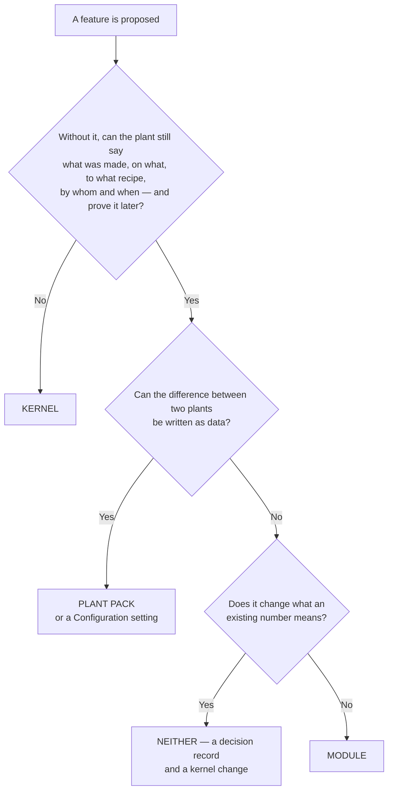

# Where the kernel ends and a module begins

*Design. Written 2026-09-26 against the code at `4cf18361`, before anything is
built. It proposes a test for the kernel boundary, a contract for what a module
may do, a versioning scheme, an answer to the Floor and Maintenance
Configuration question, a place for themes and for reports, and three
candidates for the first module. It presents the commercial question — paid
private modules on an open kernel, or not — with both sides argued, and
**decides nothing**. The decision it turns on is
[0037](../decisions/0037-where-the-kernel-ends-and-a-module-begins.md), which
is *proposed*. §9 is a list of questions; every one can be answered in a
sentence.*

---

## First: the word "module" already means three things

The vocabulary has to be repaired before anything can be decided. Today one
word covers three mechanisms.

| Called | What it actually is | Where | How many |
|---|---|---|---|
| a **registry module** | a row in a static table naming routers, pages, Configuration sections, agent tool files and tables, mounted by name at start-up | `src/fsmes/modules.py`, `REGISTRY` | 23 (9 kernel, 14 switchable) |
| an **entry-point module** | a callable returning an ERP adapter, looked up by `MES_ERP_MODE` | `pyproject.toml`, group `fsmes.modules` | 1 (`erpnext`) |
| a **module** in the architecture page | a package declaring its own tables, routers, tools and pack schema, subscribing to lifecycle hooks | [ARCHITECTURE](../ARCHITECTURE.md), the kernel section | 0 |

`fsmes info` prints `modules   erpnext` — the second kind — while the plant is
serving twenty-three of the first and none of the third
(`src/fsmes/cli.py:1545`). Two facts follow from that, and most of this page
depends on them:

- **There are no lifecycle hooks.** The architecture page says the kernel
  publishes `order.released`, `operation.completed`, `state.changed`,
  `lot.created` and that modules subscribe. No such mechanism exists: no
  registry, no subscription, no dispatch. What exists is a transactional
  outbox (`src/fsmes/services/outbox.py`) with hard-coded consumers. A module
  today can observe the plant only by polling.
- **The entry-point group loads nothing but ERP adapters.** It is read in
  three places and none of them touches `REGISTRY`
  (`src/fsmes/integrations/erp/base.py:271`, `src/fsmes/cli.py:1545`, one
  test). No installed package can contribute a router, a screen, a
  Configuration section, an agent tool, a setting or a table.

[Your first module](../develop/your-first-module.md) already says it plainly:
*"Quality, maintenance and scheduling are not yet separately installable
packages; they ship in the kernel wheel. Turning them into entry-point modules
is on the roadmap, not done."*

So this page is not tidying a working seam. It is specifying one.

---

## 1. Where the kernel ends

### The test

> **A thing is kernel if removing it makes the production record untrue or
> unreadable. Everything else is a plant pack if it is data, and a module if
> it is code.**

Three questions, in order. The first *yes* ends it.



1. **Does the plant stop being able to say what was made, on what, to what
   recipe, by whom and when — or stop being able to prove it later?** Then it
   is kernel. A record with a hole in it is worse than no record
   ([0004](../decisions/0004-never-invent-production.md), house rules 1–3).
2. **Can the difference between two plants be written as data?** Then it is a
   pack key or a Configuration setting.
   [0022](../decisions/0022-what-a-plant-pack-may-contain.md) already settled
   the shape: declarative data, no code, no secrets, nothing that changes what
   a number means, no schema changes.
3. **Does it change what an existing number means?** Then it is neither. It is
   a decision record and a kernel change. A module that can redefine OEE is a
   module that can make every plant's figures incomparable.

This is the escape hatch 0022 already names — *"the escape hatch for anything a
pack cannot express is a module"* — read forwards instead of backwards.

### Applied to today's twenty-three

The nine that are kernel are kernel under the test, and the test says *why*
rather than just ratifying the list.

| Module | Why it is the record |
|---|---|
| `masterdata` | what a thing *is*; nothing else can be said without it |
| `workorders` | what was asked for |
| `execution` | what happened, with the lots that went into it |
| `equipment` | what it happened on, and what state the machine was in |
| `ops` | the audit trail — the proof that the rest is true |
| `auth` | who did it; an unsigned record is an anonymous claim |
| `system` | whether the plant answers at all, and which version answered |
| `admin` | who may say what; roles and capabilities gate every write |
| `dashboard` | the front door, the nav, and the plant's own settings table |

Of the fourteen switchable, the test moves **one**, queries a **second**, and
leaves the other twelve where they are.

**`kpis` should be kernel.** It is one Configuration section and no tables, and
it computes OEE — the number the whole honesty discipline is built on
([0025](../decisions/0025-performance-is-measured-not-capped.md),
[0026](../decisions/0026-counts-that-outrun-the-run-time.md),
[0033](../decisions/0033-availability-is-a-share-of-what-was-watched.md)).
Question 3 says the arithmetic cannot leave the kernel and stay comparable
between plants. A plant may legally switch it off today, and nothing stops it.

**`adjustments` should be kernel, or should be switchable on purpose and say
so.** It is *"the recommendation queue — the only path to a PLC"*
([switching a module off](../operate/modules.md)). A safety-shaped approval
gate that a boolean can remove is worth a sentence in a decision record either
way. If the intent is that a plant with no write-back should not serve the
screen, that is a fine answer — it is just not written down.

**`analysis` is the clearest genuine module** and the best first thing to move
out; see §8. It owns no tables and no arithmetic of its own. It is a reading
surface over numbers the kernel computes.

The remaining twelve — `analysis`, `quality`, `maintenance`, `scheduling`,
`serialization`, `documents`, `coa`, `triggers`, `erp`, `line`, `assist` and
`design` — pass the test as modules. Each is a capability a real plant can
genuinely not have.

### What "amazing without the modules" means, concretely

A plant serving only the nine kernel modules can:

- hold its equipment, materials, BOMs and routings, and change them under a
  capability;
- take work orders and their operations and run them through dispatch and
  execution, with material lots and genealogy;
- record every machine state change, with reasons drawn from the plant's own
  vocabulary, and the tags behind them;
- sign all of it with a person's or an agent's identity and read the whole
  story back out of an append-only audit trail;
- serve the floor front door and twenty-four Configuration sections (nineteen
  under Setup, five under Engineering from `equipment`);
- answer `/health`, `/metrics` and `/shadow`, and say which version and which
  plant answered.

What it cannot do is **say how it went**: no OEE, no shift analysis, no line
view, no quality, no schedule. That is the honest gap, and it is why `kpis`
belongs on the kernel side.

So the target is narrow and reachable: **the kernel is the complete, honest,
agent-operable record of production, plus the numbers that say how the record
went.** Everything above that is a module. Nobody open-source ships even that
much as one system ([LANDSCAPE](../LANDSCAPE.md) — *"the integrated lane is
empty"*), so the kernel does not need modules to be worth installing. It needs
the record to be unimpeachable and the API to be complete.

---

## 2. What a module is allowed to do

Everything marked *today* is what the code does now.

### What a module declares

| Declares | Today | What must change |
|---|---|---|
| **Routers** — API under one prefix | `Mount(module, prefix, tags, public)`, imported by name at mount time | the prefix must be *reserved*, so two modules cannot both claim `/quality` |
| **Screens** — dashboard pages | `Page(path, file, about)`; `ui-check` reads the page list straight out of `modules.py` | a page must be servable from the module's own package, not only from `src/fsmes/web/` |
| **Configuration sections** | `ConfigSection(domain, key, label, about, href, define, approve, pack_keys, edit_here)` | a module must be able to name a domain it does not own, and be refused if that domain is absent |
| **Agent tools** | one file per module exposing `register(mcp, call, write, identify)`; twelve files, arity inspected at registration | nothing. This part already works the way the design wants |
| **Settings** — the `MES_*` prefixes it owns | `Module.settings` exists and **nothing reads it**; two modules populate it | it becomes the thing `pack check` validates against, and the prefix is owned exclusively |
| **Pack keys** — a `[section]` in `plant.toml` | the schema is closed and in-tree: 19 sections, 123 keys; only `[modules]` and `[words]` are open | a module contributes a *closed* section of its own, so a typo in it is still a refusal |
| **Tables** | `Module.tables` is recorded and never acted on; 39 revisions, one head, no branch labels anywhere | see below |

### Tables, given one database per plant

[0021](../decisions/0021-one-database-per-plant.md) settles that a fleet is
many databases and that no kernel table carries a plant column. It does not
settle who owns a migration. Today every module's tables are created by the
same `fsmes migrate` on the same single chain — which is exactly why
[switching a module off](../operate/modules.md) can promise that **off means
not served, never not stored**.

The proposal keeps that promise and makes it a rule:

- **A module owns an Alembic branch, not a chain.** Its `branch_label` is its
  name; its revisions chain within the branch and `depends_on` the kernel
  revision they need. `fsmes migrate` upgrades every installed branch to its
  head; `fsmes db-status` prints a head per branch, with the total.
- **Installing a module creates its tables; disabling it never drops them.**
  Unchanged, including the existing warning that switching a module off is not
  a retention tool.
- **Uninstalling a module leaves its tables.** There is no `downgrade` a plant
  should run against production data. Removing rows is a deliberate act with
  its own command, or it is a restore.

This is the part of the seam with the most unbuilt work behind it, and §8
scores the candidates partly on whether they force it.

### What a module may not do

1. **Import another module's internals** — only the kernel's published
   services. `tests/test_core_purity.py` holds the kernel's half of this today
   (the kernel may import nothing from a module, or the module could never be
   switched off). The module-to-module half has no guard, because there is no
   second module yet.
2. **Change the kernel's words** — not a state, a KPI, a capability, a role, an
   audit action, an event `kind`, an MCP tool name, or any field an API
   response or an MQTT topic is built from. This is 0022 clause 3 applied to
   code instead of packs: *"Two plants' events must remain comparable, or the
   fleet console is comparing dialects."*
3. **Compute a kernel number differently.** A module may present OEE. It may
   not calculate it. See §6.
4. **Bypass the audit.** Every write goes through a service that records who
   did it and on whose behalf.
5. **Widen a capability.** A module names the existing capability that gates
   each of its writes, or declares a new one an admin must grant deliberately.
   It can never make something an operator can do.
6. **Reach outside the box for the UI** — [STYLE](STYLE.md) rule 9: no build
   step, nothing fetched from outside the box.

### What "off" means

Exactly what it means today, and the existing words are the contract: routes
gone and answering **404**, not 403 and not an error page; absent from
`/openapi.json`; screens not served rather than served-and-broken; agent tools
not registered. Off does not mean not stored, does not reclaim disk, and a
name this version does not have is refused at start-up rather than ignored.

---

## 3. Versioning and compatibility

None of this exists today. The pack format is the precedent to copy, because
it works and a plant engineer has already met it.

### A module says which kernel it needs

Mirror `[pack] requires` exactly, grammar included
(`src/fsmes/pack/check.py:148`): comma-separated comparisons from
`>= <= == != > <`, each against a numeric dotted version.

```toml
# in the module's own pyproject.toml
[tool.fsmes.module]
name     = "reports"
api      = 1              # the kernel module-API version it is written for
requires = ">=0.3,<0.5"   # the product versions it is written for
```

A module whose `requires` this product does not satisfy is **refused at
start-up with a sentence**, the way a pack is — not disabled quietly, not
half-mounted. A requirement that cannot be *parsed* and one that is not *met*
are different messages, as they already are for packs.

### The kernel says what it offers

One integer, `MODULE_API`, printed by `fsmes info` beside the product version.
It increments when, and only when:

- a field is removed from `Module`, `Mount`, `Page`, `ConfigSection` or
  `ConfigDomain`, or an existing field changes meaning;
- the `register(mcp, call, write, identify)` shape changes;
- a published kernel service a module is told to call changes its contract;
- the migration-branch contract changes.

Adding an optional field does not increment it. `0.x` on the *product* version
keeps meaning what the changelog says it means — *the API may change with a
note here* — and the module API is the part that stops being allowed to.

### `fsmes info` has to stop lying

It prints the entry-point group and calls it "modules". It should print three
things, each with its total:

```text
fsmes 0.3.0  (module API 1)
modules       23 known · 18 served · 5 off        (registry)
installed     reports 0.2.0 (api 1, requires >=0.3,<0.5)
```

A `fsmes modules` command — every module, its standing, its version, and why
it is off — would replace today's situation, where the only places a person
can read served-versus-off are a `pack status` receipt and the Configuration
page's hidden-section count.

### What the registry must accept

To load an out-of-tree module, `REGISTRY` stops being a literal and becomes a
literal plus whatever the entry-point group yields. These are refusals at
start-up, each a named error and a test — none of them a warning:

- a name already taken, or a kernel name;
- a router prefix, page path, settings prefix, pack section, table name or
  branch label already owned by something else;
- a `ConfigSection` naming a domain that does not exist;
- a `requires` this product does not satisfy, or an `api` this kernel does not
  offer;
- anything failing the checks `fsmes pack check` already runs offline, so a
  module's own pack section is validated before a plant ever starts.

### The three words, applied to modules

[Compatibility](../operate/compatibility.md) already has the vocabulary,
defined for ERP connectors in
[0020](../decisions/0020-what-supported-means-for-an-erp-connector.md). Read
it across:

- **supported** — passes the module conformance checks and is tested against a
  stated kernel version by a job somebody maintains.
- **contributed** — passes the checks. Nobody here has run it against a real
  plant.
- **experimental** — exists. The row says what is missing.

And the rule that makes the table worth reading comes with them, unchanged:
**every row states the exact kernel version tested and the date it was
tested.** A module row with no date is a row nobody can age.

### What a breaking change is, and where it is written

A module carries its own SemVer, `0.x` meaning what it means for the product.
A change is breaking if a plant that upgrades the module and changes nothing
else gets a different answer, loses a route, or has to edit its pack.

And the part that matters most: **if the change alters what a number means, it
goes in the Honesty section of the changelog with a migration line, exactly as
a kernel change does.** The changelog already scopes that section to "anything
that changed what a number *means* … so plant people can find it." A module is
not exempt. A plant reading its own changelog should not have to know which
side of the seam a number came from — which is one more argument for §6's rule
that the numbers stay the kernel's.

---

## 4. Configuration workspaces and modules

Scott expected Floor and Maintenance to have Configuration tabs. They do not,
and the reason is a rule rather than an oversight — but the rule produces one
answer that is right and one that is wrong.

### The two models

**The standing rule** ([0035](../decisions/0035-configuration-is-authored-by-roles-and-selected-by-operators.md),
and §2a of [configuration assistance](config-assistance.md)): a workspace is a
**capability**. One `Configuration` entry per domain; every configurable
section of that domain lives inside it; a module that adds something
configurable adds a `ConfigSection` naming a domain, and the nav does not
grow. Four domains exist today — Engineering (18 sections), Quality (12),
Supply chain (6), Setup (19) — 55 sections in all, contributed by eight of the
twenty-three modules.

**The alternative Scott expected**: a workspace per **module family** — Floor,
Maintenance, Quality, Scheduling — so the Configuration tab sits where the
thing being configured lives.

### What each costs

| | Workspace = capability (today) | Workspace = module family |
|---|---|---|
| **Operator** | nothing either way; the floor authors nothing and selects from lists ([0035](../decisions/0035-configuration-is-authored-by-roles-and-selected-by-operators.md)) | a Configuration tab in the Floor group that the floor may not use reads as a locked door |
| **Engineer** | finds every knob she owns in one place, whatever module implements it | hunts across tabs for settings one job spans — e.g. the maintenance *and* scheduling halves of the same job-duration judgment |
| **Assistant** | `plant_settings(plant, domain)` returns a whole workspace — and Setup's is 19 sections and 44 keys, which is how it got cut at 6,000 characters on 2026-09-26 and told Scott a setting did not exist | smaller reads per call, which directly mitigates that failure |
| **Nav** | stays flat; this is the clutter §2a exists to prevent, and hundreds of sections are expected | grows one entry per family, and each family's entry is mostly empty today |
| **Gate** | the capability *is* the workspace, so the page needs no gate of its own | a tab spanning capabilities has to gate per row, which it already does |

The assistant row is the one piece of new evidence since 0035 was accepted, and
it cuts **for** splitting: a workspace is also a unit of reading, and Setup is
now too big to read in one tool result.

### The answer, under each model

| | Under the standing rule | Under the alternative |
|---|---|---|
| **Maintenance** | **Yes — a fifth domain.** It is a genuine authoring role, and the audit already found its gap: *"No maintenance engineering beyond `maintenance.plan`."* Cost is one `ConfigDomain` entry, one new capability `maintenance.define`, and three sections moved off Engineering. The `Maintenance` nav group already exists with one item and no Configuration entry. | same tab, same three sections, arrived at from the other direction |
| **Floor** | **No — not a domain.** 0035's whole point is that the floor *selects* and never *authors*. A Floor domain would be a workspace with no author. | a Floor tab exists but every row in it is gated on somebody else's capability |

**But the thing Scott actually hit on the Floor is real, and it has a smaller
fix.** Every setting that shapes the floor screens — refresh clocks, page
sizes, the assistant's budget and log ring, toast durations — lives in Setup
and is gated on `users.manage`. So the person who tunes the floor's refresh
rate must also be the person who administers accounts. Two changes fix that
without inventing a domain:

1. a `screens.define` capability, so tuning the screens is not account
   administration;
2. a named **Floor screens** group on Setup's Configuration page, which is
   presentation, not a new domain — and which also cuts Setup's assistant read
   into pieces that fit.

### What each workspace would hold today, from the audit

From the 75 curated candidates in [the configuration
audit](config-audit-2026-09-21.md):

**Maintenance — three, all built, all currently on Engineering** under
`process.define`:

| Audit ID | Setting | Pack key |
|---|---|---|
| P1 | when a plan is "coming due" (80 % of its interval) | `[process] maintenance_due_soon_fraction` |
| P3 | how long an unplanned job is assumed to take (60 min) | `[process] default_job_minutes` |
| P4 | a new plan's default expected duration (30 min) | `[process] maintenance_plan_default_minutes` |

Add two if gauge calibration counts as maintenance, and it arguably does — the
audit's own note on Q7 is *"the maintenance 80 % judgment in another domain"*:
Q7 (a gauge is due soon thirty days out, object scope, on the gauge row) and
Q8 (`[quality] gauge_default_interval_days`). So: **three sections, or five.**

**Floor — nine, all currently on Setup** under `users.manage`: A6 (five
`[screens] floor_*` keys — refresh clocks and page sizes), A4 (the pending
panel's page size), A12 (the floor agent's rounds, session lifetime and result
cap — the one that truncated), A21 (the assistant's log ring and fill-retry
budget), A22 (toast durations and input debounces), plus four the audit left
open as questions rather than routed settings: A13 (the assistant's "at most
four sentences"), A14 (how many suggestion chips), A15 (the lexical fallback
threshold) and A23 (the line-list cache lifetime).

Two floor-facing ones are *object* scope and belong on a row, not a tab: C1
(tag staleness) and C5 (how long a station trusts its current order — the one
that can mis-book ten seconds of units at a changeover).

The audit's own summary of the pattern is worth keeping: *"No `general`
candidate was found in process, controls or supply chain: every judgment in
those three is either a plant's or an object's, which is what you would expect
of the three domains that touch the floor."*

### Recommendation

Keep the standing rule. **Add Maintenance as a fifth domain with a
`maintenance.define` capability. Do not add a Floor domain; split
`screens.define` out of `users.manage` and group the floor's rows on Setup.**
Then revisit whether Setup should split further, using the assistant's read
size as the measure rather than taste.

---

## 5. Themes

Scott's words were *"different themes, where overall UI can be completely
different."* That is three asks, and only the first is a theme.

### What exists

Four themes — `control-room`, `daylight`, `high-contrast`, `night-shift` — as
custom-property palettes in `src/fsmes/web/themes.css`. Every colour on every
screen resolves to one of those variables; a hex literal in a page stylesheet
is a bug and a test enforces it. `fsmes ui-check` crawls every screen in every
theme and compares computed styles against accepted baselines, and
high-contrast's WCAG ratios are computed by a test.

What does not exist: any way for a plant to have a fifth. Selection is
`localStorage`, per browser — no server default, no pack key, no plant setting.
The list of themes is written down in four places.

### The three asks, separated

**A palette is a pack artefact, not a module.** It is values for variables the
kernel already declares: data, no code. That is question 2 of §1's test, and
0022 answers it — a `[theme]` block in `plant.toml`, with `fsmes pack check`
refusing an unknown variable, a malformed colour or a contrast ratio below the
floor, offline, before the plant starts. This is genuinely small: one pack
section, one server-rendered `<style>` block, one more `ui-check` theme
argument, and the four duplicate lists collapsed into one source.

**A different layout is a module.** Different screens, different panels,
different information on the station view. That is code, it is what
`Module.pages` already describes, and it is the mechanism §2 proposes
hardening.

**A completely different UI is a second front end, and it should stay outside
the product.** Apache-2.0 already permits it and nothing has to be built. But
the cost should be said out loud, because it is the cost
[0023](../decisions/0023-the-fleet-console-observes.md) refused to pay for
Grafana: **the honesty rules live in the UI.** "Every list states its total"
and "unknown renders as '—' or 'unknown', never as 0" ([STYLE](STYLE.md) rules
4 and 8) are enforced by `src/fsmes/web/kit.js` — whose own header says
*"Nothing here computes a number: a chart draws what the API measured, and
draws 'unknown' when it did not"* — and by `ui-check`'s baselines. A front end
that does not use the kit can render `null` as `0` and no test in this
repository will ever see it. 0023 rejected Grafana-as-the-fleet-view because it
*"puts the fleet view outside the product, where the honesty rules do not
reach."* A UI plug-in point is that argument again, at plant scale.

**Recommendation, for §9 to confirm:** ship the palette as a pack artefact;
keep layout inside the module mechanism and inside the kit; build no UI
plug-in point. A third-party front end is welcome and unsupported, and the
docs should say both of those words.

Is this ground nobody holds? **No.** Theming is table stakes, and the research
found nothing on themes anywhere — neither landscape sweep mentions them. The
differentiated part is not the palette. It is that the kit makes honesty
structural, which is worth documenting whether or not a fifth theme ever ships.

---

## 6. Graphs and reports

This is the everyday-engineer surface, and it holds the clearest unclaimed
ground on the page.

### What exists

`analysis` (one screen, three Configuration sections, no tables), `kpis` (the
OEE arithmetic), `line`, and the shared chart kit — hand-drawn SVG, no library,
which already knows how to draw a coverage row, a ledger of where unwatched
time went, and a total. Every analysis payload already states the window it
actually used. There is no saved report, no export, no catalogue, and no
extension point.

### What the extension point would be

Not "a module may add a chart". One sentence makes it safe:

> **A report declares a question and a rendering. The kernel answers it, and
> the answer arrives with its coverage, its total and its window attached. A
> report surface that cannot express "unknown" is refused at registration.**

Concretely: a module registers a report as a *declaration* — which kernel
series, which grouping, which window — and gets the kernel's own envelope back
(the value or `null`, the coverage, the total, the window, the provenance),
the same envelope the API already returns. It renders through the kit. It never
issues SQL against a kernel table, and it never does arithmetic on a figure the
kernel withheld.

That rule is what keeps 0026's amendment — a figure withheld on *every* surface
— true on a surface the kernel does not own, and what keeps 0033's promise that
every figure says how much of the window was watched.

### What a reports module owns, and what it must not

**Owns:** saved report definitions and who may see them; the catalogue and its
per-role shape; scheduling and delivery; export — CSV, and a self-contained
HTML file with no outbound requests, which survives being forwarded as an
attachment; comparison and layout; chart types beyond the kit's.

**Must not own:** the arithmetic, the coverage, the rounding, the window
semantics, or any number the kernel cannot reproduce on request. If a report
shows a figure, a `GET` on the kernel's own endpoint must produce the same
figure with the same coverage.

### Grafana, again

[0023](../decisions/0023-the-fleet-console-observes.md) rejected
Grafana-as-the-product-view, and the reasoning carries here. A **Grafana
dashboard pack** is already planned as a community `adopt-a-module` issue:
provisioned JSON beside the product, never embedded, which also keeps AGPL out
of the wheel. Both can be true — the in-product report is the one that carries
coverage; the Grafana pack is for the plant that already runs Grafana and
wants its MES on the same wall.

### Ground nobody holds?

Partly, and the split matters. **Reports are table stakes** — every MES has
them and Grafana draws prettier ones. **A report that refuses to print a number
it cannot stand behind is not.** The 2026-09-17 landscape sweep puts it
structurally: *"a vendor whose competitive claim is an OEE dashboard cannot
ship the feature that says 16 % of this shift is unaccounted for."* Nobody with
a dashboard to sell can ship the honest report. The differentiator lives in the
extension point's contract, not in the charts.

---

## 7. The commercial question: paid private modules, or not

This section argues both sides and decides nothing. The decision is the
maintainer's, and [0037](../decisions/0037-where-the-kernel-ends-and-a-module-begins.md)
carries it with two alternative resolutions written out.

### What is already written down

The project's own planning notes of 2026-09-05 (kept outside this repository)
say, under *what not to do*: **"No 'open core' split of the MES itself."** The
reason given is Odoo's community tension. The alternative offered is that a
commercial layer, if one exists, is factorysemantics.com's analytics and fleet
products — separate products that *consume* the MES's events, not a paid tier
inside it. The same note rules out dual licensing and a copyright-assigning
CLA.

[0001](../decisions/0001-apache-2-with-dco.md) chose Apache-2.0 with the DCO
partly so a commercial layer would never need a relicence, and `GOVERNANCE.md`
clause 3 puts the licence among the three things a pull request may not change:
it takes a decision record and a thirty-day comment period.

So the standing position is *no paid split of the MES*, written as strategy
rather than as a decision record. **There is no ADR on a commercial model at
all.** That is the gap this section exists to close, either way.

### The case for

1. **The seam already exists.** Modules register through entry points, and the
   plan has always been for ownership to follow that seam — per-module teams,
   `CODEOWNERS` lines, per-module docs and tool files. A commercial line drawn
   along an existing seam costs less than inventing one.
2. **The nearest comparable does it and is growing.** Carbon (`crbnos/carbon`),
   "open core for manufacturing": AGPL-3 with a commercial `packages/ee`
   carve-out. 2,416 stars on 2026-09-17, 2,635 on 2026-09-25, 98 commits in
   those eight days — and it is what a searcher finds first for "open source
   MES".
3. **The bar-setters put agent surfaces behind paid tiers.** Ignition's MCP
   module is bound for the paid Enterprise Integration suite (read
   2026-09-17), and the market has not punished it.
4. **Even the AGPL rival is building module *installation*.** OpenMes grew an
   installable-module system with an upload/install endpoint while going
   107 → 133 → 141 stars over five weeks.
5. **Evenings are the scarce input and the current answers are capped.** The
   same 2026-09-05 note says the bus factor is one and the scarce resource is
   evenings. Every income route it allows is labour, and labour does not scale
   past one person.
6. **Differential licences at the edges are already accepted practice here.**
   The Frappe-side app is GPL-3 in its own repository; an OCA module would be
   AGPL-3 or LGPL-3 in its own repository; the MES stays Apache-2.0 in this
   one — "two repos, two licences, no contamination question." A paid module in
   a private repository is the same manoeuvre with a different motive.
7. **The scope rule leaves an upper tier unbuilt by construction.** "Ship the
   20 % of each module that covers 80 % of a small-to-mid plant" names, without
   meaning to, the 80 % nobody has promised to give away.

### The case against

1. **It is ruled out by name**, and nothing since 2026-09-05 overturns the
   reasoning.
2. **It would make the project the thing it recruits against.** Odoo's
   MES-shaped features — Quality, PLM, the IoT box, the Shop Floor UI, MPS —
   are Enterprise-only, and the Community user who wants OEE and machine data
   is precisely this project's target user ([LANDSCAPE](../LANDSCAPE.md)).
   Qcadoo's scheduling is paywalled the same way. Paywalling the same layer
   here removes the reason those users came.
3. **The licence bought the adoption channel, and a paid tier spends it.**
   Apache-2.0 was chosen *because* integrators are the channel; UMH and frePPLe
   both left copyleft for that reason, UMH saying integrators must be able to
   build on it "without any further permission". The integrator's deliverable
   is a pack and never requires a fork, and the planned integrator listing is
   alphabetical, unranked and free.
4. **Module ownership is the bus-factor mitigation, and paid modules cannot be
   given away.** The `adopt-a-module` contract is that the adopter *becomes the
   maintainer*, and the 24-month win condition is "two module maintainers who
   are not Scott." Both stop working for a module that is also a product.
5. **The polite "no" depends on modules being free to adopt.** The written
   script for protecting the evening budget is *"out of scope for the kernel;
   would make a good module — here is the entry point."* That deflection
   becomes a sales pitch if the entry point leads to a paid product.
6. **The differentiator is structurally hostile to a paid-feature business.**
   A vendor whose claim is an OEE dashboard cannot ship the feature that says
   16 % of the shift is unaccounted for; shadow mode is unshippable for an
   incumbent because it helps a customer leave; nobody lets you discover your
   own connectivity because the discovery call is the funnel. Taking the
   commercial incentive takes the incentive that stops everyone else shipping
   the honest feature.
7. **Carbon is publicly selling against exactly this shape.** Its own buyer
   criteria, published 2026-07-08, include *"does the API cover everything, or
   a curated subset"* and *"can you self-host it, today, without a services
   contract"* — two tests this project passes today and a paid split would
   fail.
8. **The mechanics do not exist.** Module versioning, separate releases and
   module distribution are written down nowhere; the only standing rule is that
   modules cut nothing, because releases stay core. §3 is the smallest version
   of what would have to be built first, and it is not small.

### What each answer costs

| | If paid private modules are allowed | If they are not |
|---|---|---|
| **Licence** | This repository stays Apache-2.0 and nothing forces a relicence — exactly what [0001](../decisions/0001-apache-2-with-dco.md) bought. A private module may carry any licence, because it links over a published contract. But Apache-2.0 equally means a competitor may take the kernel and sell the same add-ons; the mitigation is the community, not the licence. | No change; `GOVERNANCE.md` clause 3 keeps it that way. |
| **Naming and trademark** | [0016](../decisions/0016-no-trademark-registration.md) declined registration *and* a `TRADEMARK.md`, and named its own revisit trigger: **"if a company forms around the project."** Selling modules is a company forming. 0016 reopens, and the usage policy it declined — telling forks what they may call themselves — becomes necessary rather than unfriendly. | 0016 stands untouched. |
| **The entry-point contract** | It becomes a **public API with a support promise**: a module a customer paid for cannot break at a kernel patch release. Everything in §3 stops being optional, and the kernel loses the freedom to change the `Module` shape in a minor release. | It stays an internal seam, hardened when a second module actually moves out — which is [0002](../decisions/0002-kernel-and-modules.md)'s own revisit trigger. §3 is still worth doing, on the project's own clock. |
| **The community pages** | Several must change and say why: the contributor ladder's module-ownership offer, the `adopt-a-module` issues, the integrator programme's no-fee listing, and the "would make a good module" deflection. Each currently promises that a module is a thing a stranger can own. | No change. |
| **What the precedent costs its owner** | Honestly: **the research shows no cost.** Neither landscape sweep records a fork, a revolt or a slowdown at Carbon, Ignition, OpenMes or Odoo; Carbon grew about 9 % in stars in eight days with the carve-out in place. The "permanent community tension" at Odoo is the project's own 2026-09-05 reading and is **not evidenced** in either sweep. The measurable cost at Carbon is narrower and real: by this project's own test it is not open source, and it spends effort arguing a position its own licence contradicts. | The cost is the one already named: money stays capped at what evenings and integration work produce, and the bus factor stays one. |

### What this section does not do

It does not recommend. Both columns are live. What it does insist on is that
the answer be a decision record rather than a drift — because a module that
becomes a product changes what the entry point *is*, and §3 cannot be built
until that is settled.

---

## 8. Where to start

Three candidates, scored on four things: what an engineer gets on day one, how
much of the unbuilt seam it proves, how far it is from what competitors already
ship, and what it costs.

### The candidates

**A. An engineer-facing reports module** — saved reports, a catalogue, export,
built on §6's declaration-plus-envelope contract.

| | |
|---|---|
| Day-one value | **High.** This is the thing an engineer opens every morning. |
| Seam proved | Screens, Configuration sections, agent tools, settings, its own tables (so the Alembic branch question), versioning. Nearly all of it. |
| Distance from the field | Reports: table stakes. Reports that carry coverage and refuse a number they cannot stand behind: nobody. |
| Cost | **Highest.** It needs §3 *and* §6 *and* module-owned migrations before the first screen. |

**B. A theme** — the palette as a pack artefact, per §5.

| | |
|---|---|
| Day-one value | Low for an engineer; real for a demo and for a plant with a dark control room. |
| Seam proved | Almost none of the *module* seam — a palette is a pack artefact, so it proves the pack seam, which already works. |
| Distance from the field | Table stakes. |
| Cost | **Lowest.** One pack section, one `<style>` block, one `ui-check` argument, four duplicate lists collapsed into one. |

**C. Move one existing module out to its own distribution** — no new product
surface at all; the same behaviour, arriving through the mechanism instead of
from the wheel.

| | |
|---|---|
| Day-one value | **None visible.** A plant sees no change, which is the point: if a plant sees a change, the move was wrong. |
| Seam proved | Entry-point loading into `REGISTRY`, prefix and name ownership, `requires` and `MODULE_API`, `fsmes info`, the compatibility row, packaging, CI across two dists. Everything except hooks. |
| Distance from the field | Not a feature. It is the thing that makes every later feature cheap. |
| Cost | Moderate, and almost all of it is one-time. |

*Which module?* Not `gauges` — it is not a registry module; it is a screen and
a Configuration section inside `quality`, so moving it means splitting quality
first. The three real candidates are `coa` (one page, one tool file, no tables,
no Configuration), `serialization` (one page, one tool file, **four tables**)
and `analysis` (one page, **three Configuration sections**, no tables, no
tools).

**`analysis` is the right one.** It proves routers, pages, Configuration
sections, settings ownership, versioning and `fsmes info` — while avoiding the
single hardest unbuilt piece, module-owned migrations, which `serialization`
would force on day one. It is also the module that grows into candidate A, so
the work is not thrown away.

### Recommendation

**Do C first, with `analysis`. Then A. B any time; it is independent and
cheap.**

Three reasons:

1. It is [0002](../decisions/0002-kernel-and-modules.md)'s own revisit trigger,
   reached deliberately instead of by accident: *"revisit when a second module
   moves out."*
2. It is the only candidate that can fail safely. If the mechanism is wrong,
   the cost is a branch nobody merges — not a screen a plant started using.
3. It is on the critical path for everything else on this page. The reports
   module, a bought module, and a community-owned module all need the same
   loading path, and none of them can be honest about compatibility until
   §3 exists.

The sequence also answers §7 without pre-empting it: C is worth doing under
either resolution of the commercial question, and doing it first buys time to
decide.

---

## 9. Questions for Scott

Each of these can be answered in a sentence.

1. **The test.** Is *"kernel if removing it makes the production record untrue
   or unreadable"* the right line?
2. **`kpis`.** Should OEE stop being switchable and become kernel?
3. **`adjustments`.** Kernel, or deliberately switchable — and which sentence
   goes in the record?
4. **Maintenance.** Add it as a fifth Configuration domain with a
   `maintenance.define` capability, moving the three existing sections off
   Engineering?
5. **Floor.** Accept that the floor authors nothing, and fix the real
   complaint with a `screens.define` capability and a named Floor group on
   Setup, rather than a Floor tab?
6. **Themes.** Palette as a pack artefact, layout as a module, and no UI
   plug-in point — agreed?
7. **Reports.** Is *"a report surface that cannot express unknown is refused"*
   the rule you want, with the numbers staying the kernel's?
8. **The module API.** Should the entry-point contract become a supported
   public API with a version number, or stay an internal seam until a second
   module needs it?
9. **The commercial question.** Which resolution of
   [0037](../decisions/0037-where-the-kernel-ends-and-a-module-begins.md) —
   the kernel stays whole, or paid private modules are allowed?
10. **First module.** Move `analysis` out to its own distribution first?
11. **This page.** §7 discusses your own commercial options in a public
    repository. Should it stay, move to the private notes, or be written more
    briefly?

---

## What this page is not

It is not a plan and nothing is built from it. No code changes, no
`modules.py`, no `pyproject.toml`. Every mechanism in §2 and §3 is a proposal
that becomes a milestone only if 0037 is accepted, and every recommendation in
§4, §5, §6 and §8 is a sentence for Scott to agree with or replace.
